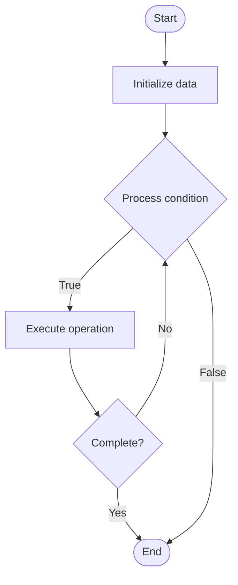

# Quantum ML Hybrid

1. **Name of Algorithm**  

## Code Files


## Algorithm Visualization

### Flowchart (ASCII)


```
Quantum ML Hybrid Flowchart:

┌─────────────┐
│   Start     │
└──────┬──────┘
       │
       ▼
┌─────────────┐
│  Initialize │
│   data      │
└──────┬──────┘
       │
       ▼
┌─────────────┐      Yes
│  Process   ├──────┐
│  condition?│      │
└──────┬──────┘      │
       │ No          │
       ▼             │
┌─────────────┐      │
│  Execute   │      │
│  operation │      │
└──────┬──────┘      │
       │             │
       └─────────────┘
       │
       ▼
┌─────────────┐
│    End      │
└─────────────┘
```


### Step-by-Step Execution


```
Quantum ML Hybrid Step-by-Step Execution:

Input: [example data]

Step 1: Initialize
State: [initial state]

Step 2: Process
State: [intermediate state]

Step 3: Finalize
State: [final state]

Result: [output]
```


### Interactive Flowchart (Mermaid)





> **Note**: Mermaid diagrams are rendered automatically on GitHub. For local viewing, use a Mermaid-compatible Markdown viewer.
- [Python Implementation](semester_12/lecture_82_hybrid_quantum/quantum_ml_hybrid/algorithm.py)
- [Java Implementation](semester_12/lecture_82_hybrid_quantum/quantum_ml_hybrid/Algorithm.java)
- [Python Tests](semester_12/lecture_82_hybrid_quantum/quantum_ml_hybrid/test_algorithm.py)


   Quantum ML Hybrid

2. **What problem does it solve? (1 sentence)**  
   Combines quantum machine learning with classical ML, using quantum algorithms for specific ML tasks while leveraging classical ML for others, enabling practical quantum ML applications on near-term hardware.

3. **Intuition (plain-language explanation)**  
   Like hybrid ML: Quantum ML Hybrid combines quantum and classical ML - you use quantum algorithms for what they're good at (quantum tasks), and classical ML for the rest - just as hybrid approaches combine strengths, quantum ML hybrid combines quantum and classical ML strengths.

4. **Inputs & Outputs**  
   - Input: ML tasks, quantum ML models, classical ML models, training data, hybrid workflow, optimization objectives.  
   - Output: Hybrid ML models, quantum-classical predictions, optimized parameters, combined ML results, enhanced ML capabilities.

5. **Step-by-step description (5–10 lines max)**  
1. Decompose: decompose ML task into quantum and classical parts.
2. Quantum: design quantum ML model for quantum part.
3. Classical: design classical ML model for classical part.
4. Train: train both models.
5. Combine: combine quantum and classical predictions.
6. Optimize: optimize hybrid model.
7. Execute: execute quantum part on quantum computer.
8. Process: process results classically.
9. Iterate: iterate to improve hybrid model.
10. Deploy: deploy hybrid ML system.

6. **Tiny example (hand-simulated)**  
   Quantum ML Hybrid: task: classification → quantum: quantum feature map → classical: classical classifier → train: train both → combine: ensemble predictions → result: better accuracy than pure classical → Quantum ML Hybrid successful.

7. **Time & Space Complexity**  
   - Time: O(q·c·t) where q is quantum time, c is classical time, t is training time (varies by task).  
   - Space: O(n + m) where n is qubits, m is classical model storage (hybrid storage).

8. **Strengths**  
- Practical: enables practical quantum ML on NISQ hardware.
- Flexibility: leverages strengths of both quantum and classical ML.
- Performance: can outperform pure classical or quantum approaches.

9. **Weaknesses / limitations**  
- Complexity: hybrid ML systems are complex to design.
- Coordination: requires coordination between quantum and classical.
- Overhead: communication overhead between systems.

10. **Compare with alternatives**  
    Alternatives: Pure Quantum ML, Pure Classical ML, Quantum-Inspired ML, Hybrid Frameworks

11. **30-second explanation (your own words)**  
    Combines quantum machine learning with classical ML, using quantum algorithms for specific ML tasks while leveraging classical ML for others, enabling practical quantum ML applications on near-term hardware.

*Sources: Adapted from standard university textbooks and Wikipedia summaries.*
