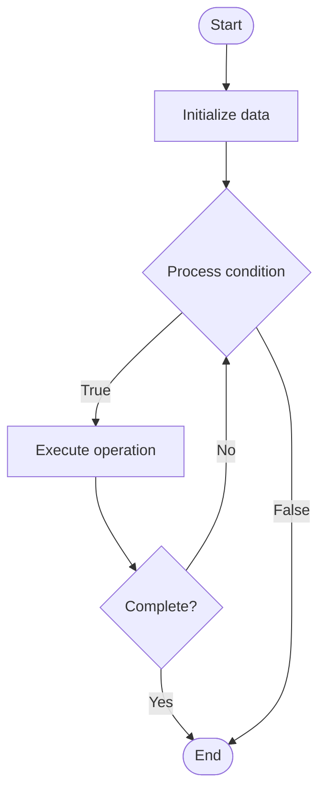

# Quantum Optimization Hybrid

## Учебные материалы

- [Школьный уровень](school.ru.md)
- [Университетский уровень](univer.ru.md)

## Algorithm Visualization

### Flowchart (ASCII)

```
Quantum Optimization Hybrid Flowchart:

┌─────────────┐
│   Start     │
└──────┬──────┘
       │
       ▼
┌─────────────┐
│  Initialize │
│   data      │
└──────┬──────┘
       │
       ▼
┌─────────────┐      Yes
│  Process   ├──────┐
│  condition?│      │
└──────┬──────┘      │
       │ No          │
       ▼             │
┌─────────────┐      │
│  Execute   │      │
│  operation │      │
└──────┬──────┘      │
       │             │
       └─────────────┘
       │
       ▼
┌─────────────┐
│    End      │
└─────────────┘
```

### Step-by-Step Execution

```
Quantum Optimization Hybrid Step-by-Step Execution:

Input: [example data]

Step 1: Initialize
State: [initial state]

Step 2: Process
State: [intermediate state]

Step 3: Finalize
State: [final state]

Result: [output]
```

### Interactive Flowchart (Mermaid)



> **Note**: Mermaid diagrams are rendered automatically on GitHub. For local viewing, use a Mermaid-compatible Markdown viewer.

- [Python Implementation](/code/semester_12/lecture_82_hybrid_quantum/quantum_optimization_hybrid/algorithm.py)
- [Java Implementation](/code/semester_12/lecture_82_hybrid_quantum/quantum_optimization_hybrid/Algorithm.java)
- [Python Tests](/code/semester_12/lecture_82_hybrid_quantum/quantum_optimization_hybrid/test_algorithm.py)

What problem does it solve? (1 sentence)  
   Combines quantum optimization algorithms with classical optimization, using quantum computers for optimization subproblems while classical computers handle other aspects, enabling practical quantum optimization.

Intuition (plain-language explanation)  
   Like hybrid optimization: Quantum Optimization Hybrid combines quantum and classical optimization - you use quantum algorithms for hard optimization subproblems, and classical methods for the rest - just as hybrid approaches combine strengths, quantum optimization hybrid combines quantum and classical optimization strengths.

Inputs & Outputs  

- Input: Optimization problems, quantum optimization algorithms, classical optimizers, hybrid workflow, problem decomposition.
  - Output: Hybrid optimization solutions, optimized parameters, quantum-classical results, improved solutions, combined outputs.

Step-by-step description (5–10 lines max)  
Decompose: decompose optimization problem.
Quantum: identify parts suitable for quantum optimization.
Classical: identify parts for classical optimization.
Execute: execute quantum optimization on quantum computer.
Process: process quantum results classically.
Optimize: optimize using classical methods.
Iterate: iterate between quantum and classical.
Combine: combine quantum and classical solutions.
Validate: validate hybrid solution.
Output: output final hybrid solution.

Tiny example (hand-simulated)  
   Quantum Optimization Hybrid: problem: large-scale optimization → quantum: optimize hard subproblem → classical: optimize rest → combine: combine solutions → result: better solution than pure classical → Quantum Optimization Hybrid successful.

Time & Space Complexity  

  - Time: O(q·c·i) where q is quantum time, c is classical time, i is iterations (varies by problem).  
  - Space: O(n + m) where n is qubits, m is classical storage (hybrid storage).

Strengths  

- Practical: enables practical quantum optimization on NISQ hardware.
- Performance: can find better solutions than pure classical methods.
- Flexibility: leverages strengths of both approaches.

Weaknesses / limitations  

- Complexity: hybrid optimization is complex to design.
- Coordination: requires coordination between quantum and classical.
- Decomposition: problem decomposition can be challenging.

Compare with alternatives  
    Alternatives: Pure Quantum Optimization, Pure Classical Optimization, Quantum-Inspired, Hybrid Frameworks

30-second explanation (your own words)  
    Combines quantum optimization algorithms with classical optimization, using quantum computers for optimization subproblems while classical computers handle other aspects, enabling practical quantum optimization.

*Sources: Adapted from standard university textbooks and Wikipedia summaries.*
