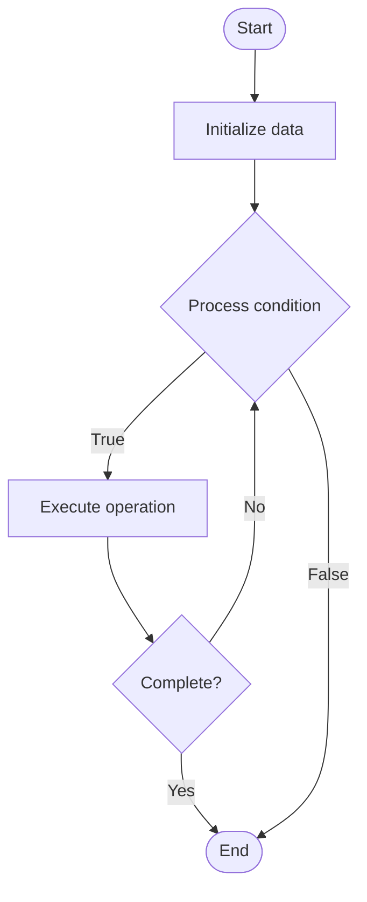

# Quantum Simulation Hybrid

## Учебные материалы

- [Школьный уровень](school.ru.md)
- [Университетский уровень](univer.ru.md)

## Algorithm Visualization

### Flowchart (ASCII)

```
Quantum Simulation Hybrid Flowchart:

┌─────────────┐
│   Start     │
└──────┬──────┘
       │
       ▼
┌─────────────┐
│  Initialize │
│   data      │
└──────┬──────┘
       │
       ▼
┌─────────────┐      Yes
│  Process   ├──────┐
│  condition?│      │
└──────┬──────┘      │
       │ No          │
       ▼             │
┌─────────────┐      │
│  Execute   │      │
│  operation │      │
└──────┬──────┘      │
       │             │
       └─────────────┘
       │
       ▼
┌─────────────┐
│    End      │
└─────────────┘
```

### Step-by-Step Execution

```
Quantum Simulation Hybrid Step-by-Step Execution:

Input: [example data]

Step 1: Initialize
State: [initial state]

Step 2: Process
State: [intermediate state]

Step 3: Finalize
State: [final state]

Result: [output]
```

### Interactive Flowchart (Mermaid)



> **Note**: Mermaid diagrams are rendered automatically on GitHub. For local viewing, use a Mermaid-compatible Markdown viewer.

- [Python Implementation](/code/semester_12/lecture_82_hybrid_quantum/quantum_simulation_hybrid/algorithm.py)
- [Java Implementation](/code/semester_12/lecture_82_hybrid_quantum/quantum_simulation_hybrid/Algorithm.java)
- [Python Tests](/code/semester_12/lecture_82_hybrid_quantum/quantum_simulation_hybrid/test_algorithm.py)

What problem does it solve? (1 sentence)  
Combines quantum simulation with classical simulation, using quantum computers for quantum parts of systems while classical computers simulate classical parts, enabling efficient simulation of hybrid quantum-classical systems.

Intuition (plain-language explanation)  
   Like hybrid simulation: Quantum Simulation Hybrid combines quantum and classical simulation - you simulate quantum parts on quantum computers, and classical parts on classical computers - just as hybrid approaches combine strengths, quantum simulation hybrid combines quantum and classical simulation strengths.

Inputs & Outputs  

  - Input: Hybrid systems, quantum Hamiltonians, classical models, simulation parameters, coupling terms.  
  - Output: Hybrid simulation results, quantum states, classical states, coupled dynamics, simulation data.

Step-by-step description (5–10 lines max)  
Decompose: decompose system into quantum and classical parts.
Quantum: simulate quantum part on quantum computer.
Classical: simulate classical part classically.
Couple: couple quantum and classical parts.
Evolve: evolve hybrid system in time.
Exchange: exchange information between parts.
Iterate: iterate time evolution steps.
Measure: measure quantum and classical observables.
Analyze: analyze hybrid simulation results.
Validate: validate against known results.

Tiny example (hand-simulated)  
   Quantum Simulation Hybrid: system: molecule + environment → quantum: simulate molecule → classical: simulate environment → couple: exchange energy → evolve: time evolution → result: accurate hybrid simulation → Quantum Simulation Hybrid successful.

Time & Space Complexity  

  - Time: O(q·c·t) where q is quantum simulation time, c is classical time, t is time steps (varies by system).  
  - Space: O(n + m) where n is qubits, m is classical state storage (hybrid storage).

Strengths  

- Efficiency: enables efficient simulation of hybrid systems.
- Accuracy: provides accurate simulation of quantum-classical coupling.
- Practical: enables practical simulation of complex systems.

Weaknesses / limitations  

- Complexity: hybrid simulation is complex to design.
- Coupling: quantum-classical coupling can be challenging.
- Synchronization: requires synchronization between simulations.

Compare with alternatives  
    Alternatives: Pure Quantum Simulation, Pure Classical Simulation, Approximate Methods, Hybrid Frameworks

30-second explanation (your own words)  
Combines quantum simulation with classical simulation, using quantum computers for quantum parts of systems while classical computers simulate classical parts, enabling efficient simulation of hybrid quantum-classical systems.

*Sources: Adapted from standard university textbooks and Wikipedia summaries.*
