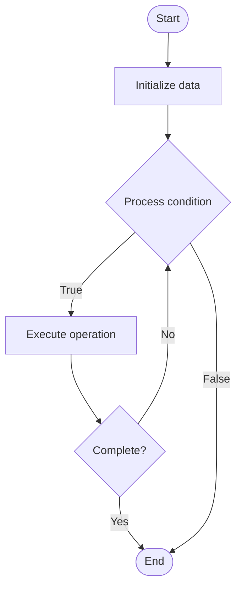

# Variational Quantum Algorithms (VQA)

Name of Algorithm  

## Code Files


## Algorithm Visualization

### Flowchart (ASCII)


```
Variational Quantum Algorithms (VQA) Flowchart:

┌─────────────┐
│   Start     │
└──────┬──────┘
       │
       ▼
┌─────────────┐
│  Initialize │
│   data      │
└──────┬──────┘
       │
       ▼
┌─────────────┐      Yes
│  Process   ├──────┐
│  condition?│      │
└──────┬──────┘      │
       │ No          │
       ▼             │
┌─────────────┐      │
│  Execute   │      │
│  operation │      │
└──────┬──────┘      │
       │             │
       └─────────────┘
       │
       ▼
┌─────────────┐
│    End      │
└─────────────┘
```


### Step-by-Step Execution


```
Variational Quantum Algorithms (VQA) Step-by-Step Execution:

Input: [example data]

Step 1: Initialize
State: [initial state]

Step 2: Process
State: [intermediate state]

Step 3: Finalize
State: [final state]

Result: [output]
```


### Interactive Flowchart (Mermaid)





> **Note**: Mermaid diagrams are rendered automatically on GitHub. For local viewing, use a Mermaid-compatible Markdown viewer.
- [Python Implementation](/code/semester_12/lecture_82_hybrid_quantum/variational_quantum/algorithm.py)
- [Java Implementation](/code/semester_12/lecture_82_hybrid_quantum/variational_quantum/Algorithm.java)
- [Python Tests](/code/semester_12/lecture_82_hybrid_quantum/variational_quantum/test_algorithm.py)


   Variational Quantum Algorithms (VQA)

What problem does it solve? (1 sentence)  
   Solves optimization and machine learning problems by using parameterized quantum circuits (variational circuits) that are optimized classically to minimize a cost function.

Intuition (plain-language explanation)  
   Like training a quantum neural network: Variational quantum algorithms are like training a neural network, but the network is quantum - you have a quantum circuit with adjustable parameters (like weights), you run it on a quantum computer to get results, then use a classical computer to adjust the parameters to minimize a cost function - repeat until you find the best parameters.

Inputs & Outputs  
   - Input: Cost function, variational circuit ansatz, initial parameters, quantum device, classical optimizer, convergence criteria.  
   - Output: Optimized parameters, minimum cost value, optimized quantum state, convergence history.

Step-by-step description (5–10 lines max)  
Design: design variational circuit ansatz (parameterized circuit).
Initialize: initialize circuit parameters randomly or heuristically.
Prepare: prepare quantum state using variational circuit.
Measure: measure quantum state to compute cost function.
Evaluate: evaluate cost function value.
Optimize: use classical optimizer to update parameters.
Update: update circuit parameters.
Iterate: repeat preparation, measurement, and optimization.
Converge: converge to optimal parameters.
Extract: extract solution from optimized quantum state.

Tiny example (hand-simulated)  
   VQE: design ansatz → initialize parameters → prepare |ψ(θ)⟩ → measure energy ⟨H⟩ → evaluate E(θ) = 2.5 → optimize θ → update → repeat → converge → E(θ*) = 1.8 → VQE successful.

Time & Space Complexity  
   - Time: O(i * (q + c)) where i is optimization iterations, q is quantum evaluation time, c is classical optimization time (variational complexity).  
   - Space: O(n) qubits for n-qubit variational circuit (quantum state space).

Strengths  
- Near-term: suitable for noisy intermediate-scale quantum (NISQ) devices.
- Flexible: applicable to optimization, ML, and chemistry problems.
- Hybrid: leverages both quantum and classical advantages.

Weaknesses / limitations  
- Barren plateaus: optimization can get stuck in flat regions.
- Expressibility: ansatz design is crucial and problem-dependent.
- Convergence: may require many iterations to converge.

Compare with alternatives  
Alternatives: Quantum Approximate Optimization Algorithm, Quantum Machine Learning, Quantum Chemistry Algorithms, Classical Optimization

30-second explanation (your own words)  
    A class of hybrid quantum-classical algorithms that use parameterized quantum circuits optimized classically to solve optimization and machine learning problems.

*Sources: Adapted from standard university textbooks and Wikipedia summaries.*
