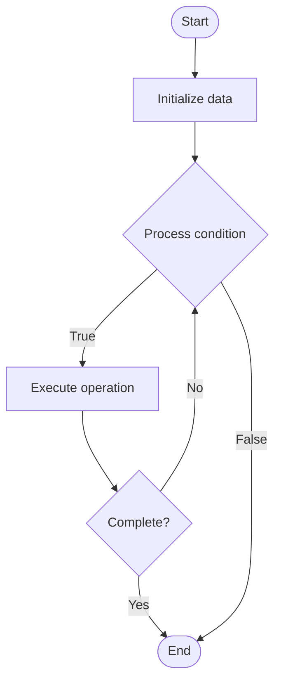

# Quantum Debugging

## Учебные материалы

- [Школьный уровень](school.ru.md)
- [Университетский уровень](univer.ru.md)

## Algorithm Visualization

### Flowchart (ASCII)

```
Quantum Debugging Flowchart:

┌─────────────┐
│   Start     │
└──────┬──────┘
       │
       ▼
┌─────────────┐
│  Initialize │
│   data      │
└──────┬──────┘
       │
       ▼
┌─────────────┐      Yes
│  Process   ├──────┐
│  condition?│      │
└──────┬──────┘      │
       │ No          │
       ▼             │
┌─────────────┐      │
│  Execute   │      │
│  operation │      │
└──────┬──────┘      │
       │             │
       └─────────────┘
       │
       ▼
┌─────────────┐
│    End      │
└─────────────┘
```

### Step-by-Step Execution

```
Quantum Debugging Step-by-Step Execution:

Input: [example data]

Step 1: Initialize
State: [initial state]

Step 2: Process
State: [intermediate state]

Step 3: Finalize
State: [final state]

Result: [output]
```

### Interactive Flowchart (Mermaid)



> **Note**: Mermaid diagrams are rendered automatically on GitHub. For local viewing, use a Mermaid-compatible Markdown viewer.

- [Python Implementation](/code/semester_12/lecture_83_quantum_software/quantum_debugging/algorithm.py)
- [Java Implementation](/code/semester_12/lecture_83_quantum_software/quantum_debugging/Algorithm.java)
- [Python Tests](/code/semester_12/lecture_83_quantum_software/quantum_debugging/test_algorithm.py)

What problem does it solve? (1 sentence)  
   Debugs quantum programs and circuits by identifying errors, analyzing quantum state evolution, and validating quantum operations, addressing unique challenges of quantum computing like superposition and measurement.

Intuition (plain-language explanation)  
   Like debugging for quantum: Quantum Debugging is like debugging but for quantum programs - you find bugs (errors) in quantum circuits, but it's harder because quantum states are probabilistic and measurement destroys them - just as you debug classical programs, you debug quantum programs, but with quantum-specific challenges.

Inputs & Outputs  

  - Input: Quantum programs, circuits, expected behavior, quantum states, measurement results, error models.  
  - Output: Debugged programs, error identification, corrected circuits, validation results, debugging reports.

Step-by-step description (5–10 lines max)  
Identify: identify unexpected behavior or errors.
Analyze: analyze quantum circuit and state evolution.
Instrument: instrument circuit for debugging.
Simulate: simulate on quantum simulator.
Measure: measure intermediate quantum states (carefully).
Trace: trace quantum state evolution.
Isolate: isolate error location.
Fix: fix identified errors.
Validate: validate fixes.
Iterate: iterate until program works correctly.

Tiny example (hand-simulated)  
   Quantum Debugging: program: Grover's algorithm not working → analyze: circuit structure → simulate: trace state evolution → identify: oracle error → fix: correct oracle → validate: algorithm works → result: debugged quantum program → Quantum Debugging successful.

Time & Space Complexity  

  - Time: O(d + s + a) where d is debugging time, s is simulation time, a is analysis time (varies by complexity).  
  - Space: O(n + d) where n is qubits, d is debugging data storage (state snapshots, traces).

Strengths  

- Error detection: helps identify errors in quantum programs.
- Validation: validates quantum program correctness.
- Learning: helps understand quantum program behavior.

Weaknesses / limitations  

- Measurement: measurement destroys quantum states (challenge).
- Probabilistic: probabilistic results complicate debugging.
- Complexity: debugging quantum programs is complex.

Compare with alternatives  
    Alternatives: No Debugging, Simulation Only, Formal Verification, Testing

30-second explanation (your own words)  
    Debugs quantum programs and circuits by identifying errors, analyzing quantum state evolution, and validating quantum operations, addressing unique challenges of quantum computing like superposition and measurement.

*Sources: Adapted from standard university textbooks and Wikipedia summaries.*
