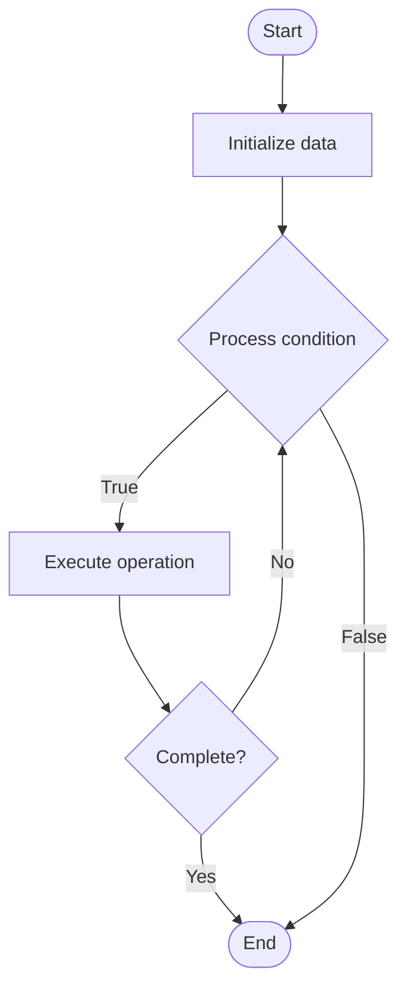

# Quantum Optimization Tools

## Учебные материалы

- [Школьный уровень](school.ru.md)
- [Университетский уровень](univer.ru.md)

## Algorithm Visualization

### Flowchart (ASCII)

```
Quantum Optimization Tools Flowchart:

┌─────────────┐
│   Start     │
└──────┬──────┘
       │
       ▼
┌─────────────┐
│  Initialize │
│   data      │
└──────┬──────┘
       │
       ▼
┌─────────────┐      Yes
│  Process   ├──────┐
│  condition?│      │
└──────┬──────┘      │
       │ No          │
       ▼             │
┌─────────────┐      │
│  Execute   │      │
│  operation │      │
└──────┬──────┘      │
       │             │
       └─────────────┘
       │
       ▼
┌─────────────┐
│    End      │
└─────────────┘
```

### Step-by-Step Execution

```
Quantum Optimization Tools Step-by-Step Execution:

Input: [example data]

Step 1: Initialize
State: [initial state]

Step 2: Process
State: [intermediate state]

Step 3: Finalize
State: [final state]

Result: [output]
```

### Interactive Flowchart (Mermaid)



> **Note**: Mermaid diagrams are rendered automatically on GitHub. For local viewing, use a Mermaid-compatible Markdown viewer.

- [Python Implementation](/code/semester_12/lecture_83_quantum_software/quantum_optimization_tools/algorithm.py)
- [Java Implementation](/code/semester_12/lecture_83_quantum_software/quantum_optimization_tools/Algorithm.java)
- [Python Tests](/code/semester_12/lecture_83_quantum_software/quantum_optimization_tools/test_algorithm.py)

What problem does it solve? (1 sentence)  
Provides tools and frameworks for quantum optimization, enabling developers to formulate, solve, and optimize problems using quantum algorithms like QAOA and quantum annealing.

Intuition (plain-language explanation)  
Like optimization tools for quantum: Quantum Optimization Tools are like optimization tools but for quantum computers - you use tools to formulate problems (like QUBO), solve them with quantum algorithms, and optimize solutions - just as optimization tools help solve classical problems, quantum optimization tools help solve problems with quantum computers.

Inputs & Outputs  

- Input: Optimization problems, problem formulations, quantum algorithms, optimization parameters, tools and frameworks.
- Output: Optimized solutions, problem formulations, quantum circuits, optimization results, tool outputs.

Step-by-step description (5–10 lines max)  
Formulate: formulate problem (QUBO, Ising).
Encode: encode into quantum format.
Select: select quantum optimization algorithm.
Configure: configure algorithm parameters.
Execute: execute on quantum computer or simulator.
Optimize: optimize parameters.
Solve: solve optimization problem.
Extract: extract solution.
Validate: validate solution quality.
Iterate: iterate to improve solution.

Tiny example (hand-simulated)  
   Quantum Optimization Tools: problem: max-cut → formulate: QUBO → encode: Ising Hamiltonian → QAOA: configure algorithm → execute: run on quantum computer → optimize: improve parameters → result: optimal cut found → Quantum Optimization Tools successful.

Time & Space Complexity  

  - Time: O(f + e + o) where f is formulation time, e is execution time, o is optimization time (varies by problem).  
  - Space: O(n + t) where n is problem size, t is tool storage (problem data, results).

Strengths  

- Ease: makes quantum optimization accessible.
- Efficiency: provides efficient problem formulation and solving.
- Flexibility: supports various optimization problems.

Weaknesses / limitations  

- Learning: requires learning quantum optimization concepts.
- Hardware: limited by quantum hardware availability.
- Optimality: may provide approximate, not exact solutions.

Compare with alternatives  
    Alternatives: Manual Formulation, Classical Optimization Tools, Quantum-Inspired, Custom Solutions

30-second explanation (your own words)  
Provides tools and frameworks for quantum optimization, enabling developers to formulate, solve, and optimize problems using quantum algorithms like QAOA and quantum annealing.

*Sources: Adapted from standard university textbooks and Wikipedia summaries.*
