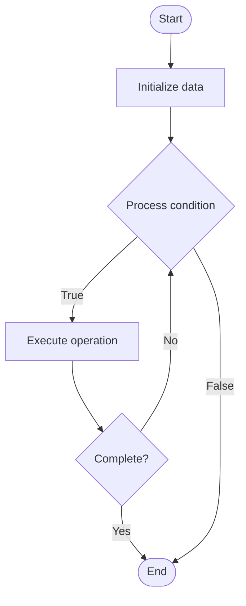

# Quantum Programming

1. **Name of Algorithm**  

## Code Files


## Algorithm Visualization

### Flowchart (ASCII)


```
Quantum Programming Flowchart:

┌─────────────┐
│   Start     │
└──────┬──────┘
       │
       ▼
┌─────────────┐
│  Initialize │
│   data      │
└──────┬──────┘
       │
       ▼
┌─────────────┐      Yes
│  Process   ├──────┐
│  condition?│      │
└──────┬──────┘      │
       │ No          │
       ▼             │
┌─────────────┐      │
│  Execute   │      │
│  operation │      │
└──────┬──────┘      │
       │             │
       └─────────────┘
       │
       ▼
┌─────────────┐
│    End      │
└─────────────┘
```


### Step-by-Step Execution


```
Quantum Programming Step-by-Step Execution:

Input: [example data]

Step 1: Initialize
State: [initial state]

Step 2: Process
State: [intermediate state]

Step 3: Finalize
State: [final state]

Result: [output]
```


### Interactive Flowchart (Mermaid)





> **Note**: Mermaid diagrams are rendered automatically on GitHub. For local viewing, use a Mermaid-compatible Markdown viewer.
- [Python Implementation](semester_12/lecture_83_quantum_software/quantum_programming/algorithm.py)
- [Java Implementation](semester_12/lecture_83_quantum_software/quantum_programming/Algorithm.java)
- [Python Tests](semester_12/lecture_83_quantum_software/quantum_programming/test_algorithm.py)


   Quantum Programming

2. **What problem does it solve? (1 sentence)**  
   Develops software and algorithms for quantum computers using quantum programming languages and frameworks, enabling developers to write, test, and execute quantum programs.

3. **Intuition (plain-language explanation)**  
   Like programming for quantum: Quantum Programming is like programming but for quantum computers - you write code (quantum circuits) using quantum languages (like Qiskit, Cirq) that run on quantum hardware - just as you program classical computers, you program quantum computers with quantum code.

4. **Inputs & Outputs**  
   - Input: Quantum algorithms, programming language, quantum circuits, gates, measurements.  
   - Output: Quantum programs, compiled circuits, executable code, quantum results, optimized programs.

5. **Step-by-step description (5–10 lines max)**  
1. Design: design quantum algorithm.
2. Code: write quantum program in quantum language.
3. Compile: compile to quantum gates.
4. Optimize: optimize quantum circuit.
5. Simulate: simulate on quantum simulator.
6. Test: test quantum program.
7. Execute: execute on quantum hardware.
8. Measure: measure quantum results.
9. Analyze: analyze results.
10. Iterate: iterate and improve.

6. **Tiny example (hand-simulated)**  
   Quantum Programming: algorithm: Grover's search → code: Qiskit program → compile: to gates → simulate: test on simulator → execute: run on quantum computer → measure: get result → result: search successful → Quantum Programming successful.

7. **Time & Space Complexity**  
   - Time: O(d) where d is circuit depth (program execution time).  
   - Space: O(n) where n is number of qubits (quantum register size).

8. **Strengths**  
- Abstraction: provides high-level abstraction for quantum computing.
- Portability: programs can run on different quantum hardware.
- Ecosystem: growing ecosystem of tools and libraries.

9. **Weaknesses / limitations**  
- Learning: requires learning quantum concepts.
- Hardware: limited by quantum hardware availability.
- Debugging: debugging quantum programs is challenging.

10. **Compare with alternatives**  
    Alternatives: Gate-Level Programming, Hardware-Specific, Quantum Assembly, Visual Programming

11. **30-second explanation (your own words)**  
    Develops software and algorithms for quantum computers using quantum programming languages and frameworks, enabling developers to write, test, and execute quantum programs.

*Sources: Adapted from standard university textbooks and Wikipedia summaries.*
