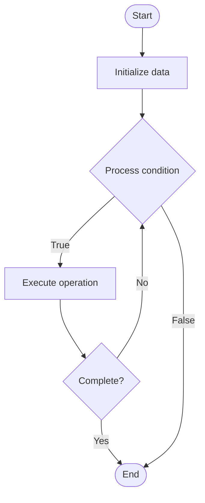

# Quantum Software Stack

Name of Algorithm  

## Code Files


## Algorithm Visualization

### Flowchart (ASCII)


```
Quantum Software Stack Flowchart:

┌─────────────┐
│   Start     │
└──────┬──────┘
       │
       ▼
┌─────────────┐
│  Initialize │
│   data      │
└──────┬──────┘
       │
       ▼
┌─────────────┐      Yes
│  Process   ├──────┐
│  condition?│      │
└──────┬──────┘      │
       │ No          │
       ▼             │
┌─────────────┐      │
│  Execute   │      │
│  operation │      │
└──────┬──────┘      │
       │             │
       └─────────────┘
       │
       ▼
┌─────────────┐
│    End      │
└─────────────┘
```


### Step-by-Step Execution


```
Quantum Software Stack Step-by-Step Execution:

Input: [example data]

Step 1: Initialize
State: [initial state]

Step 2: Process
State: [intermediate state]

Step 3: Finalize
State: [final state]

Result: [output]
```


### Interactive Flowchart (Mermaid)





> **Note**: Mermaid diagrams are rendered automatically on GitHub. For local viewing, use a Mermaid-compatible Markdown viewer.
- [Python Implementation](/code/semester_12/lecture_83_quantum_software/quantum_software_stack/algorithm.py)
- [Java Implementation](/code/semester_12/lecture_83_quantum_software/quantum_software_stack/Algorithm.java)
- [Python Tests](/code/semester_12/lecture_83_quantum_software/quantum_software_stack/test_algorithm.py)


   Quantum Software Stack

What problem does it solve? (1 sentence)  
   Provides layered software stack for quantum computing, from high-level programming languages to low-level quantum gates, enabling development and execution of quantum applications.

Intuition (plain-language explanation)  
   Like software stack for quantum: Quantum Software Stack is like a software stack but for quantum computers - you have layers from high-level (quantum languages) to low-level (quantum gates), just like classical stacks - just as software stacks enable classical computing, quantum software stacks enable quantum computing.

Inputs & Outputs  
   - Input: Quantum programs, high-level languages, compilers, quantum circuits, hardware interfaces, execution environments.  
   - Output: Compiled circuits, executable quantum programs, optimized code, hardware-specific programs, quantum results.

Step-by-step description (5–10 lines max)  
Program: write quantum program in high-level language.
Compile: compile to quantum gates.
Optimize: optimize quantum circuit.
Target: target specific quantum hardware.
Execute: execute on quantum computer or simulator.
Measure: measure quantum results.
Process: process results.
Return: return program outputs.
Debug: debug if needed.
Iterate: iterate development cycle.

Tiny example (hand-simulated)  
   Quantum Software Stack: program: Qiskit code → compile: to gates → optimize: circuit optimization → target: IBM quantum hardware → execute: run on quantum computer → result: quantum program executed → Quantum Software Stack operational.

Time & Space Complexity  
   - Time: O(c + e) where c is compilation time, e is execution time (varies by program).  
   - Space: O(s + h) where s is stack storage, h is hardware interface storage (software layers).

Strengths  
- Abstraction: provides high-level abstraction for quantum computing.
- Portability: enables portability across quantum hardware.
- Ecosystem: growing ecosystem of tools and libraries.

Weaknesses / limitations  
- Complexity: quantum software stacks are complex.
- Maturity: field is still maturing.
- Hardware: limited by quantum hardware capabilities.

Compare with alternatives  
    Alternatives: Gate-Level Programming, Hardware-Specific, Low-Level Assembly, Visual Programming

30-second explanation (your own words)  
    Provides layered software stack for quantum computing, from high-level programming languages to low-level quantum gates, enabling development and execution of quantum applications.

*Sources: Adapted from standard university textbooks and Wikipedia summaries.*
