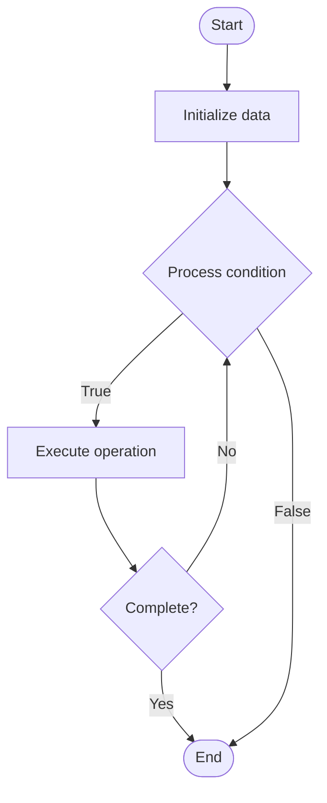

# Quantum Testing

## Учебные материалы

- [Школьный уровень](school.ru.md)
- [Университетский уровень](univer.ru.md)

## Algorithm Visualization

### Flowchart (ASCII)

```
Quantum Testing Flowchart:

┌─────────────┐
│   Start     │
└──────┬──────┘
       │
       ▼
┌─────────────┐
│  Initialize │
│   data      │
└──────┬──────┘
       │
       ▼
┌─────────────┐      Yes
│  Process   ├──────┐
│  condition?│      │
└──────┬──────┘      │
       │ No          │
       ▼             │
┌─────────────┐      │
│  Execute   │      │
│  operation │      │
└──────┬──────┘      │
       │             │
       └─────────────┘
       │
       ▼
┌─────────────┐
│    End      │
└─────────────┘
```

### Step-by-Step Execution

```
Quantum Testing Step-by-Step Execution:

Input: [example data]

Step 1: Initialize
State: [initial state]

Step 2: Process
State: [intermediate state]

Step 3: Finalize
State: [final state]

Result: [output]
```

### Interactive Flowchart (Mermaid)



> **Note**: Mermaid diagrams are rendered automatically on GitHub. For local viewing, use a Mermaid-compatible Markdown viewer.

- [Python Implementation](/code/semester_12/lecture_83_quantum_software/quantum_testing/algorithm.py)
- [Java Implementation](/code/semester_12/lecture_83_quantum_software/quantum_testing/Algorithm.java)
- [Python Tests](/code/semester_12/lecture_83_quantum_software/quantum_testing/test_algorithm.py)

What problem does it solve? (1 sentence)  
Tests and validates quantum programs, circuits, and algorithms to ensure correctness, performance, and reliability, addressing unique challenges of quantum computing like noise and measurement.

Intuition (plain-language explanation)  
   Like testing for quantum: Quantum Testing is like software testing but for quantum programs - you test quantum circuits to make sure they work correctly, handle noise, and produce expected results - just as you test classical software, you test quantum software, but with quantum-specific challenges.

Inputs & Outputs  

  - Input: Quantum programs, test cases, expected outputs, noise models, test frameworks.  
  - Output: Test results, validation reports, bug reports, performance metrics, reliability assessments.

Step-by-step description (5–10 lines max)  
Design: design test cases for quantum program.
Unit test: test individual quantum gates and circuits.
Integration test: test complete quantum algorithms.
Simulate: test on quantum simulators.
Noise test: test with noise models.
Hardware test: test on quantum hardware.
Validate: validate against expected results.
Benchmark: benchmark performance.
Debug: debug quantum bugs.
Report: report test results.

Tiny example (hand-simulated)  
   Quantum Testing: program: Grover's algorithm → unit test: test oracle → integration test: test full algorithm → simulate: test on simulator → noise test: test with noise → hardware test: test on real hardware → result: tests pass → Quantum Testing successful.

Time & Space Complexity  

  - Time: O(t·d) where t is test cases, d is circuit depth (testing time).  
  - Space: O(n) where n is qubits (quantum state space).

Strengths  

- Validation: validates quantum program correctness.
- Reliability: improves quantum program reliability.
- Debugging: helps identify quantum bugs.

Weaknesses / limitations  

- Noise: quantum noise makes testing challenging.
- Measurement: probabilistic results complicate testing.
- Hardware: limited hardware access for testing.

Compare with alternatives  
    Alternatives: No Testing, Simulation Only, Hardware Only, Formal Verification

30-second explanation (your own words)  
Tests and validates quantum programs, circuits, and algorithms to ensure correctness, performance, and reliability, addressing unique challenges of quantum computing like noise and measurement.

*Sources: Adapted from standard university textbooks and Wikipedia summaries.*


## References

- [Quantum Testing - Wikipedia](https://en.wikipedia.org/wiki/Quantum%20Testing)
