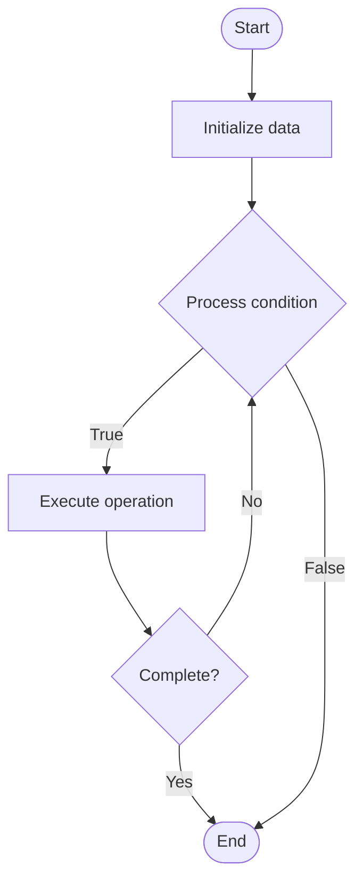

# Quantum Verification

1. **Name of Algorithm**  

## Code Files


## Algorithm Visualization

### Flowchart (ASCII)


```
Quantum Verification Flowchart:

┌─────────────┐
│   Start     │
└──────┬──────┘
       │
       ▼
┌─────────────┐
│  Initialize │
│   data      │
└──────┬──────┘
       │
       ▼
┌─────────────┐      Yes
│  Process   ├──────┐
│  condition?│      │
└──────┬──────┘      │
       │ No          │
       ▼             │
┌─────────────┐      │
│  Execute   │      │
│  operation │      │
└──────┬──────┘      │
       │             │
       └─────────────┘
       │
       ▼
┌─────────────┐
│    End      │
└─────────────┘
```


### Step-by-Step Execution


```
Quantum Verification Step-by-Step Execution:

Input: [example data]

Step 1: Initialize
State: [initial state]

Step 2: Process
State: [intermediate state]

Step 3: Finalize
State: [final state]

Result: [output]
```


### Interactive Flowchart (Mermaid)





> **Note**: Mermaid diagrams are rendered automatically on GitHub. For local viewing, use a Mermaid-compatible Markdown viewer.
- [Python Implementation](semester_12/lecture_83_quantum_software/quantum_verification/algorithm.py)
- [Java Implementation](semester_12/lecture_83_quantum_software/quantum_verification/Algorithm.java)
- [Python Tests](semester_12/lecture_83_quantum_software/quantum_verification/test_algorithm.py)


   Quantum Verification

2. **What problem does it solve? (1 sentence)**  
   Verifies correctness of quantum programs and circuits through formal methods, testing, and validation techniques, ensuring quantum algorithms work as intended.

3. **Intuition (plain-language explanation)**  
Like verification for quantum: Quantum Verification is like software verification but for quantum programs - you verify that quantum circuits are correct (do what they're supposed to do) using formal methods and testing - just as you verify classical software, you verify quantum software to ensure correctness.

4. **Inputs & Outputs**  
   - Input: Quantum programs, specifications, verification methods, test cases, formal models, validation criteria.  
   - Output: Verification results, correctness proofs, test outcomes, validation reports, verified programs.

5. **Step-by-step description (5–10 lines max)**  
1. Specify: specify program requirements and behavior.
2. Model: model quantum program formally.
3. Verify: verify correctness using formal methods.
4. Test: test quantum program.
5. Validate: validate against specifications.
6. Prove: prove correctness properties.
7. Check: check quantum properties.
8. Report: report verification results.
9. Fix: fix issues if found.
10. Iterate: iterate until verified.

6. **Tiny example (hand-simulated)**  
   Quantum Verification: program: Shor's algorithm → specify: factorization requirements → model: formal model → verify: prove correctness → test: test on examples → validate: validate factorization → result: verified quantum program → Quantum Verification successful.

7. **Time & Space Complexity**  
   - Time: O(v + t + p) where v is verification time, t is testing time, p is proof time (varies by method).  
   - Space: O(m + v) where m is model storage, v is verification data storage (proofs, test results).

8. **Strengths**  
- Correctness: ensures quantum program correctness.
- Reliability: improves reliability of quantum programs.
- Trust: increases trust in quantum systems.

9. **Weaknesses / limitations**  
- Complexity: quantum verification is complex.
- Methods: verification methods are still developing.
- Coverage: may not verify all properties.

10. **Compare with alternatives**  
    Alternatives: No Verification, Testing Only, Simulation, Formal Methods

11. **30-second explanation (your own words)**  
    Verifies correctness of quantum programs and circuits through formal methods, testing, and validation techniques, ensuring quantum algorithms work as intended.

*Sources: Adapted from standard university textbooks and Wikipedia summaries.*
