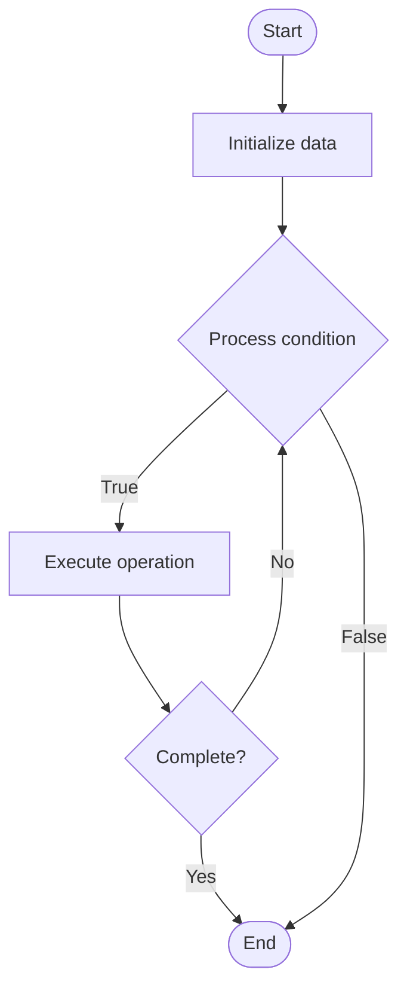

# Quantum Calibration

1. **Name of Algorithm**  

## Code Files


## Algorithm Visualization

### Flowchart (ASCII)


```
Quantum Calibration Flowchart:

┌─────────────┐
│   Start     │
└──────┬──────┘
       │
       ▼
┌─────────────┐
│  Initialize │
│   data      │
└──────┬──────┘
       │
       ▼
┌─────────────┐      Yes
│  Process   ├──────┐
│  condition?│      │
└──────┬──────┘      │
       │ No          │
       ▼             │
┌─────────────┐      │
│  Execute   │      │
│  operation │      │
└──────┬──────┘      │
       │             │
       └─────────────┘
       │
       ▼
┌─────────────┐
│    End      │
└─────────────┘
```


### Step-by-Step Execution


```
Quantum Calibration Step-by-Step Execution:

Input: [example data]

Step 1: Initialize
State: [initial state]

Step 2: Process
State: [intermediate state]

Step 3: Finalize
State: [final state]

Result: [output]
```


### Interactive Flowchart (Mermaid)





> **Note**: Mermaid diagrams are rendered automatically on GitHub. For local viewing, use a Mermaid-compatible Markdown viewer.
- [Python Implementation](semester_12/lecture_84_quantum_hardware/quantum_calibration/algorithm.py)
- [Java Implementation](semester_12/lecture_84_quantum_hardware/quantum_calibration/Algorithm.java)
- [Python Tests](semester_12/lecture_84_quantum_hardware/quantum_calibration/test_algorithm.py)


   Quantum Calibration

2. **What problem does it solve? (1 sentence)**  
Calibrates quantum hardware to optimize gate fidelities, reduce errors, and maintain system performance, ensuring quantum computers operate at peak performance.

3. **Intuition (plain-language explanation)**  
   Like tuning instruments: Quantum Calibration is like tuning musical instruments - you adjust parameters (like tuning pegs) to make the instrument (quantum computer) perform correctly - just as instruments need tuning, quantum computers need calibration to work accurately.

4. **Inputs & Outputs**  
   - Input: Quantum hardware, calibration protocols, target fidelities, measurement data, calibration parameters.  
   - Output: Calibrated hardware, optimized parameters, improved fidelities, calibration reports, system performance.

5. **Step-by-step description (5–10 lines max)**  
1. Measure: measure current gate fidelities.
2. Identify: identify calibration parameters.
3. Tune: tune control parameters.
4. Test: test gate operations.
5. Optimize: optimize for best fidelities.
6. Validate: validate calibration results.
7. Document: document calibrated parameters.
8. Monitor: monitor calibration drift.
9. Recalibrate: recalibrate as needed.
10. Maintain: maintain calibration over time.

6. **Tiny example (hand-simulated)**  
   Quantum Calibration: measure: gate fidelity 95% → tune: adjust control parameters → test: measure new fidelity → optimize: improve to 99.5% → validate: confirm improvement → result: calibrated quantum computer → Quantum Calibration successful.

7. **Time & Space Complexity**  
   - Time: O(m·t) where m is measurements, t is tuning time (calibration process).  
   - Space: O(p) where p is calibration parameters (parameter storage).

8. **Strengths**  
- Performance: improves quantum computer performance.
- Fidelity: increases gate fidelities.
- Reliability: improves system reliability.

9. **Weaknesses / limitations**  
- Time: calibration takes time.
- Drift: calibration drifts over time.
- Complexity: calibration can be complex.

10. **Compare with alternatives**  
    Alternatives: No Calibration, Manual Calibration, Automated Calibration, Continuous Calibration

11. **30-second explanation (your own words)**  
Calibrates quantum hardware to optimize gate fidelities, reduce errors, and maintain system performance, ensuring quantum computers operate at peak performance.

*Sources: Adapted from standard university textbooks and Wikipedia summaries.*
