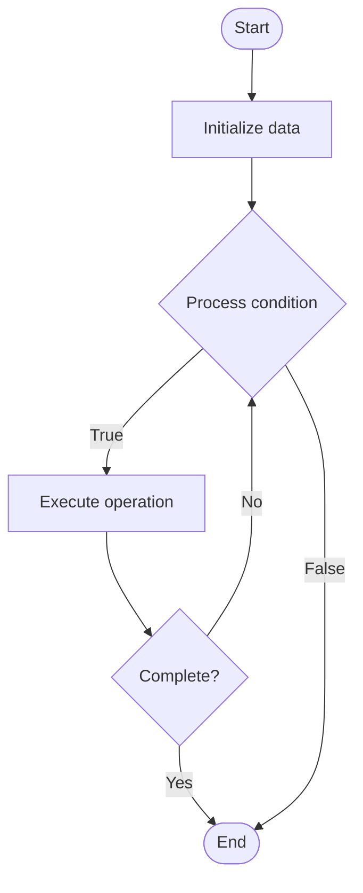

# Quantum Characterization

1. **Name of Algorithm**  

## Code Files


## Algorithm Visualization

### Flowchart (ASCII)


```
Quantum Characterization Flowchart:

┌─────────────┐
│   Start     │
└──────┬──────┘
       │
       ▼
┌─────────────┐
│  Initialize │
│   data      │
└──────┬──────┘
       │
       ▼
┌─────────────┐      Yes
│  Process   ├──────┐
│  condition?│      │
└──────┬──────┘      │
       │ No          │
       ▼             │
┌─────────────┐      │
│  Execute   │      │
│  operation │      │
└──────┬──────┘      │
       │             │
       └─────────────┘
       │
       ▼
┌─────────────┐
│    End      │
└─────────────┘
```


### Step-by-Step Execution


```
Quantum Characterization Step-by-Step Execution:

Input: [example data]

Step 1: Initialize
State: [initial state]

Step 2: Process
State: [intermediate state]

Step 3: Finalize
State: [final state]

Result: [output]
```


### Interactive Flowchart (Mermaid)





> **Note**: Mermaid diagrams are rendered automatically on GitHub. For local viewing, use a Mermaid-compatible Markdown viewer.
- [Python Implementation](semester_12/lecture_84_quantum_hardware/quantum_characterization/algorithm.py)
- [Java Implementation](semester_12/lecture_84_quantum_hardware/quantum_characterization/Algorithm.java)
- [Python Tests](semester_12/lecture_84_quantum_hardware/quantum_characterization/test_algorithm.py)


   Quantum Characterization

2. **What problem does it solve? (1 sentence)**  
   Characterizes quantum hardware properties like gate fidelities, coherence times, and error rates, providing detailed understanding of quantum system performance and limitations.

3. **Intuition (plain-language explanation)**  
   Like characterizing hardware: Quantum Characterization is like characterizing classical hardware - you measure performance (gate fidelities), reliability (error rates), and limitations (coherence times) - just as you characterize CPUs, you characterize quantum processors to understand their capabilities.

4. **Inputs & Outputs**  
   - Input: Quantum hardware, characterization protocols, measurement data, test sequences, analysis tools.  
   - Output: Characterization results, gate fidelities, error rates, coherence times, performance metrics, hardware reports.

5. **Step-by-step description (5–10 lines max)**  
1. Design: design characterization experiments.
2. Execute: execute test sequences.
3. Measure: measure quantum states and operations.
4. Collect: collect measurement data.
5. Analyze: analyze data for hardware properties.
6. Calculate: calculate fidelities and error rates.
7. Model: model hardware errors.
8. Report: report characterization results.
9. Validate: validate characterization accuracy.
10. Update: update hardware models.

6. **Tiny example (hand-simulated)**  
   Quantum Characterization: hardware: 5-qubit processor → test: randomized benchmarking → measure: gate fidelities → analyze: T1=100μs, T2=50μs, gate error=0.1% → result: hardware characterized → Quantum Characterization successful.

7. **Time & Space Complexity**  
   - Time: O(e·m·a) where e is experiments, m is measurements, a is analysis time (characterization process).  
   - Space: O(d + m) where d is data storage, m is model storage (characterization data, error models).

8. **Strengths**  
- Understanding: provides detailed understanding of quantum hardware.
- Optimization: enables optimization based on hardware properties.
- Reliability: improves reliability through hardware knowledge.

9. **Weaknesses / limitations**  
- Time: characterization takes time.
- Complexity: characterization can be complex.
- Variability: hardware properties may vary over time.

10. **Compare with alternatives**  
    Alternatives: No Characterization, Basic Testing, Partial Characterization, Continuous Characterization

11. **30-second explanation (your own words)**  
    Characterizes quantum hardware properties like gate fidelities, coherence times, and error rates, providing detailed understanding of quantum system performance and limitations.

*Sources: Adapted from standard university textbooks and Wikipedia summaries.*
