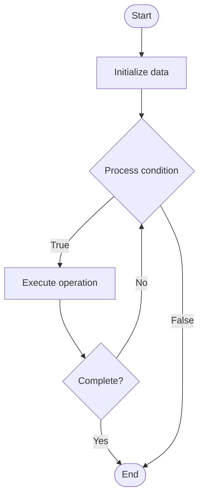

# Quantum Control

1. **Name of Algorithm**  

## Code Files


## Algorithm Visualization

### Flowchart (ASCII)


```
Quantum Control Flowchart:

┌─────────────┐
│   Start     │
└──────┬──────┘
       │
       ▼
┌─────────────┐
│  Initialize │
│   data      │
└──────┬──────┘
       │
       ▼
┌─────────────┐      Yes
│  Process   ├──────┐
│  condition?│      │
└──────┬──────┘      │
       │ No          │
       ▼             │
┌─────────────┐      │
│  Execute   │      │
│  operation │      │
└──────┬──────┘      │
       │             │
       └─────────────┘
       │
       ▼
┌─────────────┐
│    End      │
└─────────────┘
```


### Step-by-Step Execution


```
Quantum Control Step-by-Step Execution:

Input: [example data]

Step 1: Initialize
State: [initial state]

Step 2: Process
State: [intermediate state]

Step 3: Finalize
State: [final state]

Result: [output]
```


### Interactive Flowchart (Mermaid)





> **Note**: Mermaid diagrams are rendered automatically on GitHub. For local viewing, use a Mermaid-compatible Markdown viewer.
- [Python Implementation](semester_12/lecture_84_quantum_hardware/quantum_control/algorithm.py)
- [Java Implementation](semester_12/lecture_84_quantum_hardware/quantum_control/Algorithm.java)
- [Python Tests](semester_12/lecture_84_quantum_hardware/quantum_control/test_algorithm.py)


   Quantum Control

2. **What problem does it solve? (1 sentence)**  
   Controls and manipulates quantum systems (qubits) precisely using control pulses, gates, and feedback, enabling accurate quantum operations and maintaining quantum coherence.

3. **Intuition (plain-language explanation)**  
   Like controlling quantum systems: Quantum Control is like controlling quantum systems precisely - you send control signals (pulses) to qubits to perform operations (gates) accurately - just as you control machines with signals, you control qubits with quantum control signals.

4. **Inputs & Outputs**  
   - Input: Control pulses, gate specifications, qubit states, control parameters, feedback signals.  
   - Output: Controlled quantum operations, gate fidelities, quantum states, control sequences, optimized pulses.

5. **Step-by-step description (5–10 lines max)**  
1. Specify: specify desired quantum operation.
2. Design: design control pulse sequence.
3. Calibrate: calibrate control parameters.
4. Apply: apply control pulses to qubits.
5. Monitor: monitor qubit response.
6. Feedback: use feedback for correction.
7. Optimize: optimize pulse shapes.
8. Validate: validate operation fidelity.
9. Iterate: iterate for improvement.
10. Execute: execute controlled operation.

6. **Tiny example (hand-simulated)**  
   Quantum Control: operation: CNOT gate → design: control pulse sequence → calibrate: adjust parameters → apply: send pulses → monitor: measure fidelity → optimize: improve pulses → result: 99.9% gate fidelity → Quantum Control successful.

7. **Time & Space Complexity**  
   - Time: O(p) where p is pulse duration (control operation time).  
   - Space: O(1) per qubit (control signal storage).

8. **Strengths**  
- Precision: enables precise quantum operations.
- Fidelity: improves gate fidelities.
- Flexibility: flexible control for different operations.

9. **Weaknesses / limitations**  
- Complexity: quantum control is complex.
- Noise: control noise affects operations.
- Calibration: requires careful calibration.

10. **Compare with alternatives**  
    Alternatives: Fixed Gates, Open-Loop Control, Basic Control, Advanced Control

11. **30-second explanation (your own words)**  
    Controls and manipulates quantum systems (qubits) precisely using control pulses, gates, and feedback, enabling accurate quantum operations and maintaining quantum coherence.

*Sources: Adapted from standard university textbooks and Wikipedia summaries.*
