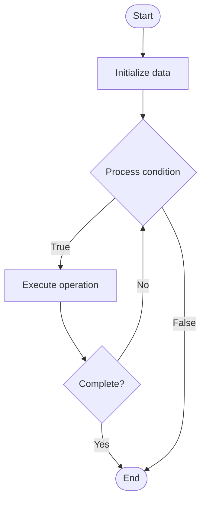

# Quantum Control Systems

## Учебные материалы

- [Школьный уровень](school.ru.md)
- [Университетский уровень](univer.ru.md)

## Algorithm Visualization

### Flowchart (ASCII)

```
Quantum Control Systems Flowchart:

┌─────────────┐
│   Start     │
└──────┬──────┘
       │
       ▼
┌─────────────┐
│  Initialize │
│   data      │
└──────┬──────┘
       │
       ▼
┌─────────────┐      Yes
│  Process   ├──────┐
│  condition?│      │
└──────┬──────┘      │
       │ No          │
       ▼             │
┌─────────────┐      │
│  Execute   │      │
│  operation │      │
└──────┬──────┘      │
       │             │
       └─────────────┘
       │
       ▼
┌─────────────┐
│    End      │
└─────────────┘
```

### Step-by-Step Execution

```
Quantum Control Systems Step-by-Step Execution:

Input: [example data]

Step 1: Initialize
State: [initial state]

Step 2: Process
State: [intermediate state]

Step 3: Finalize
State: [final state]

Result: [output]
```

### Interactive Flowchart (Mermaid)



> **Note**: Mermaid diagrams are rendered automatically on GitHub. For local viewing, use a Mermaid-compatible Markdown viewer.

- [Python Implementation](/code/semester_12/lecture_84_quantum_hardware/quantum_control_systems/algorithm.py)
- [Java Implementation](/code/semester_12/lecture_84_quantum_hardware/quantum_control_systems/Algorithm.java)
- [Python Tests](/code/semester_12/lecture_84_quantum_hardware/quantum_control_systems/test_algorithm.py)

What problem does it solve? (1 sentence)  
   Designs and implements control systems for quantum hardware, managing qubit manipulation, gate operations, and system coordination to enable accurate quantum computation.

Intuition (plain-language explanation)  
Like control systems for quantum: Quantum Control Systems are like control systems for machines but for quantum hardware - you control qubits (like controlling machines), coordinate operations (like coordinating machines), and ensure accuracy (like ensuring machines work correctly) - just as control systems manage machines, quantum control systems manage quantum hardware.

Inputs & Outputs  

  - Input: Control specifications, gate requirements, qubit states, control pulses, feedback signals, system parameters.  
  - Output: Controlled quantum operations, gate sequences, system coordination, accurate operations, control signals.

Step-by-step description (5–10 lines max)  
Specify: specify quantum operations to perform.
Design: design control system architecture.
Generate: generate control pulses.
Calibrate: calibrate control parameters.
Execute: execute control sequences.
Monitor: monitor qubit responses.
Feedback: use feedback for correction.
Coordinate: coordinate multiple qubits.
Optimize: optimize control performance.
Validate: validate control accuracy.

Tiny example (hand-simulated)  
   Quantum Control Systems: operation: CNOT gate → design: control system → generate: control pulses → calibrate: adjust parameters → execute: apply pulses → monitor: measure fidelity → result: 99.9% gate fidelity → Quantum Control Systems operational.

Time & Space Complexity  

  - Time: O(p + c + e) where p is pulse generation, c is calibration, e is execution time (control operations).  
  - Space: O(s + p) where s is system storage, p is pulse storage (control system data).

Strengths  

- Precision: enables precise quantum operations.
- Coordination: coordinates complex quantum operations.
- Reliability: improves reliability through control.

Weaknesses / limitations  

- Complexity: quantum control systems are complex.
- Calibration: requires careful calibration.
- Noise: control noise affects operations.

Compare with alternatives  
    Alternatives: Manual Control, Basic Control, Open-Loop Control, Advanced Feedback Control

30-second explanation (your own words)  
    Designs and implements control systems for quantum hardware, managing qubit manipulation, gate operations, and system coordination to enable accurate quantum computation.

*Sources: Adapted from standard university textbooks and Wikipedia summaries.*
