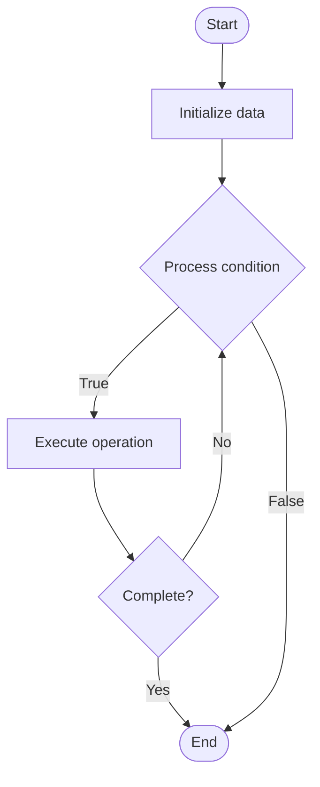

# Quantum Processors

1. **Name of Algorithm**  

## Code Files


## Algorithm Visualization

### Flowchart (ASCII)


```
Quantum Processors Flowchart:

┌─────────────┐
│   Start     │
└──────┬──────┘
       │
       ▼
┌─────────────┐
│  Initialize │
│   data      │
└──────┬──────┘
       │
       ▼
┌─────────────┐      Yes
│  Process   ├──────┐
│  condition?│      │
└──────┬──────┘      │
       │ No          │
       ▼             │
┌─────────────┐      │
│  Execute   │      │
│  operation │      │
└──────┬──────┘      │
       │             │
       └─────────────┘
       │
       ▼
┌─────────────┐
│    End      │
└─────────────┘
```


### Step-by-Step Execution


```
Quantum Processors Step-by-Step Execution:

Input: [example data]

Step 1: Initialize
State: [initial state]

Step 2: Process
State: [intermediate state]

Step 3: Finalize
State: [final state]

Result: [output]
```


### Interactive Flowchart (Mermaid)





> **Note**: Mermaid diagrams are rendered automatically on GitHub. For local viewing, use a Mermaid-compatible Markdown viewer.
- [Python Implementation](semester_12/lecture_84_quantum_hardware/quantum_processors/algorithm.py)
- [Java Implementation](semester_12/lecture_84_quantum_hardware/quantum_processors/Algorithm.java)
- [Python Tests](semester_12/lecture_84_quantum_hardware/quantum_processors/test_algorithm.py)


   Quantum Processors

2. **What problem does it solve? (1 sentence)**  
   Designs and implements quantum processors (quantum processing units), the hardware that executes quantum algorithms, managing qubits, gates, and quantum operations.

3. **Intuition (plain-language explanation)**  
   Like CPUs for quantum: Quantum Processors are like CPUs but for quantum computing - they're the hardware that runs quantum programs (like CPUs run programs), execute quantum gates (like CPUs execute instructions), and process quantum information - just as CPUs are the heart of classical computers, quantum processors are the heart of quantum computers.

4. **Inputs & Outputs**  
   - Input: Qubit technologies, gate specifications, connectivity requirements, control systems, quantum algorithms.  
   - Output: Quantum processors, qubit arrays, gate implementations, quantum operations, processed quantum states.

5. **Step-by-step description (5–10 lines max)**  
1. Design: design quantum processor architecture.
2. Fabricate: fabricate qubits and control systems.
3. Initialize: initialize qubits to known states.
4. Execute: execute quantum gates.
5. Manipulate: manipulate quantum states.
6. Measure: measure quantum states.
7. Control: control qubit operations.
8. Coordinate: coordinate multi-qubit operations.
9. Optimize: optimize processor performance.
10. Scale: scale to larger processors.

6. **Tiny example (hand-simulated)**  
   Quantum Processors: design: 5-qubit processor → fabricate: superconducting qubits → initialize: |0⟩ states → execute: quantum gates → measure: quantum states → result: quantum processor operational → Quantum Processors successful.

7. **Time & Space Complexity**  
   - Time: O(g) where g is number of gates (gate execution time, typically O(1) per gate).  
   - Space: O(n) where n is number of qubits (quantum state space, exponential in qubits).

8. **Strengths**  
- Execution: enables execution of quantum algorithms.
- Scalability: can scale to larger processors.
- Flexibility: supports various quantum algorithms.

9. **Weaknesses / limitations**  
- Noise: quantum noise limits processor performance.
- Coherence: limited coherence times.
- Scaling: scaling to many qubits is challenging.

10. **Compare with alternatives**  
    Alternatives: Quantum Simulators, Classical Simulation, Quantum Annealers, Specialized Quantum

11. **30-second explanation (your own words)**  

*Sources: Adapted from standard university textbooks and Wikipedia summaries.*
