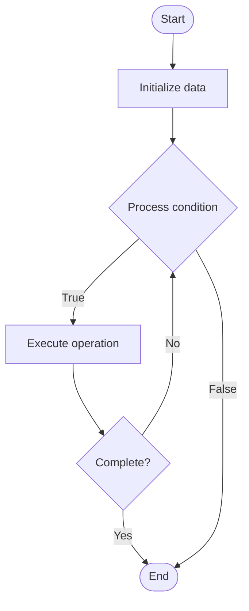

# Quantum Readout

## Учебные материалы

- [Школьный уровень](school.ru.md)
- [Университетский уровень](univer.ru.md)

## Algorithm Visualization

### Flowchart (ASCII)

```
Quantum Readout Flowchart:

┌─────────────┐
│   Start     │
└──────┬──────┘
       │
       ▼
┌─────────────┐
│  Initialize │
│   data      │
└──────┬──────┘
       │
       ▼
┌─────────────┐      Yes
│  Process   ├──────┐
│  condition?│      │
└──────┬──────┘      │
       │ No          │
       ▼             │
┌─────────────┐      │
│  Execute   │      │
│  operation │      │
└──────┬──────┘      │
       │             │
       └─────────────┘
       │
       ▼
┌─────────────┐
│    End      │
└─────────────┘
```

### Step-by-Step Execution

```
Quantum Readout Step-by-Step Execution:

Input: [example data]

Step 1: Initialize
State: [initial state]

Step 2: Process
State: [intermediate state]

Step 3: Finalize
State: [final state]

Result: [output]
```

### Interactive Flowchart (Mermaid)



> **Note**: Mermaid diagrams are rendered automatically on GitHub. For local viewing, use a Mermaid-compatible Markdown viewer.

- [Python Implementation](/code/semester_12/lecture_84_quantum_hardware/quantum_readout/algorithm.py)
- [Java Implementation](/code/semester_12/lecture_84_quantum_hardware/quantum_readout/Algorithm.java)
- [Python Tests](/code/semester_12/lecture_84_quantum_hardware/quantum_readout/test_algorithm.py)

What problem does it solve? (1 sentence)  
   Reads out quantum states by measuring qubits, converting quantum information into classical information, enabling extraction of results from quantum computations.

Intuition (plain-language explanation)  
   Like reading quantum states: Quantum Readout is like reading the state of qubits - you measure qubits (like reading sensors) to get classical information (0 or 1) from quantum states - just as you read sensors to get information, you read qubits to get quantum computation results.

Inputs & Outputs  

  - Input: Quantum states, qubits, measurement bases, readout systems, measurement protocols.  
  - Output: Measurement results, classical bits, quantum state information, readout data, computation results.

Step-by-step description (5–10 lines max)  
Prepare: prepare qubit in quantum state.
Select: select measurement basis.
Measure: measure qubit state.
Read: read measurement signal.
Convert: convert to classical bit.
Process: process measurement results.
Repeat: repeat measurements for statistics.
Analyze: analyze measurement data.
Extract: extract quantum information.
Report: report measurement results.

Tiny example (hand-simulated)  
   Quantum Readout: state: |ψ⟩ = α|0⟩ + β|1⟩ → measure: measure in Z basis → read: readout signal → convert: get 0 or 1 → repeat: 1000 measurements → analyze: estimate |α|² and |β|² → result: quantum state readout → Quantum Readout successful.

Time & Space Complexity  

  - Time: O(m) where m is number of measurements (readout time per measurement, typically O(1)).  
  - Space: O(1) per qubit (readout system storage).

Strengths  

- Extraction: enables extraction of quantum computation results.
- Information: provides information about quantum states.
- Essential: essential for quantum computing.

Weaknesses / limitations  

- Destruction: measurement destroys quantum superposition.
- Noise: readout noise affects measurement accuracy.
- Fidelity: readout fidelity may be imperfect.

Compare with alternatives  
    Alternatives: No Measurement, Weak Measurement, Quantum Non-Demolition, Improved Readout

30-second explanation (your own words)  
    Reads out quantum states by measuring qubits, converting quantum information into classical information, enabling extraction of results from quantum computations.

*Sources: Adapted from standard university textbooks and Wikipedia summaries.*
