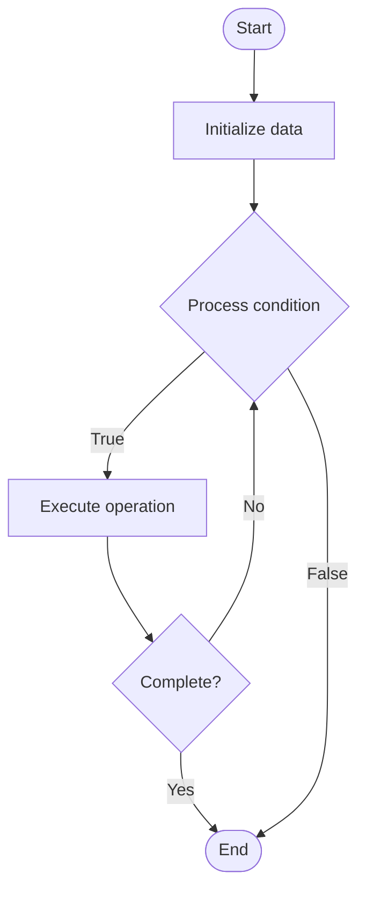

# Quantum Communication

Name of Algorithm  

## Code Files


## Algorithm Visualization

### Flowchart (ASCII)


```
Quantum Communication Flowchart:

┌─────────────┐
│   Start     │
└──────┬──────┘
       │
       ▼
┌─────────────┐
│  Initialize │
│   data      │
└──────┬──────┘
       │
       ▼
┌─────────────┐      Yes
│  Process   ├──────┐
│  condition?│      │
└──────┬──────┘      │
       │ No          │
       ▼             │
┌─────────────┐      │
│  Execute   │      │
│  operation │      │
└──────┬──────┘      │
       │             │
       └─────────────┘
       │
       ▼
┌─────────────┐
│    End      │
└─────────────┘
```


### Step-by-Step Execution


```
Quantum Communication Step-by-Step Execution:

Input: [example data]

Step 1: Initialize
State: [initial state]

Step 2: Process
State: [intermediate state]

Step 3: Finalize
State: [final state]

Result: [output]
```


### Interactive Flowchart (Mermaid)





> **Note**: Mermaid diagrams are rendered automatically on GitHub. For local viewing, use a Mermaid-compatible Markdown viewer.
- [Python Implementation](/code/semester_12/lecture_85_quantum_networking/quantum_communication/algorithm.py)
- [Java Implementation](/code/semester_12/lecture_85_quantum_networking/quantum_communication/Algorithm.java)
- [Python Tests](/code/semester_12/lecture_85_quantum_networking/quantum_communication/test_algorithm.py)


   Quantum Communication

What problem does it solve? (1 sentence)  
   Transmits quantum information between distant locations using quantum channels, enabling secure quantum communication, quantum teleportation, and quantum networks.

Intuition (plain-language explanation)  
   Like communication but quantum: Quantum Communication is like communication but for quantum information - you send quantum states (qubits) through quantum channels instead of classical bits - just as you send messages classically, you send quantum information using quantum communication.

Inputs & Outputs  
   - Input: Quantum states, quantum channels, entanglement, classical communication, protocols.  
   - Output: Transmitted quantum states, secure communication, quantum keys, teleported states, network connectivity.

Step-by-step description (5–10 lines max)  
Prepare: prepare quantum state to transmit.
Encode: encode information into quantum state.
Transmit: transmit through quantum channel.
Protect: protect from noise and loss.
Receive: receive quantum state.
Decode: decode quantum information.
Verify: verify transmission success.
Secure: implement quantum cryptography.
Teleport: use quantum teleportation if needed.
Complete: communication complete.

Tiny example (hand-simulated)  
   Quantum Communication: state: |ψ⟩ → encode: encode message → transmit: send through fiber → protect: error correction → receive: receive state → decode: decode message → verify: verify integrity → result: secure quantum communication → Quantum Communication successful.

Time & Space Complexity  
   - Time: O(d + t) where d is distance, t is transmission time (varies by channel).  
   - Space: O(n) where n is number of qubits (quantum state storage).

Strengths  
- Security: enables secure quantum communication.
- Teleportation: enables quantum teleportation.
- Networking: foundation for quantum networks.

Weaknesses / limitations  
- Distance: limited by channel distance and loss.
- Noise: quantum noise affects transmission.
- Infrastructure: requires quantum communication infrastructure.

Compare with alternatives  
    Alternatives: Classical Communication, Quantum Repeaters, Hybrid Approaches, Quantum Internet

30-second explanation (your own words)  

*Sources: Adapted from standard university textbooks and Wikipedia summaries.*
