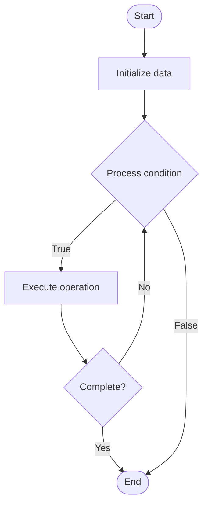

# Quantum Internet

1. **Name of Algorithm**  

## Code Files


## Algorithm Visualization

### Flowchart (ASCII)


```
Quantum Internet Flowchart:

┌─────────────┐
│   Start     │
└──────┬──────┘
       │
       ▼
┌─────────────┐
│  Initialize │
│   data      │
└──────┬──────┘
       │
       ▼
┌─────────────┐      Yes
│  Process   ├──────┐
│  condition?│      │
└──────┬──────┘      │
       │ No          │
       ▼             │
┌─────────────┐      │
│  Execute   │      │
│  operation │      │
└──────┬──────┘      │
       │             │
       └─────────────┘
       │
       ▼
┌─────────────┐
│    End      │
└─────────────┘
```


### Step-by-Step Execution


```
Quantum Internet Step-by-Step Execution:

Input: [example data]

Step 1: Initialize
State: [initial state]

Step 2: Process
State: [intermediate state]

Step 3: Finalize
State: [final state]

Result: [output]
```


### Interactive Flowchart (Mermaid)





> **Note**: Mermaid diagrams are rendered automatically on GitHub. For local viewing, use a Mermaid-compatible Markdown viewer.
- [Python Implementation](semester_12/lecture_85_quantum_networking/quantum_internet/algorithm.py)
- [Java Implementation](semester_12/lecture_85_quantum_networking/quantum_internet/Algorithm.java)
- [Python Tests](semester_12/lecture_85_quantum_networking/quantum_internet/test_algorithm.py)


   Quantum Internet

2. **What problem does it solve? (1 sentence)**  
   Builds global quantum network infrastructure connecting quantum computers and devices, enabling distributed quantum computing, quantum communication, and quantum applications over long distances.

3. **Intuition (plain-language explanation)**  
   Like internet but quantum: Quantum Internet is like the internet but for quantum information - you connect quantum devices (like connecting computers) to share quantum information and compute together over long distances - just as the internet connects computers globally, quantum internet connects quantum devices globally.

4. **Inputs & Outputs**  
   - Input: Quantum nodes, quantum channels, entanglement distribution, quantum repeaters, network protocols, quantum applications.  
   - Output: Quantum network, distributed quantum systems, quantum communication, entangled states, network connectivity, quantum services.

5. **Step-by-step description (5–10 lines max)**  
1. Deploy: deploy quantum nodes globally.
2. Connect: connect nodes with quantum channels.
3. Distribute: distribute entanglement between nodes.
4. Route: route quantum information through network.
5. Teleport: use quantum teleportation for communication.
6. Repeat: use quantum repeaters for long distances.
7. Protocol: implement quantum network protocols.
8. Secure: implement quantum cryptography.
9. Scale: scale network to more nodes.
10. Enable: enable distributed quantum applications.

6. **Tiny example (hand-simulated)**  
   Quantum Internet: nodes: quantum computers in 3 cities → connect: quantum fiber links → distribute: create entanglement → route: route qubits → teleport: teleport quantum states → result: global quantum network → Quantum Internet operational.

7. **Time & Space Complexity**  
   - Time: O(d + r + t) where d is distance, r is routing time, t is teleportation time (network operations).  
   - Space: O(n) where n is number of nodes (network topology, entanglement storage).

8. **Strengths**  
- Global: enables global quantum connectivity.
- Distributed: enables distributed quantum computing.
- Secure: enables secure quantum communication.

9. **Weaknesses / limitations**  
- Infrastructure: requires extensive quantum infrastructure.
- Distance: limited by quantum channel distance and loss.
- Complexity: quantum internet is complex to build.

10. **Compare with alternatives**  
    Alternatives: Local Quantum Networks, Classical Internet, Hybrid Networks, Quantum Repeaters

11. **30-second explanation (your own words)**  
    Builds global quantum network infrastructure connecting quantum computers and devices, enabling distributed quantum computing, quantum communication, and quantum applications over long distances.

*Sources: Adapted from standard university textbooks and Wikipedia summaries.*
