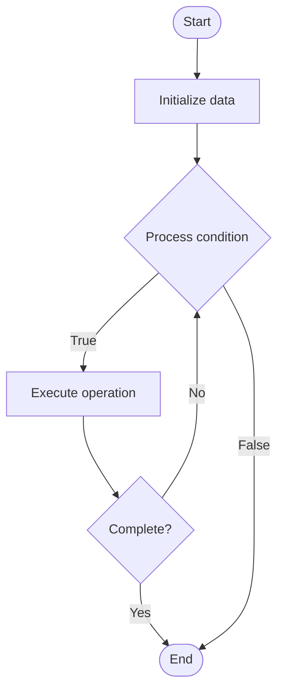

# Quantum Key Distribution (QKD)

Name of Algorithm  

## Code Files


## Algorithm Visualization

### Flowchart (ASCII)


```
Quantum Key Distribution (QKD) Flowchart:

┌─────────────┐
│   Start     │
└──────┬──────┘
       │
       ▼
┌─────────────┐
│  Initialize │
│   data      │
└──────┬──────┘
       │
       ▼
┌─────────────┐      Yes
│  Process   ├──────┐
│  condition?│      │
└──────┬──────┘      │
       │ No          │
       ▼             │
┌─────────────┐      │
│  Execute   │      │
│  operation │      │
└──────┬──────┘      │
       │             │
       └─────────────┘
       │
       ▼
┌─────────────┐
│    End      │
└─────────────┘
```


### Step-by-Step Execution


```
Quantum Key Distribution (QKD) Step-by-Step Execution:

Input: [example data]

Step 1: Initialize
State: [initial state]

Step 2: Process
State: [intermediate state]

Step 3: Finalize
State: [final state]

Result: [output]
```


### Interactive Flowchart (Mermaid)





> **Note**: Mermaid diagrams are rendered automatically on GitHub. For local viewing, use a Mermaid-compatible Markdown viewer.
- [Python Implementation](/code/semester_12/lecture_85_quantum_networking/quantum_key_distribution/algorithm.py)
- [Java Implementation](/code/semester_12/lecture_85_quantum_networking/quantum_key_distribution/Algorithm.java)
- [Python Tests](/code/semester_12/lecture_85_quantum_networking/quantum_key_distribution/test_algorithm.py)


   Quantum Key Distribution (QKD)

What problem does it solve? (1 sentence)  
   Distributes cryptographic keys securely using quantum mechanics, providing provably secure key exchange that detects any eavesdropping attempts, enabling unbreakable encryption.

Intuition (plain-language explanation)  
   Like secure key exchange: Quantum Key Distribution is like exchanging keys securely - you send quantum states (keys) that can't be copied or intercepted without detection - just as you exchange keys securely, QKD exchanges keys using quantum mechanics, and any eavesdropping is detected.

Inputs & Outputs  
   - Input: Quantum states, measurement bases, quantum channel, classical channel, protocols (BB84, E91).  
   - Output: Secure quantum keys, key distribution, eavesdropping detection, encryption keys, secure communication.

Step-by-step description (5–10 lines max)  
Prepare: prepare quantum states (qubits) randomly.
Transmit: transmit qubits to receiver.
Measure: measure qubits using random bases.
Compare: compare measurement bases publicly.
Extract: extract key from matching bases.
Verify: verify key security (error checking).
Detect: detect eavesdropping from errors.
Reject: reject key if eavesdropping detected.
Use: use secure key for encryption.
Renew: renew keys periodically.

Tiny example (hand-simulated)  
   QKD: Alice: prepare qubits → transmit: send to Bob → measure: both measure randomly → compare: share bases → extract: key from matches → verify: check errors → detect: no eavesdropping → result: secure key distributed → QKD successful.

Time & Space Complexity  
   - Time: O(n) where n is number of qubits (key distribution time).  
   - Space: O(n) where n is key length (quantum state storage).

Strengths  
- Security: provably secure based on physics.
- Detection: automatically detects eavesdropping.
- Future-proof: secure against quantum computers.

Weaknesses / limitations  
- Distance: limited by quantum channel distance.
- Rate: key distribution rate is limited.
- Infrastructure: requires quantum infrastructure.

Compare with alternatives  
    Alternatives: Classical Key Exchange, Post-Quantum Cryptography, Hybrid Approaches, Quantum Networks

30-second explanation (your own words)  
    Distributes cryptographic keys securely using quantum mechanics, providing provably secure key exchange that detects any eavesdropping attempts, enabling unbreakable encryption.

*Sources: Adapted from standard university textbooks and Wikipedia summaries.*
