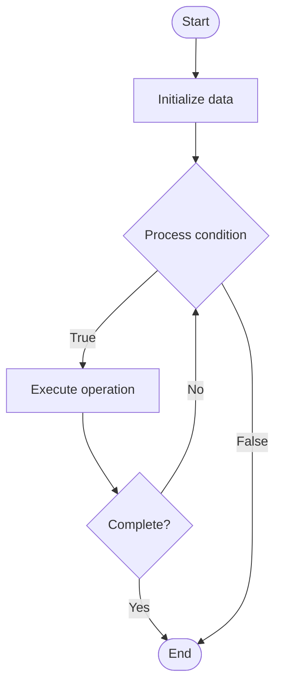

# Quantum Repeaters

## Учебные материалы

- [Школьный уровень](school.ru.md)
- [Университетский уровень](univer.ru.md)

## Algorithm Visualization

### Flowchart (ASCII)

```
Quantum Repeaters Flowchart:

┌─────────────┐
│   Start     │
└──────┬──────┘
       │
       ▼
┌─────────────┐
│  Initialize │
│   data      │
└──────┬──────┘
       │
       ▼
┌─────────────┐      Yes
│  Process   ├──────┐
│  condition?│      │
└──────┬──────┘      │
       │ No          │
       ▼             │
┌─────────────┐      │
│  Execute   │      │
│  operation │      │
└──────┬──────┘      │
       │             │
       └─────────────┘
       │
       ▼
┌─────────────┐
│    End      │
└─────────────┘
```

### Step-by-Step Execution

```
Quantum Repeaters Step-by-Step Execution:

Input: [example data]

Step 1: Initialize
State: [initial state]

Step 2: Process
State: [intermediate state]

Step 3: Finalize
State: [final state]

Result: [output]
```

### Interactive Flowchart (Mermaid)



> **Note**: Mermaid diagrams are rendered automatically on GitHub. For local viewing, use a Mermaid-compatible Markdown viewer.

- [Python Implementation](/code/semester_12/lecture_85_quantum_networking/quantum_repeaters/algorithm.py)
- [Java Implementation](/code/semester_12/lecture_85_quantum_networking/quantum_repeaters/Algorithm.java)
- [Python Tests](/code/semester_12/lecture_85_quantum_networking/quantum_repeaters/test_algorithm.py)

What problem does it solve? (1 sentence)  
   Extends quantum communication distance by creating entanglement between distant nodes through intermediate nodes, enabling long-distance quantum communication and quantum networks.

Intuition (plain-language explanation)  
   Like signal repeaters: Quantum Repeaters are like signal repeaters but for quantum information - you use intermediate nodes (repeaters) to extend the range of quantum communication, creating entanglement over long distances - just as repeaters extend radio range, quantum repeaters extend quantum communication range.

Inputs & Outputs  

  - Input: Quantum channels, intermediate nodes, entanglement sources, quantum memories, protocols.  
  - Output: Extended quantum links, long-distance entanglement, quantum communication, network connectivity.

Step-by-step description (5–10 lines max)  
Deploy: deploy quantum repeaters along path.
Create: create local entanglement at each segment.
Store: store entanglement in quantum memories.
Swap: perform entanglement swapping.
Extend: extend entanglement to next segment.
Chain: chain entanglement swaps.
Establish: establish end-to-end entanglement.
Use: use for quantum communication.
Maintain: maintain entanglement.
Scale: scale to longer distances.

Tiny example (hand-simulated)  
   Quantum Repeaters: distance: 1000 km → repeaters: deploy 10 repeaters → create: local entanglement → swap: entanglement swapping → chain: chain swaps → result: entanglement over 1000 km → Quantum Repeaters successful.

Time & Space Complexity  

  - Time: O(r·s) where r is repeaters, s is swap time (repeater operations).  
  - Space: O(r + m) where r is repeater storage, m is memory storage (quantum memories).

Strengths  

- Distance: extends quantum communication distance.
- Networking: enables long-distance quantum networks.
- Scalability: enables scaling quantum networks.

Weaknesses / limitations  

- Complexity: quantum repeaters are complex.
- Memory: requires quantum memories.
- Loss: entanglement loss affects performance.

Compare with alternatives  
    Alternatives: Direct Transmission, Quantum Satellites, Hybrid Approaches, No Repeaters

30-second explanation (your own words)  
    Extends quantum communication distance by creating entanglement between distant nodes through intermediate nodes, enabling long-distance quantum communication and quantum networks.

*Sources: Adapted from standard university textbooks and Wikipedia summaries.*


## References

- [Quantum Repeaters - Wikipedia](https://en.wikipedia.org/wiki/Quantum%20Repeaters)
