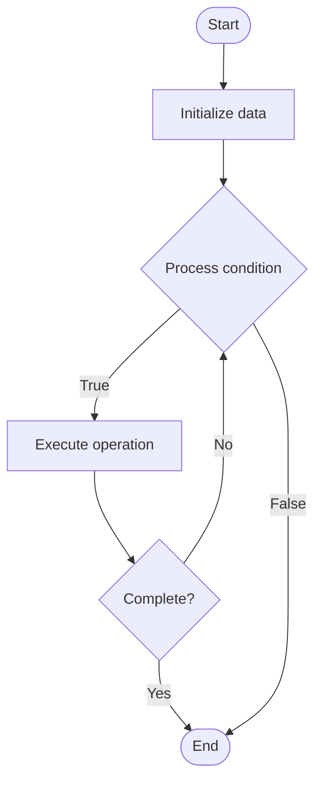

# Quantum Routing

Name of Algorithm  

## Code Files


## Algorithm Visualization

### Flowchart (ASCII)


```
Quantum Routing Flowchart:

┌─────────────┐
│   Start     │
└──────┬──────┘
       │
       ▼
┌─────────────┐
│  Initialize │
│   data      │
└──────┬──────┘
       │
       ▼
┌─────────────┐      Yes
│  Process   ├──────┐
│  condition?│      │
└──────┬──────┘      │
       │ No          │
       ▼             │
┌─────────────┐      │
│  Execute   │      │
│  operation │      │
└──────┬──────┘      │
       │             │
       └─────────────┘
       │
       ▼
┌─────────────┐
│    End      │
└─────────────┘
```


### Step-by-Step Execution


```
Quantum Routing Step-by-Step Execution:

Input: [example data]

Step 1: Initialize
State: [initial state]

Step 2: Process
State: [intermediate state]

Step 3: Finalize
State: [final state]

Result: [output]
```


### Interactive Flowchart (Mermaid)





> **Note**: Mermaid diagrams are rendered automatically on GitHub. For local viewing, use a Mermaid-compatible Markdown viewer.
- [Python Implementation](/code/semester_12/lecture_85_quantum_networking/quantum_routing/algorithm.py)
- [Java Implementation](/code/semester_12/lecture_85_quantum_networking/quantum_routing/Algorithm.java)
- [Python Tests](/code/semester_12/lecture_85_quantum_networking/quantum_routing/test_algorithm.py)


   Quantum Routing

What problem does it solve? (1 sentence)  
   Routes quantum information through quantum networks, determining optimal paths for quantum communication and managing quantum data flow in distributed quantum systems.

Intuition (plain-language explanation)  
   Like routing for quantum: Quantum Routing is like network routing but for quantum information - you find the best path (like routing packets) to send quantum information through a quantum network - just as routers route internet traffic, quantum routers route quantum information.

Inputs & Outputs  
   - Input: Quantum networks, routing tables, network topology, quantum data, routing algorithms, path metrics.  
- Output: Routed quantum information, optimal paths, network connectivity, efficient routing, quantum data delivery.

Step-by-step description (5–10 lines max)  
Discover: discover network topology.
Calculate: calculate routing paths.
Select: select optimal path.
Route: route quantum information along path.
Teleport: use quantum teleportation if needed.
Manage: manage quantum data flow.
Optimize: optimize routing for efficiency.
Handle: handle network changes.
Monitor: monitor routing performance.
Adapt: adapt to network conditions.

Tiny example (hand-simulated)  
   Quantum Routing: network: 5 quantum nodes → topology: discover connections → calculate: shortest path → route: route qubit from A to E via B, C, D → teleport: teleport at each hop → result: qubit routed successfully → Quantum Routing successful.

Time & Space Complexity  
   - Time: O(n² + r) where n is nodes, r is routing time (path calculation and routing).  
   - Space: O(n + r) where n is network topology, r is routing tables (routing data).

Strengths  
- Efficiency: enables efficient quantum communication.
- Scalability: supports scalable quantum networks.
- Flexibility: adapts to network conditions.

Weaknesses / limitations  
- Complexity: quantum routing is complex.
- Loss: quantum information loss affects routing.
- Topology: network topology affects routing efficiency.

Compare with alternatives  
    Alternatives: Direct Links, Fixed Routing, Classical Routing, Hybrid Routing

30-second explanation (your own words)  
    Routes quantum information through quantum networks, determining optimal paths for quantum communication and managing quantum data flow in distributed quantum systems.

*Sources: Adapted from standard university textbooks and Wikipedia summaries.*
