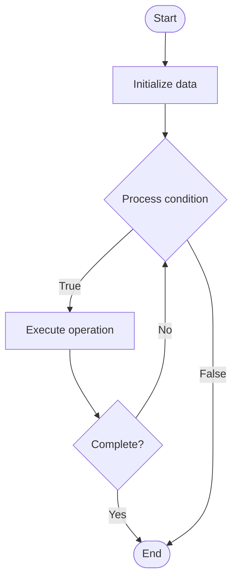

# Quantum Switching

## Учебные материалы

- [Школьный уровень](school.ru.md)
- [Университетский уровень](univer.ru.md)

## Algorithm Visualization

### Flowchart (ASCII)

```
Quantum Switching Flowchart:

┌─────────────┐
│   Start     │
└──────┬──────┘
       │
       ▼
┌─────────────┐
│  Initialize │
│   data      │
└──────┬──────┘
       │
       ▼
┌─────────────┐      Yes
│  Process   ├──────┐
│  condition?│      │
└──────┬──────┘      │
       │ No          │
       ▼             │
┌─────────────┐      │
│  Execute   │      │
│  operation │      │
└──────┬──────┘      │
       │             │
       └─────────────┘
       │
       ▼
┌─────────────┐
│    End      │
└─────────────┘
```

### Step-by-Step Execution

```
Quantum Switching Step-by-Step Execution:

Input: [example data]

Step 1: Initialize
State: [initial state]

Step 2: Process
State: [intermediate state]

Step 3: Finalize
State: [final state]

Result: [output]
```

### Interactive Flowchart (Mermaid)



> **Note**: Mermaid diagrams are rendered automatically on GitHub. For local viewing, use a Mermaid-compatible Markdown viewer.

- [Python Implementation](/code/semester_12/lecture_85_quantum_networking/quantum_switching/algorithm.py)
- [Java Implementation](/code/semester_12/lecture_85_quantum_networking/quantum_switching/Algorithm.java)
- [Python Tests](/code/semester_12/lecture_85_quantum_networking/quantum_switching/test_algorithm.py)

What problem does it solve? (1 sentence)  
Switches and routes quantum information between quantum channels and nodes in quantum networks, enabling efficient quantum communication and network management.

Intuition (plain-language explanation)  
   Like network switches for quantum: Quantum Switching is like network switches but for quantum information - you switch quantum signals (like switching network packets) between quantum channels to route quantum information - just as network switches route internet traffic, quantum switches route quantum information.

Inputs & Outputs  

  - Input: Quantum signals, switching configurations, routing tables, quantum channels, control signals.  
- Output: Switched quantum information, routed quantum signals, network connectivity, efficient switching, quantum data flow.

Step-by-step description (5–10 lines max)  
Receive: receive quantum signal on input channel.
Route: determine output channel based on routing.
Switch: switch quantum signal to output channel.
Preserve: preserve quantum state during switching.
Forward: forward quantum signal to destination.
Manage: manage switching configurations.
Optimize: optimize switching for efficiency.
Monitor: monitor switching performance.
Handle: handle switching errors.
Scale: scale to larger networks.

Tiny example (hand-simulated)  
   Quantum Switching: signal: quantum state on channel A → route: determine output channel B → switch: switch to channel B → preserve: maintain quantum state → forward: forward to destination → result: quantum signal switched → Quantum Switching successful.

Time & Space Complexity  

  - Time: O(1) for switching operation (constant time per switch).  
  - Space: O(n) where n is number of channels (switching table storage).

Strengths  

- Efficiency: enables efficient quantum network routing.
- Flexibility: supports flexible network topologies.
- Scalability: enables scaling quantum networks.

Weaknesses / limitations  

- Complexity: quantum switching is complex.
- Loss: quantum information loss during switching.
- Noise: switching noise affects quantum states.

Compare with alternatives  
    Alternatives: Direct Links, Fixed Routing, Classical Switching, Hybrid Switching

30-second explanation (your own words)  
Switches and routes quantum information between quantum channels and nodes in quantum networks, enabling efficient quantum communication and network management.

*Sources: Adapted from standard university textbooks and Wikipedia summaries.*


## References

- [Quantum Switching - Wikipedia](https://en.wikipedia.org/wiki/Quantum%20Switching)
