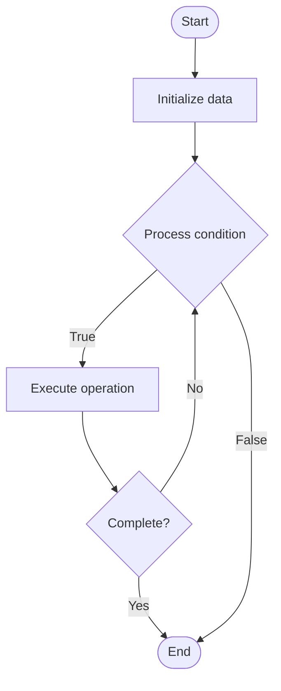

# Post-Quantum Cryptography

Name of Algorithm  

## Code Files


## Algorithm Visualization

### Flowchart (ASCII)


```
Post-Quantum Cryptography Flowchart:

┌─────────────┐
│   Start     │
└──────┬──────┘
       │
       ▼
┌─────────────┐
│  Initialize │
│   data      │
└──────┬──────┘
       │
       ▼
┌─────────────┐      Yes
│  Process   ├──────┐
│  condition?│      │
└──────┬──────┘      │
       │ No          │
       ▼             │
┌─────────────┐      │
│  Execute   │      │
│  operation │      │
└──────┬──────┘      │
       │             │
       └─────────────┘
       │
       ▼
┌─────────────┐
│    End      │
└─────────────┘
```


### Step-by-Step Execution


```
Post-Quantum Cryptography Step-by-Step Execution:

Input: [example data]

Step 1: Initialize
State: [initial state]

Step 2: Process
State: [intermediate state]

Step 3: Finalize
State: [final state]

Result: [output]
```


### Interactive Flowchart (Mermaid)





> **Note**: Mermaid diagrams are rendered automatically on GitHub. For local viewing, use a Mermaid-compatible Markdown viewer.
- [Python Implementation](/code/semester_12/lecture_86_quantum_security/post_quantum_cryptography/algorithm.py)
- [Java Implementation](/code/semester_12/lecture_86_quantum_security/post_quantum_cryptography/Algorithm.java)
- [Python Tests](/code/semester_12/lecture_86_quantum_security/post_quantum_cryptography/test_algorithm.py)


   Post-Quantum Cryptography

What problem does it solve? (1 sentence)  
   Develops cryptographic algorithms that are secure against attacks from both classical and quantum computers, ensuring long-term security as quantum computers become available.

Intuition (plain-language explanation)  
   Like future-proof security: Post-Quantum Cryptography is like future-proof security - you use encryption that works even when quantum computers exist (which can break current encryption) - just as you prepare for future threats, post-quantum crypto prepares for quantum threats.

Inputs & Outputs  
   - Input: Classical data, post-quantum algorithms, key material, security parameters, implementation requirements.  
   - Output: Post-quantum secure encryption, quantum-resistant keys, secure communication, future-proof security.

Step-by-step description (5–10 lines max)  
Select: select post-quantum algorithm (lattice, code-based, etc.).
Generate: generate post-quantum keys.
Encrypt: encrypt data using post-quantum algorithm.
Sign: create post-quantum signatures.
Verify: verify post-quantum signatures.
Deploy: deploy in systems.
Migrate: migrate from classical crypto.
Validate: validate security properties.
Monitor: monitor for vulnerabilities.
Update: update as standards evolve.

Tiny example (hand-simulated)  
   Post-Quantum Cryptography: algorithm: CRYSTALS-Kyber → generate: post-quantum keys → encrypt: encrypt message → result: secure against quantum attacks → Post-Quantum Cryptography operational.

Time & Space Complexity  
   - Time: O(n) where n is data size (varies by algorithm, typically polynomial).  
   - Space: O(n) where n is key/data size (algorithm-dependent).

Strengths  
- Security: secure against quantum attacks.
- Future-proof: ensures long-term security.
- Standards: NIST standardized algorithms available.

Weaknesses / limitations  
- Performance: may be slower than classical crypto.
- Migration: requires migration from classical crypto.
- Maturity: field is still evolving.

Compare with alternatives  
    Alternatives: Classical Cryptography, Quantum Cryptography, Hybrid Approaches, Quantum Key Distribution

30-second explanation (your own words)  
    Develops cryptographic algorithms that are secure against attacks from both classical and quantum computers, ensuring long-term security as quantum computers become available.

*Sources: Adapted from standard university textbooks and Wikipedia summaries.*
