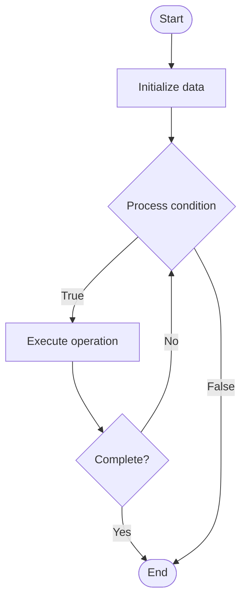

# Quantum Attacks

## Учебные материалы

- [Школьный уровень](school.ru.md)
- [Университетский уровень](univer.ru.md)

## Algorithm Visualization

### Flowchart (ASCII)

```
Quantum Attacks Flowchart:

┌─────────────┐
│   Start     │
└──────┬──────┘
       │
       ▼
┌─────────────┐
│  Initialize │
│   data      │
└──────┬──────┘
       │
       ▼
┌─────────────┐      Yes
│  Process   ├──────┐
│  condition?│      │
└──────┬──────┘      │
       │ No          │
       ▼             │
┌─────────────┐      │
│  Execute   │      │
│  operation │      │
└──────┬──────┘      │
       │             │
       └─────────────┘
       │
       ▼
┌─────────────┐
│    End      │
└─────────────┘
```

### Step-by-Step Execution

```
Quantum Attacks Step-by-Step Execution:

Input: [example data]

Step 1: Initialize
State: [initial state]

Step 2: Process
State: [intermediate state]

Step 3: Finalize
State: [final state]

Result: [output]
```

### Interactive Flowchart (Mermaid)



> **Note**: Mermaid diagrams are rendered automatically on GitHub. For local viewing, use a Mermaid-compatible Markdown viewer.

- [Python Implementation](/code/semester_12/lecture_86_quantum_security/quantum_attacks/algorithm.py)
- [Java Implementation](/code/semester_12/lecture_86_quantum_security/quantum_attacks/Algorithm.java)
- [Python Tests](/code/semester_12/lecture_86_quantum_security/quantum_attacks/test_algorithm.py)

What problem does it solve? (1 sentence)  
   Studies and analyzes attacks on cryptographic systems using quantum computers, understanding threats posed by quantum computing to current encryption methods.

Intuition (plain-language explanation)  
   Like attacks using quantum: Quantum Attacks are like cyber attacks but using quantum computers - quantum computers can break some encryption (like RSA) that classical computers can't - just as new weapons change warfare, quantum computers change the security landscape, and we need to understand these threats.

Inputs & Outputs  

  - Input: Cryptographic systems, quantum algorithms, attack methods, quantum computers, security analysis.  
  - Output: Attack analysis, threat assessments, vulnerability identification, security recommendations, attack demonstrations.

Step-by-step description (5–10 lines max)  
Identify: identify cryptographic systems to analyze.
Analyze: analyze vulnerability to quantum attacks.
Design: design quantum attack algorithms.
Implement: implement attacks on quantum computers.
Execute: execute quantum attacks.
Evaluate: evaluate attack effectiveness.
Assess: assess security impact.
Recommend: recommend countermeasures.
Mitigate: implement mitigations.
Monitor: monitor for new attack methods.

Tiny example (hand-simulated)  
   Quantum Attacks: system: RSA encryption → analyze: vulnerable to Shor's algorithm → design: Shor's attack → implement: on quantum computer → execute: factor large number → result: RSA broken → assess: need post-quantum crypto → Quantum Attacks analysis complete.

Time & Space Complexity  

  - Time: O(poly(log N)) for Shor's algorithm where N is key size (exponential speedup over classical).  
  - Space: O(log N) where N is key size (qubits needed).

Strengths  

- Understanding: provides understanding of quantum threats.
- Preparedness: enables preparation for quantum threats.
- Security: improves security through threat awareness.

Weaknesses / limitations  

- Threat: demonstrates threats to current cryptography.
- Resources: requires quantum computing resources.
- Evolution: attack methods continue to evolve.

Compare with alternatives  
    Alternatives: No Analysis, Classical Attacks, Theoretical Analysis, Post-Quantum Migration

30-second explanation (your own words)  
    Studies and analyzes attacks on cryptographic systems using quantum computers, understanding threats posed by quantum computing to current encryption methods.

*Sources: Adapted from standard university textbooks and Wikipedia summaries.*
