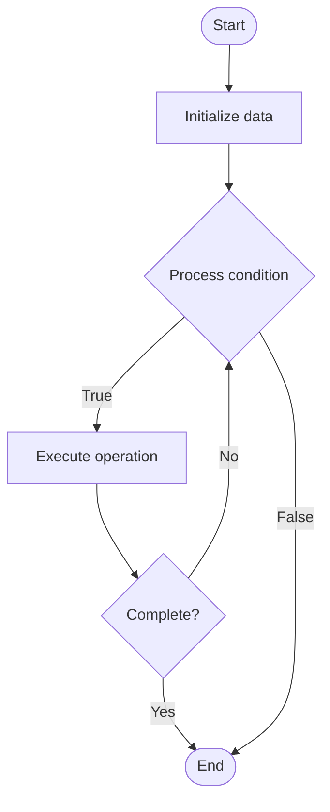

# Quantum Defense

## Учебные материалы

- [Школьный уровень](school.ru.md)
- [Университетский уровень](univer.ru.md)

## Algorithm Visualization

### Flowchart (ASCII)

```
Quantum Defense Flowchart:

┌─────────────┐
│   Start     │
└──────┬──────┘
       │
       ▼
┌─────────────┐
│  Initialize │
│   data      │
└──────┬──────┘
       │
       ▼
┌─────────────┐      Yes
│  Process   ├──────┐
│  condition?│      │
└──────┬──────┘      │
       │ No          │
       ▼             │
┌─────────────┐      │
│  Execute   │      │
│  operation │      │
└──────┬──────┘      │
       │             │
       └─────────────┘
       │
       ▼
┌─────────────┐
│    End      │
└─────────────┘
```

### Step-by-Step Execution

```
Quantum Defense Step-by-Step Execution:

Input: [example data]

Step 1: Initialize
State: [initial state]

Step 2: Process
State: [intermediate state]

Step 3: Finalize
State: [final state]

Result: [output]
```

### Interactive Flowchart (Mermaid)



> **Note**: Mermaid diagrams are rendered automatically on GitHub. For local viewing, use a Mermaid-compatible Markdown viewer.

- [Python Implementation](/code/semester_12/lecture_86_quantum_security/quantum_defense/algorithm.py)
- [Java Implementation](/code/semester_12/lecture_86_quantum_security/quantum_defense/Algorithm.java)
- [Python Tests](/code/semester_12/lecture_86_quantum_security/quantum_defense/test_algorithm.py)

What problem does it solve? (1 sentence)  
   Defends against quantum attacks on cryptographic systems by implementing quantum-resistant cryptography, quantum key distribution, and other defense mechanisms to protect against quantum computing threats.

Intuition (plain-language explanation)  
   Like defense against quantum threats: Quantum Defense is like defense systems but against quantum attacks - you protect systems from quantum threats (like quantum computers breaking encryption) using quantum-resistant methods - just as you defend against cyber attacks, you defend against quantum attacks.

Inputs & Outputs  

  - Input: Cryptographic systems, quantum threats, defense mechanisms, quantum-resistant algorithms, security requirements.  
  - Output: Defended systems, quantum-resistant encryption, security improvements, defense mechanisms, protected data.

Step-by-step description (5–10 lines max)  
Assess: assess quantum threats and vulnerabilities.
Identify: identify systems at risk.
Select: select quantum defense mechanisms.
Implement: implement quantum-resistant cryptography.
Deploy: deploy quantum key distribution if needed.
Migrate: migrate to post-quantum cryptography.
Monitor: monitor for quantum threats.
Update: update defenses as threats evolve.
Test: test defense effectiveness.
Maintain: maintain quantum defenses.

Tiny example (hand-simulated)  
   Quantum Defense: system: RSA encryption → assess: vulnerable to Shor's algorithm → implement: migrate to CRYSTALS-Kyber → deploy: post-quantum crypto → result: system defended against quantum attacks → Quantum Defense operational.

Time & Space Complexity  

  - Time: O(d + i + m) where d is deployment time, i is implementation time, m is migration time (defense process).  
  - Space: O(s + d) where s is system storage, d is defense storage (defense mechanisms, keys).

Strengths  

- Protection: protects against quantum threats.
- Future-proof: ensures long-term security.
- Comprehensive: provides comprehensive quantum defense.

Weaknesses / limitations  

- Migration: migration to quantum-resistant crypto can be complex.
- Performance: quantum-resistant crypto may be slower.
- Cost: implementing quantum defense has costs.

Compare with alternatives  
    Alternatives: No Defense, Basic Defense, Partial Migration, Hybrid Approaches

30-second explanation (your own words)  
    Defends against quantum attacks on cryptographic systems by implementing quantum-resistant cryptography, quantum key distribution, and other defense mechanisms to protect against quantum computing threats.

*Sources: Adapted from standard university textbooks and Wikipedia summaries.*
