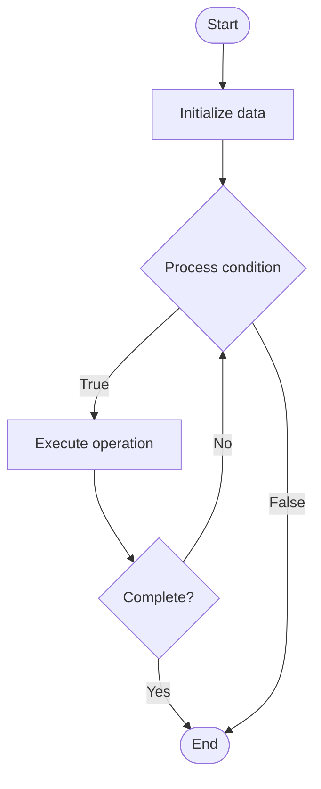

# Quantum Key Management

Name of Algorithm  

## Code Files


## Algorithm Visualization

### Flowchart (ASCII)


```
Quantum Key Management Flowchart:

┌─────────────┐
│   Start     │
└──────┬──────┘
       │
       ▼
┌─────────────┐
│  Initialize │
│   data      │
└──────┬──────┘
       │
       ▼
┌─────────────┐      Yes
│  Process   ├──────┐
│  condition?│      │
└──────┬──────┘      │
       │ No          │
       ▼             │
┌─────────────┐      │
│  Execute   │      │
│  operation │      │
└──────┬──────┘      │
       │             │
       └─────────────┘
       │
       ▼
┌─────────────┐
│    End      │
└─────────────┘
```


### Step-by-Step Execution


```
Quantum Key Management Step-by-Step Execution:

Input: [example data]

Step 1: Initialize
State: [initial state]

Step 2: Process
State: [intermediate state]

Step 3: Finalize
State: [final state]

Result: [output]
```


### Interactive Flowchart (Mermaid)





> **Note**: Mermaid diagrams are rendered automatically on GitHub. For local viewing, use a Mermaid-compatible Markdown viewer.
- [Python Implementation](/code/semester_12/lecture_86_quantum_security/quantum_key_management/algorithm.py)
- [Java Implementation](/code/semester_12/lecture_86_quantum_security/quantum_key_management/Algorithm.java)
- [Python Tests](/code/semester_12/lecture_86_quantum_security/quantum_key_management/test_algorithm.py)


   Quantum Key Management

What problem does it solve? (1 sentence)  
   Manages cryptographic keys in quantum-secure systems, including generation, distribution, storage, rotation, and lifecycle management of quantum keys and quantum-resistant keys.

Intuition (plain-language explanation)  
   Like key management for quantum: Quantum Key Management is like key management but for quantum-secure systems - you manage keys (like managing passwords) but for quantum cryptography - just as you manage keys for encryption, you manage quantum keys for quantum-secure systems.

Inputs & Outputs  
   - Input: Key generation requests, key policies, quantum key distribution, key storage, lifecycle requirements.  
   - Output: Managed keys, key distribution, secure key storage, key rotation, key lifecycle management.

Step-by-step description (5–10 lines max)  
Generate: generate quantum or quantum-resistant keys.
Distribute: distribute keys securely (QKD if needed).
Store: store keys securely.
Rotate: rotate keys periodically.
Revoke: revoke compromised keys.
Archive: archive old keys if needed.
Monitor: monitor key usage and security.
Audit: audit key management operations.
Update: update key policies.
Maintain: maintain key management system.

Tiny example (hand-simulated)  
   Quantum Key Management: request: generate quantum key → generate: create key using QKD → distribute: distribute securely → store: store in secure key store → rotate: rotate every 30 days → result: keys managed securely → Quantum Key Management operational.

Time & Space Complexity  
   - Time: O(g + d + r) where g is generation time, d is distribution time, r is rotation time (key operations).  
   - Space: O(k + s) where k is key storage, s is system storage (key management system).

Strengths  
- Security: ensures secure key management.
- Compliance: helps meet security compliance requirements.
- Lifecycle: manages complete key lifecycle.

Weaknesses / limitations  
- Complexity: quantum key management is complex.
- Infrastructure: requires quantum infrastructure for QKD.
- Cost: quantum key management has costs.

Compare with alternatives  
    Alternatives: Classical Key Management, Manual Management, Basic Management, Hybrid Approaches

30-second explanation (your own words)  
    Manages cryptographic keys in quantum-secure systems, including generation, distribution, storage, rotation, and lifecycle management of quantum keys and quantum-resistant keys.

*Sources: Adapted from standard university textbooks and Wikipedia summaries.*
