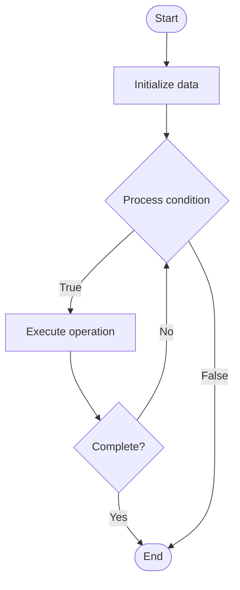

# Quantum Resistant

## Учебные материалы

- [Школьный уровень](school.ru.md)
- [Университетский уровень](univer.ru.md)

## Algorithm Visualization

### Flowchart (ASCII)

```
Quantum Resistant Flowchart:

┌─────────────┐
│   Start     │
└──────┬──────┘
       │
       ▼
┌─────────────┐
│  Initialize │
│   data      │
└──────┬──────┘
       │
       ▼
┌─────────────┐      Yes
│  Process   ├──────┐
│  condition?│      │
└──────┬──────┘      │
       │ No          │
       ▼             │
┌─────────────┐      │
│  Execute   │      │
│  operation │      │
└──────┬──────┘      │
       │             │
       └─────────────┘
       │
       ▼
┌─────────────┐
│    End      │
└─────────────┘
```

### Step-by-Step Execution

```
Quantum Resistant Step-by-Step Execution:

Input: [example data]

Step 1: Initialize
State: [initial state]

Step 2: Process
State: [intermediate state]

Step 3: Finalize
State: [final state]

Result: [output]
```

### Interactive Flowchart (Mermaid)



> **Note**: Mermaid diagrams are rendered automatically on GitHub. For local viewing, use a Mermaid-compatible Markdown viewer.

- [Python Implementation](/code/semester_12/lecture_86_quantum_security/quantum_resistant/algorithm.py)
- [Java Implementation](/code/semester_12/lecture_86_quantum_security/quantum_resistant/Algorithm.java)
- [Python Tests](/code/semester_12/lecture_86_quantum_security/quantum_resistant/test_algorithm.py)

What problem does it solve? (1 sentence)  
   Implements quantum-resistant cryptographic algorithms and systems that remain secure against attacks from both classical and quantum computers, ensuring long-term security.

Intuition (plain-language explanation)  
   Like future-proof security: Quantum Resistant is like future-proof security - you use encryption that resists quantum attacks (quantum computers can't break it) - just as you prepare for future threats, quantum-resistant crypto prepares for quantum threats.

Inputs & Outputs  

  - Input: Data, quantum-resistant algorithms, key material, security parameters, implementation requirements.  
  - Output: Quantum-resistant encryption, secure systems, protected data, future-proof security, resistant cryptography.

Step-by-step description (5–10 lines max)  
Select: select quantum-resistant algorithm (lattice, code-based, hash-based, etc.).
Implement: implement quantum-resistant cryptography.
Generate: generate quantum-resistant keys.
Encrypt: encrypt data using quantum-resistant algorithm.
Deploy: deploy quantum-resistant systems.
Migrate: migrate from vulnerable algorithms.
Validate: validate quantum resistance.
Monitor: monitor for vulnerabilities.
Update: update as standards evolve.
Maintain: maintain quantum resistance.

Tiny example (hand-simulated)  
   Quantum Resistant: algorithm: CRYSTALS-Kyber (lattice-based) → implement: implement in system → generate: generate keys → encrypt: encrypt data → result: data secure against quantum attacks → Quantum Resistant operational.

Time & Space Complexity  

  - Time: O(n) where n is data size (varies by algorithm, typically polynomial).  
  - Space: O(n) where n is key/data size (algorithm-dependent).

Strengths  

- Security: secure against quantum attacks.
- Future-proof: ensures long-term security.
- Standards: NIST standardized algorithms available.

Weaknesses / limitations  

- Performance: may be slower than classical crypto.
- Migration: migration can be complex.
- Maturity: field is still evolving.

Compare with alternatives  
    Alternatives: Classical Cryptography, Quantum Cryptography, Hybrid Approaches, No Migration

30-second explanation (your own words)  
    Implements quantum-resistant cryptographic algorithms and systems that remain secure against attacks from both classical and quantum computers, ensuring long-term security.

*Sources: Adapted from standard university textbooks and Wikipedia summaries.*


## References

- [Quantum Resistant - Wikipedia](https://en.wikipedia.org/wiki/Quantum%20Resistant)
