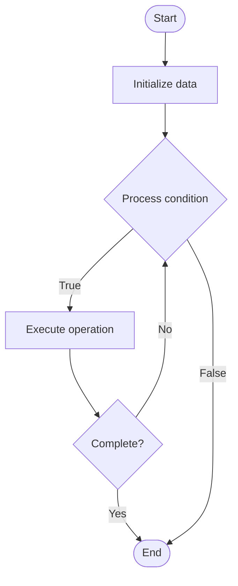

# Quantum Security Protocols

1. **Name of Algorithm**  

## Code Files


## Algorithm Visualization

### Flowchart (ASCII)


```
Quantum Security Protocols Flowchart:

┌─────────────┐
│   Start     │
└──────┬──────┘
       │
       ▼
┌─────────────┐
│  Initialize │
│   data      │
└──────┬──────┘
       │
       ▼
┌─────────────┐      Yes
│  Process   ├──────┐
│  condition?│      │
└──────┬──────┘      │
       │ No          │
       ▼             │
┌─────────────┐      │
│  Execute   │      │
│  operation │      │
└──────┬──────┘      │
       │             │
       └─────────────┘
       │
       ▼
┌─────────────┐
│    End      │
└─────────────┘
```


### Step-by-Step Execution


```
Quantum Security Protocols Step-by-Step Execution:

Input: [example data]

Step 1: Initialize
State: [initial state]

Step 2: Process
State: [intermediate state]

Step 3: Finalize
State: [final state]

Result: [output]
```


### Interactive Flowchart (Mermaid)





> **Note**: Mermaid diagrams are rendered automatically on GitHub. For local viewing, use a Mermaid-compatible Markdown viewer.
- [Python Implementation](semester_12/lecture_86_quantum_security/quantum_security_protocols/algorithm.py)
- [Java Implementation](semester_12/lecture_86_quantum_security/quantum_security_protocols/Algorithm.java)
- [Python Tests](semester_12/lecture_86_quantum_security/quantum_security_protocols/test_algorithm.py)


   Quantum Security Protocols

2. **What problem does it solve? (1 sentence)**  
   Implements security protocols that leverage quantum mechanics for secure communication, authentication, and cryptographic operations, providing provably secure protocols based on quantum principles.

3. **Intuition (plain-language explanation)**  
   Like security protocols using quantum: Quantum Security Protocols are like security protocols but using quantum mechanics - you use quantum properties (like entanglement, no-cloning) to create secure protocols - just as security protocols protect communication, quantum security protocols protect using quantum mechanics.

4. **Inputs & Outputs**  
   - Input: Communication channels, quantum states, protocols, authentication requirements, security parameters.  
   - Output: Secure quantum protocols, authenticated communication, quantum-secure operations, protocol implementations.

5. **Step-by-step description (5–10 lines max)**  
1. Design: design quantum security protocol.
2. Implement: implement protocol using quantum mechanics.
3. Authenticate: implement quantum authentication.
4. Encrypt: implement quantum encryption.
5. Verify: verify protocol security properties.
6. Deploy: deploy quantum security protocol.
7. Test: test protocol effectiveness.
8. Monitor: monitor protocol security.
9. Update: update protocol as needed.
10. Maintain: maintain protocol security.

6. **Tiny example (hand-simulated)**  
   Quantum Security Protocols: protocol: BB84 QKD → implement: implement quantum key distribution → authenticate: quantum authentication → encrypt: use quantum keys → result: provably secure communication → Quantum Security Protocols operational.

7. **Time & Space Complexity**  
   - Time: O(p) where p is protocol execution time (varies by protocol).  
   - Space: O(q + s) where q is quantum state storage, s is protocol state storage.

8. **Strengths**  
- Security: provably secure based on quantum mechanics.
- Detection: automatically detects attacks.
- Future-proof: secure against quantum computers.

9. **Weaknesses / limitations**  
- Infrastructure: requires quantum infrastructure.
- Complexity: quantum protocols are complex.
- Distance: limited by quantum channel distance.

10. **Compare with alternatives**  
    Alternatives: Classical Security Protocols, Post-Quantum Protocols, Hybrid Protocols, Basic Security

11. **30-second explanation (your own words)**  
    Implements security protocols that leverage quantum mechanics for secure communication, authentication, and cryptographic operations, providing provably secure protocols based on quantum principles.

*Sources: Adapted from standard university textbooks and Wikipedia summaries.*
