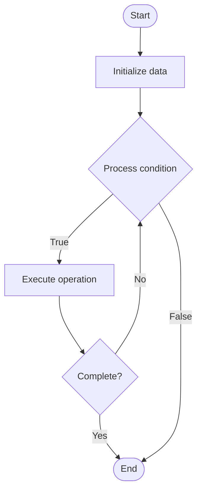

# Blockchain Scalability Solutions

## Учебные материалы

- [Школьный уровень](school.ru.md)
- [Университетский уровень](univer.ru.md)

## Algorithm Visualization

### Flowchart (ASCII)

```
Blockchain Scalability Solutions Flowchart:

┌─────────────┐
│   Start     │
└──────┬──────┘
       │
       ▼
┌─────────────┐
│  Initialize │
│   data      │
└──────┬──────┘
       │
       ▼
┌─────────────┐      Yes
│  Process   ├──────┐
│  condition?│      │
└──────┬──────┘      │
       │ No          │
       ▼             │
┌─────────────┐      │
│  Execute   │      │
│  operation │      │
└──────┬──────┘      │
       │             │
       └─────────────┘
       │
       ▼
┌─────────────┐
│    End      │
└─────────────┘
```

### Step-by-Step Execution

```
Blockchain Scalability Solutions Step-by-Step Execution:

Input: [example data]

Step 1: Initialize
State: [initial state]

Step 2: Process
State: [intermediate state]

Step 3: Finalize
State: [final state]

Result: [output]
```

### Interactive Flowchart (Mermaid)



> **Note**: Mermaid diagrams are rendered automatically on GitHub. For local viewing, use a Mermaid-compatible Markdown viewer.

- [Python Implementation](/code/semester_13/lecture_87_blockchain_advanced/blockchain_scalability_solutions/algorithm.py)
- [Java Implementation](/code/semester_13/lecture_87_blockchain_advanced/blockchain_scalability_solutions/Algorithm.java)
- [Python Tests](/code/semester_13/lecture_87_blockchain_advanced/blockchain_scalability_solutions/test_algorithm.py)

What problem does it solve? (1 sentence)  
   Addresses blockchain throughput limitations by implementing Layer 2 solutions, sharding, and optimization techniques that increase transaction processing capacity while maintaining security and decentralization.

Intuition (plain-language explanation)  
Like adding lanes to a highway: Blockchain scalability solutions are like adding lanes to a congested highway - instead of one slow lane (main chain), you add multiple lanes (Layer 2, sharding) that process transactions in parallel, or you optimize the existing lane (optimizations) - the goal is to handle more traffic (transactions) without compromising safety (security) or accessibility (decentralization).

Inputs & Outputs  

  - Input: Transactions, scalability requirements, security constraints, decentralization goals, network topology, consensus mechanism.  
  - Output: Scaled blockchain, increased throughput, maintained security, preserved decentralization, optimized performance.

Step-by-step description (5–10 lines max)  
Analyze: analyze current bottlenecks and limitations.
Choose: choose scalability approach (Layer 2, sharding, optimization).
Design: design scalability solution architecture.
Implement: implement chosen solution (rollups, plasma, sidechains, etc.).
Optimize: optimize transaction processing and data structures.
Test: test scalability improvements and security.
Deploy: deploy solution to network.
Monitor: monitor performance and security metrics.
Iterate: iterate on improvements based on results.
Maintain: maintain scalability solution and adapt to growth.

Tiny example (hand-simulated)  
   Scalability: analyze → identify bottleneck (15 tx/s) → choose rollups → design → implement → optimize → test → deploy → monitor → 1000 tx/s → Scalability successful.

Time & Space Complexity  

  - Time: Varies by solution: O(t/s) for sharding, O(b) for rollups where t is transactions, s is shards, b is batch size (scalability complexity).  
  - Space: Varies by solution: O(n/s) for sharding, O(c) for rollups where n is state, s is shards, c is compressed data (scalability storage).

Strengths  

- Throughput: significantly increases transaction throughput.
- Flexibility: multiple approaches for different use cases.
- Compatibility: can maintain main chain security.

Weaknesses / limitations  

- Complexity: adds complexity to system architecture.
- Trade-offs: may trade off some security or decentralization.
- Coordination: requires careful coordination and testing.

Compare with alternatives  
    Alternatives: No Scaling, Bigger Blocks, Faster Consensus, Off-Chain Solutions

30-second explanation (your own words)  
    Techniques and solutions that increase blockchain transaction throughput, including Layer 2 solutions, sharding, and optimization methods.

*Sources: Adapted from standard university textbooks and Wikipedia summaries.*
