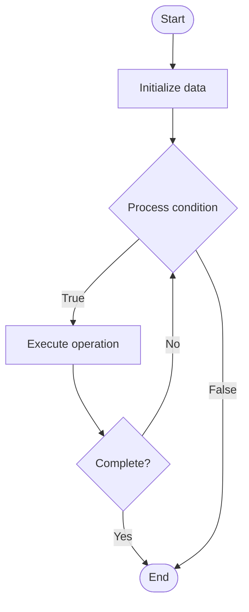

# Plasma

## Учебные материалы

- [Школьный уровень](school.ru.md)
- [Университетский уровень](univer.ru.md)

## Algorithm Visualization

### Flowchart (ASCII)

```
Plasma Flowchart:

┌─────────────┐
│   Start     │
└──────┬──────┘
       │
       ▼
┌─────────────┐
│  Initialize │
│   data      │
└──────┬──────┘
       │
       ▼
┌─────────────┐      Yes
│  Process   ├──────┐
│  condition?│      │
└──────┬──────┘      │
       │ No          │
       ▼             │
┌─────────────┐      │
│  Execute   │      │
│  operation │      │
└──────┬──────┘      │
       │             │
       └─────────────┘
       │
       ▼
┌─────────────┐
│    End      │
└─────────────┘
```

### Step-by-Step Execution

```
Plasma Step-by-Step Execution:

Input: [example data]

Step 1: Initialize
State: [initial state]

Step 2: Process
State: [intermediate state]

Step 3: Finalize
State: [final state]

Result: [output]
```

### Interactive Flowchart (Mermaid)



> **Note**: Mermaid diagrams are rendered automatically on GitHub. For local viewing, use a Mermaid-compatible Markdown viewer.

- [Python Implementation](/code/semester_13/lecture_87_blockchain_advanced/plasma/algorithm.py)
- [Java Implementation](/code/semester_13/lecture_87_blockchain_advanced/plasma/Algorithm.java)
- [Python Tests](/code/semester_13/lecture_87_blockchain_advanced/plasma/test_algorithm.py)

What problem does it solve? (1 sentence)  
   Scales blockchain transactions by creating child chains (Plasma chains) that process transactions off the main chain and periodically commit state roots, reducing main chain congestion and fees.

Intuition (plain-language explanation)  
   Like branch offices: Plasma is like a company with branch offices - the main office (main chain) doesn't handle every transaction, instead branch offices (Plasma chains) handle most transactions locally and only report summaries (state roots) to the main office - this reduces workload on the main office while maintaining security through fraud proofs.

Inputs & Outputs  

  - Input: Transactions, Plasma chain configuration, operator, state commitments, fraud proofs, exit requests.  
  - Output: Plasma chain blocks, state roots, committed transactions, exit proofs, scaled throughput.

Step-by-step description (5–10 lines max)  
Create: create Plasma child chain with operator.
Process: process transactions on Plasma chain (off-chain).
Commit: commit state roots to main chain periodically.
Validate: validate transactions using fraud proofs.
Exit: allow users to exit to main chain with proofs.
Challenge: challenge invalid state transitions.
Settle: settle disputes using fraud proofs.
Withdraw: withdraw funds to main chain after exit period.
Monitor: monitor Plasma chain for fraud.
Maintain: maintain Plasma chain security and liveness.

Tiny example (hand-simulated)  
   Plasma: create chain → process 1000 tx/s on Plasma → commit root every 10 blocks → user exits → submit exit proof → wait 7 days → withdraw to main chain → Plasma successful.

Time & Space Complexity  

  - Time: O(t + c) where t is transaction processing time, c is commitment time (Plasma operations).  
  - Space: O(s + p) where s is state storage, p is proof storage (Plasma storage).

Strengths  

- Scalability: significantly increases transaction throughput.
- Cost: reduces transaction fees on main chain.
- Flexibility: supports various Plasma chain designs.

Weaknesses / limitations  

- Complexity: complex exit and fraud proof mechanisms.
- Security: requires users to monitor for fraud.
- Liquidity: exit periods can lock funds temporarily.

Compare with alternatives  
    Alternatives: Rollups, Sidechains, State Channels, Sharding

30-second explanation (your own words)  
A Layer 2 scaling solution that creates child chains that process transactions off-chain and commit state roots to the main chain, enabling high throughput while maintaining security.

*Sources: Adapted from standard university textbooks and Wikipedia summaries.*
