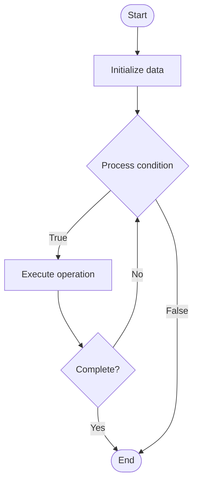

# Rollups

## Учебные материалы

- [Школьный уровень](school.ru.md)
- [Университетский уровень](univer.ru.md)

## Algorithm Visualization

### Flowchart (ASCII)

```
Rollups Flowchart:

┌─────────────┐
│   Start     │
└──────┬──────┘
       │
       ▼
┌─────────────┐
│  Initialize │
│   data      │
└──────┬──────┘
       │
       ▼
┌─────────────┐      Yes
│  Process   ├──────┐
│  condition?│      │
└──────┬──────┘      │
       │ No          │
       ▼             │
┌─────────────┐      │
│  Execute   │      │
│  operation │      │
└──────┬──────┘      │
       │             │
       └─────────────┘
       │
       ▼
┌─────────────┐
│    End      │
└─────────────┘
```

### Step-by-Step Execution

```
Rollups Step-by-Step Execution:

Input: [example data]

Step 1: Initialize
State: [initial state]

Step 2: Process
State: [intermediate state]

Step 3: Finalize
State: [final state]

Result: [output]
```

### Interactive Flowchart (Mermaid)



> **Note**: Mermaid diagrams are rendered automatically on GitHub. For local viewing, use a Mermaid-compatible Markdown viewer.

- [Python Implementation](/code/semester_13/lecture_87_blockchain_advanced/rollups/algorithm.py)
- [Java Implementation](/code/semester_13/lecture_87_blockchain_advanced/rollups/Algorithm.java)
- [Python Tests](/code/semester_13/lecture_87_blockchain_advanced/rollups/test_algorithm.py)

What problem does it solve? (1 sentence)  
   Scales blockchain by executing transactions off-chain, batching them, and submitting compressed transaction data and state roots to the main chain, achieving high throughput with main chain security.

Intuition (plain-language explanation)  
   Like a shipping container: Rollups are like shipping containers - instead of shipping items individually (expensive), you pack many items into a container (batch transactions), compress it (compress data), and ship the container (submit to main chain) - this reduces shipping costs (fees) while maintaining security (main chain validation).

Inputs & Outputs  

- Input: Transactions, rollup sequencer, compression algorithm, state transitions, validity proofs (optional).
  - Output: Rollup blocks, compressed transaction data, state roots, validity proofs (ZK-Rollups), fraud proofs (Optimistic Rollups).

Step-by-step description (5–10 lines max)  
Collect: collect transactions from users.
Execute: execute transactions off-chain (in rollup).
Batch: batch multiple transactions together.
Compress: compress transaction data.
Compute: compute new state root.
Prove: generate validity proof (ZK-Rollup) or prepare for fraud proof (Optimistic).
Submit: submit batch to main chain.
Verify: verify proof on main chain (ZK) or wait for challenge period (Optimistic).
Finalize: finalize state on main chain.
Settle: settle disputes if needed (Optimistic).

Tiny example (hand-simulated)  
   Rollup: collect 1000 tx → execute off-chain → batch → compress 1000 tx to 10KB → compute root → submit to main chain → verify → finalize → Rollup successful (100x cheaper).

Time & Space Complexity  

  - Time: O(b + v) where b is batch processing time, v is verification time (rollup operations).  
  - Space: O(c + s) where c is compressed data, s is state storage (rollup storage).

Strengths  

- Scalability: 10-100x throughput improvement.
- Security: inherits main chain security.
- Cost: significantly reduces transaction fees.

Weaknesses / limitations  

- Latency: some delay for finality (especially Optimistic).
- Complexity: requires sophisticated compression and proof systems.
- Centralization: sequencer can be centralized point of failure.

Compare with alternatives  
    Alternatives: Plasma, Sidechains, State Channels, Sharding

30-second explanation (your own words)  
    Layer 2 scaling solutions that execute transactions off-chain, batch and compress them, then submit to the main chain, achieving high throughput with main chain security guarantees.

*Sources: Adapted from standard university textbooks and Wikipedia summaries.*


## References

- [Rollups - Wikipedia](https://en.wikipedia.org/wiki/Rollups)
