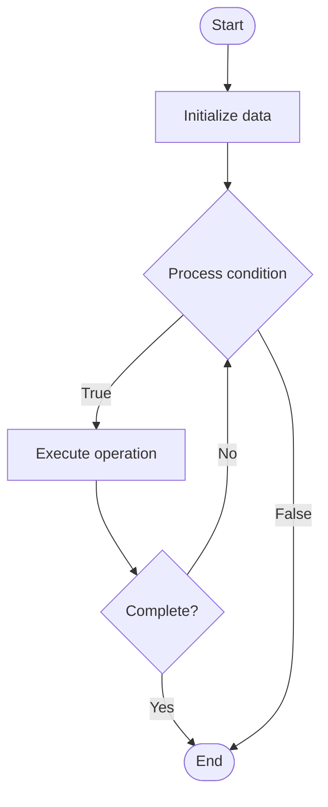

# Blockchain Sharding

## Учебные материалы

- [Школьный уровень](school.ru.md)
- [Университетский уровень](univer.ru.md)

## Algorithm Visualization

### Flowchart (ASCII)

```
Blockchain Sharding Flowchart:

┌─────────────┐
│   Start     │
└──────┬──────┘
       │
       ▼
┌─────────────┐
│  Initialize │
│   data      │
└──────┬──────┘
       │
       ▼
┌─────────────┐      Yes
│  Process   ├──────┐
│  condition?│      │
└──────┬──────┘      │
       │ No          │
       ▼             │
┌─────────────┐      │
│  Execute   │      │
│  operation │      │
└──────┬──────┘      │
       │             │
       └─────────────┘
       │
       ▼
┌─────────────┐
│    End      │
└─────────────┘
```

### Step-by-Step Execution

```
Blockchain Sharding Step-by-Step Execution:

Input: [example data]

Step 1: Initialize
State: [initial state]

Step 2: Process
State: [intermediate state]

Step 3: Finalize
State: [final state]

Result: [output]
```

### Interactive Flowchart (Mermaid)



> **Note**: Mermaid diagrams are rendered automatically on GitHub. For local viewing, use a Mermaid-compatible Markdown viewer.

- [Python Implementation](/code/semester_13/lecture_87_blockchain_advanced/sharding_blockchain/algorithm.py)
- [Java Implementation](/code/semester_13/lecture_87_blockchain_advanced/sharding_blockchain/Algorithm.java)
- [Python Tests](/code/semester_13/lecture_87_blockchain_advanced/sharding_blockchain/test_algorithm.py)

What problem does it solve? (1 sentence)  
   Scales blockchain by partitioning the network into multiple shards that process transactions in parallel, each maintaining its own state and transaction history, enabling horizontal scaling.

Intuition (plain-language explanation)  
   Like dividing a library into sections: Blockchain sharding is like dividing a library into sections (shards) - instead of everyone using one catalog (single chain), each section has its own catalog (shard) - people can use different sections simultaneously (parallel processing), and the library (network) can handle more visitors (transactions) overall.

Inputs & Outputs  

  - Input: Transactions, shard assignment, validators, cross-shard communication, consensus mechanism.  
  - Output: Shard blocks, cross-shard transactions, aggregated state, network-wide consensus.

Step-by-step description (5–10 lines max)  
Partition: partition network into multiple shards.
Assign: assign validators to shards (randomly or by stake).
Route: route transactions to appropriate shards.
Process: process transactions within each shard in parallel.
Consensus: reach consensus within each shard.
Cross-shard: handle cross-shard transactions.
Aggregate: aggregate shard states periodically.
Sync: synchronize shard states across network.
Validate: validate cross-shard transactions.
Finalize: finalize shard blocks and network state.

Tiny example (hand-simulated)  
   Sharding: partition into 4 shards → assign validators → route tx to shard 2 → process in parallel → consensus in shard 2 → cross-shard tx to shard 3 → aggregate → Sharding successful (4x throughput).

Time & Space Complexity  

  - Time: O(t/s + c) where t is transactions, s is shards, c is cross-shard overhead (sharded complexity).  
  - Space: O(n/s) per shard where n is total state, s is shards (sharded storage).

Strengths  

- Scalability: linear scaling with number of shards.
- Parallelism: enables parallel transaction processing.
- Efficiency: reduces storage and processing per node.

Weaknesses / limitations  

- Complexity: complex cross-shard communication and consensus.
- Security: smaller shards may be more vulnerable to attacks.
- Synchronization: requires careful state synchronization.

Compare with alternatives  
    Alternatives: Rollups, Plasma, Sidechains, State Channels

30-second explanation (your own words)  
    A scaling technique that partitions the blockchain into multiple shards that process transactions in parallel, enabling horizontal scaling of transaction throughput.

*Sources: Adapted from standard university textbooks and Wikipedia summaries.*
