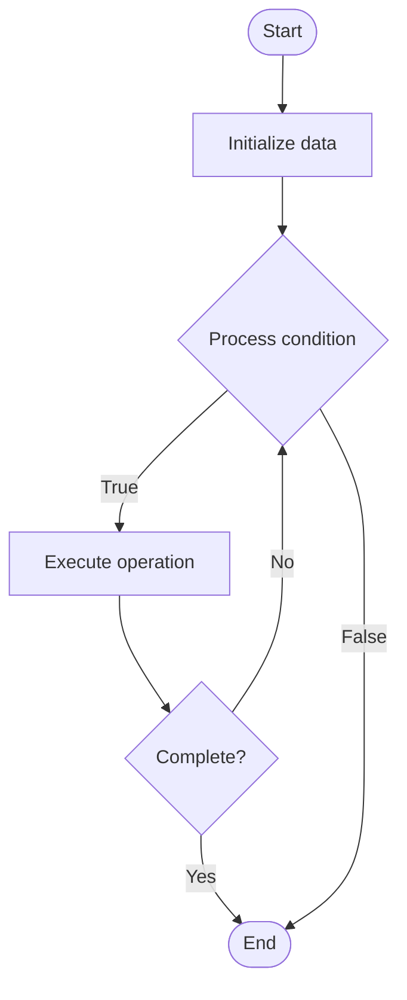

# Sidechains

Name of Algorithm  

## Code Files


## Algorithm Visualization

### Flowchart (ASCII)


```
Sidechains Flowchart:

┌─────────────┐
│   Start     │
└──────┬──────┘
       │
       ▼
┌─────────────┐
│  Initialize │
│   data      │
└──────┬──────┘
       │
       ▼
┌─────────────┐      Yes
│  Process   ├──────┐
│  condition?│      │
└──────┬──────┘      │
       │ No          │
       ▼             │
┌─────────────┐      │
│  Execute   │      │
│  operation │      │
└──────┬──────┘      │
       │             │
       └─────────────┘
       │
       ▼
┌─────────────┐
│    End      │
└─────────────┘
```


### Step-by-Step Execution


```
Sidechains Step-by-Step Execution:

Input: [example data]

Step 1: Initialize
State: [initial state]

Step 2: Process
State: [intermediate state]

Step 3: Finalize
State: [final state]

Result: [output]
```


### Interactive Flowchart (Mermaid)





> **Note**: Mermaid diagrams are rendered automatically on GitHub. For local viewing, use a Mermaid-compatible Markdown viewer.
- [Python Implementation](/code/semester_13/lecture_87_blockchain_advanced/sidechains/algorithm.py)
- [Java Implementation](/code/semester_13/lecture_87_blockchain_advanced/sidechains/Algorithm.java)
- [Python Tests](/code/semester_13/lecture_87_blockchain_advanced/sidechains/test_algorithm.py)


   Sidechains

What problem does it solve? (1 sentence)  
   Enables blockchain interoperability and scaling by creating separate blockchains (sidechains) that are pegged to the main chain, allowing assets and data to move between chains.

Intuition (plain-language explanation)  
   Like connected islands: Sidechains are like islands connected by bridges to the mainland (main chain) - you can move between islands (sidechains) and the mainland, each island can have different rules (consensus, features), but they're all connected - this allows experimentation and scaling while maintaining connection to the main chain.

Inputs & Outputs  
   - Input: Assets to transfer, sidechain configuration, peg mechanism, validators, consensus parameters.  
   - Output: Sidechain blocks, pegged assets, cross-chain transfers, sidechain state.

Step-by-step description (5–10 lines max)  
Create: create sidechain with its own consensus and rules.
Peg: establish two-way peg with main chain.
Lock: lock assets on main chain.
Transfer: transfer assets to sidechain.
Process: process transactions on sidechain.
Unlock: unlock assets on main chain when transferring back.
Validate: validate peg operations and transfers.
Monitor: monitor sidechain security and liveness.
Settle: settle cross-chain transactions.
Maintain: maintain peg security and sidechain operations.

Tiny example (hand-simulated)  
   Sidechain: create sidechain → establish peg → lock 10 ETH on main chain → transfer 10 ETH to sidechain → process tx on sidechain → transfer back → unlock on main chain → Sidechain successful.

Time & Space Complexity  
   - Time: O(t + p) where t is transaction time, p is peg operation time (sidechain operations).  
   - Space: O(s + m) where s is sidechain state, m is main chain state (sidechain storage).

Strengths  
- Flexibility: allows experimentation with different consensus and features.
- Interoperability: enables asset and data transfer between chains.
- Scalability: offloads transactions from main chain.

Weaknesses / limitations  
- Security: sidechain security is independent (weaker than main chain).
- Peg: two-way peg can be complex and risky.
- Trust: may require trusted validators for peg.

Compare with alternatives  
    Alternatives: Rollups, Plasma, State Channels, Sharding

30-second explanation (your own words)  
    Separate blockchains that are pegged to the main chain, enabling asset transfer and interoperability while allowing different consensus mechanisms and features.

*Sources: Adapted from standard university textbooks and Wikipedia summaries.*
