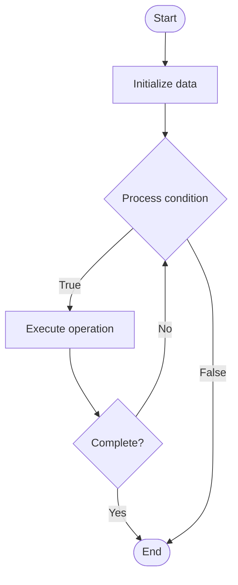

# State Channels

## Учебные материалы

- [Школьный уровень](school.ru.md)
- [Университетский уровень](univer.ru.md)

## Algorithm Visualization

### Flowchart (ASCII)

```
State Channels Flowchart:

┌─────────────┐
│   Start     │
└──────┬──────┘
       │
       ▼
┌─────────────┐
│  Initialize │
│   data      │
└──────┬──────┘
       │
       ▼
┌─────────────┐      Yes
│  Process   ├──────┐
│  condition?│      │
└──────┬──────┘      │
       │ No          │
       ▼             │
┌─────────────┐      │
│  Execute   │      │
│  operation │      │
└──────┬──────┘      │
       │             │
       └─────────────┘
       │
       ▼
┌─────────────┐
│    End      │
└─────────────┘
```

### Step-by-Step Execution

```
State Channels Step-by-Step Execution:

Input: [example data]

Step 1: Initialize
State: [initial state]

Step 2: Process
State: [intermediate state]

Step 3: Finalize
State: [final state]

Result: [output]
```

### Interactive Flowchart (Mermaid)



> **Note**: Mermaid diagrams are rendered automatically on GitHub. For local viewing, use a Mermaid-compatible Markdown viewer.

- [Python Implementation](/code/semester_13/lecture_87_blockchain_advanced/state_channels/algorithm.py)
- [Java Implementation](/code/semester_13/lecture_87_blockchain_advanced/state_channels/Algorithm.java)
- [Python Tests](/code/semester_13/lecture_87_blockchain_advanced/state_channels/test_algorithm.py)

What problem does it solve? (1 sentence)  
   Enables off-chain transactions between parties by opening a channel, conducting multiple transactions off-chain, and settling the final state on-chain, reducing fees and latency.

Intuition (plain-language explanation)  
   Like a tab at a bar: State channels are like running a tab at a bar - instead of paying for each drink immediately (on-chain transaction), you keep a tab (off-chain state), order multiple drinks (off-chain transactions), and settle the tab at the end (on-chain settlement) - this is faster and cheaper than paying each time.

Inputs & Outputs  

  - Input: Channel participants, initial state, off-chain transactions, signatures, settlement conditions.  
  - Output: Channel state, signed transactions, final settlement, channel closure.

Step-by-step description (5–10 lines max)  
Open: open channel by depositing funds on-chain.
Update: update channel state off-chain with transactions.
Sign: sign state updates with both parties.
Exchange: exchange signed state updates.
Continue: continue off-chain transactions.
Close: close channel by submitting final state on-chain.
Challenge: challenge period for dispute resolution.
Settle: settle final state on-chain.
Withdraw: withdraw funds after settlement.
Dispute: handle disputes using latest signed state.

Tiny example (hand-simulated)  
   State Channel: open with 10 ETH deposit → update: Alice pays Bob 1 ETH (off-chain) → update: Bob pays Alice 0.5 ETH (off-chain) → close: submit final state (Alice: 9.5, Bob: 0.5) → settle → State Channel successful.

Time & Space Complexity  

  - Time: O(1) for off-chain transactions, O(b) for on-chain settlement where b is block time (channel operations).  
  - Space: O(p) where p is participants (channel state storage).

Strengths  

- Speed: instant off-chain transactions.
- Cost: minimal fees (only on open/close).
- Privacy: transactions are private until settlement.

Weaknesses / limitations  

- Liquidity: requires locking funds in channel.
- Online: participants must be online for updates.
- Disputes: requires monitoring and dispute mechanisms.

Compare with alternatives  
    Alternatives: Rollups, Plasma, Sidechains, Payment Channels

30-second explanation (your own words)  
    Off-chain transaction channels that allow parties to conduct multiple transactions off-chain and settle the final state on-chain, enabling fast and cheap transactions.

*Sources: Adapted from standard university textbooks and Wikipedia summaries.*
