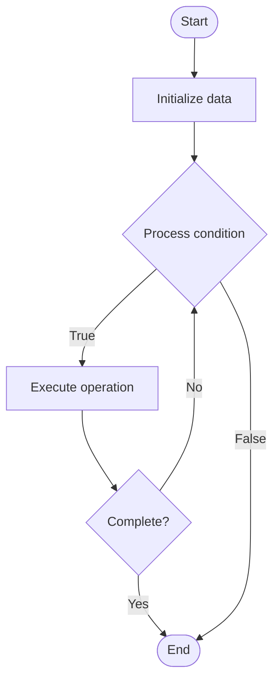

# Algorand

1. **Name of Algorithm**  

## Code Files


## Algorithm Visualization

### Flowchart (ASCII)


```
Algorand Flowchart:

┌─────────────┐
│   Start     │
└──────┬──────┘
       │
       ▼
┌─────────────┐
│  Initialize │
│   data      │
└──────┬──────┘
       │
       ▼
┌─────────────┐      Yes
│  Process   ├──────┐
│  condition?│      │
└──────┬──────┘      │
       │ No          │
       ▼             │
┌─────────────┐      │
│  Execute   │      │
│  operation │      │
└──────┬──────┘      │
       │             │
       └─────────────┘
       │
       ▼
┌─────────────┐
│    End      │
└─────────────┘
```


### Step-by-Step Execution


```
Algorand Step-by-Step Execution:

Input: [example data]

Step 1: Initialize
State: [initial state]

Step 2: Process
State: [intermediate state]

Step 3: Finalize
State: [final state]

Result: [output]
```


### Interactive Flowchart (Mermaid)





> **Note**: Mermaid diagrams are rendered automatically on GitHub. For local viewing, use a Mermaid-compatible Markdown viewer.
- [Python Implementation](semester_13/lecture_88_consensus_advanced/algorand/algorithm.py)
- [Java Implementation](semester_13/lecture_88_consensus_advanced/algorand/Algorithm.java)
- [Python Tests](semester_13/lecture_88_consensus_advanced/algorand/test_algorithm.py)


   Algorand

2. **What problem does it solve? (1 sentence)**  
   Achieves Byzantine fault tolerance and fast finality in a permissionless blockchain using pure proof-of-stake, cryptographic sortition for leader selection, and a two-phase consensus protocol.

3. **Intuition (plain-language explanation)**  
   Like a democratic lottery: Algorand is like a democratic lottery system - instead of everyone voting (expensive), you randomly select a small committee (cryptographic sortition) based on stake (like weighted lottery tickets) - the committee reaches consensus quickly, and because selection is random and cryptographic, it's secure and fair - this enables fast, secure consensus without energy waste.

4. **Inputs & Outputs**  
   - Input: Stake distribution, transactions, cryptographic sortition, committee selection, consensus messages.  
   - Output: Finalized blocks, consensus certificates, leader selection, network agreement.

5. **Step-by-step description (5–10 lines max)**  
1. Sortition: use cryptographic sortition to select committee members.
2. Propose: selected proposer creates block proposal.
3. Broadcast: broadcast proposal to network.
4. Vote: committee members vote on proposal.
5. Certify: certify block if sufficient votes received.
6. Finalize: finalize block (no forks possible).
7. Next: proceed to next round with new sortition.
8. Validate: validate sortition and votes cryptographically.
9. Sync: synchronize network on finalized blocks.
10. Maintain: maintain liveness and safety properties.

6. **Tiny example (hand-simulated)**  
   Algorand: sortition selects 1000 validators → proposer creates block → committee votes → 667+ votes → certify → finalize in <5s → Algorand successful (fast finality).

7. **Time & Space Complexity**  
   - Time: O(log n) for sortition, O(1) for consensus with small committee (Algorand complexity).  
   - Space: O(n) for stake distribution, O(c) for committee where c << n (Algorand storage).

8. **Strengths**  
- Speed: fast finality (under 5 seconds).
- Security: Byzantine fault tolerant with no forks.
- Efficiency: energy efficient (pure PoS, no mining).

9. **Weaknesses / limitations**  
- Complexity: sophisticated cryptographic sortition mechanism.
- Stake: security depends on stake distribution.
- Scalability: committee size affects performance.

10. **Compare with alternatives**  
    Alternatives: Proof of Work, Delegated Proof of Stake, Practical Byzantine Fault Tolerance, Tendermint

11. **30-second explanation (your own words)**  
    A pure proof-of-stake consensus protocol that uses cryptographic sortition to randomly select small committees for fast, secure, and fork-free consensus.

*Sources: Adapted from standard university textbooks and Wikipedia summaries.*
