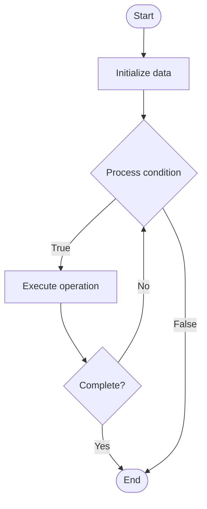

# Delegated Proof of Stake (DPoS) Advanced

1. **Name of Algorithm**  

## Code Files


## Algorithm Visualization

### Flowchart (ASCII)


```
Delegated Proof of Stake (DPoS) Advanced Flowchart:

┌─────────────┐
│   Start     │
└──────┬──────┘
       │
       ▼
┌─────────────┐
│  Initialize │
│   data      │
└──────┬──────┘
       │
       ▼
┌─────────────┐      Yes
│  Process   ├──────┐
│  condition?│      │
└──────┬──────┘      │
       │ No          │
       ▼             │
┌─────────────┐      │
│  Execute   │      │
│  operation │      │
└──────┬──────┘      │
       │             │
       └─────────────┘
       │
       ▼
┌─────────────┐
│    End      │
└─────────────┘
```


### Step-by-Step Execution


```
Delegated Proof of Stake (DPoS) Advanced Step-by-Step Execution:

Input: [example data]

Step 1: Initialize
State: [initial state]

Step 2: Process
State: [intermediate state]

Step 3: Finalize
State: [final state]

Result: [output]
```


### Interactive Flowchart (Mermaid)





> **Note**: Mermaid diagrams are rendered automatically on GitHub. For local viewing, use a Mermaid-compatible Markdown viewer.
- [Python Implementation](semester_13/lecture_88_consensus_advanced/dpos_advanced/algorithm.py)
- [Java Implementation](semester_13/lecture_88_consensus_advanced/dpos_advanced/Algorithm.java)
- [Python Tests](semester_13/lecture_88_consensus_advanced/dpos_advanced/test_algorithm.py)


   Delegated Proof of Stake (DPoS) Advanced

2. **What problem does it solve? (1 sentence)**  
   Enhances DPoS with advanced features like vote decay, proxy voting, flexible block production, and governance mechanisms to improve decentralization, security, and efficiency.

3. **Intuition (plain-language explanation)**  
   Like an improved representative democracy: Advanced DPoS is like improving representative democracy - instead of static representatives (basic DPoS), you add features like vote decay (representatives lose support over time if inactive), proxy voting (delegating votes to trusted proxies), flexible scheduling (adaptive block production), and governance (voting on proposals) - this makes the system more dynamic, responsive, and decentralized.

4. **Inputs & Outputs**  
   - Input: Stake, delegate votes, vote decay parameters, proxy settings, block production schedule, governance proposals.  
   - Output: Elected delegates, block production schedule, governance decisions, network parameters, consensus blocks.

5. **Step-by-step description (5–10 lines max)**  
1. Vote: stakeholders vote for delegates (with optional proxy).
2. Decay: apply vote decay to inactive delegates.
3. Elect: elect top delegates as block producers.
4. Schedule: create flexible block production schedule.
5. Produce: delegates produce blocks in rotation.
6. Govern: participate in on-chain governance.
7. Update: update network parameters via governance.
8. Monitor: monitor delegate performance and rewards.
9. Adjust: adjust votes based on performance.
10. Maintain: maintain network security and efficiency.

6. **Tiny example (hand-simulated)**  
   DPoS Advanced: vote for delegates → decay reduces inactive votes → elect top 21 → flexible schedule → produce blocks → governance proposal → vote → update parameters → DPoS Advanced successful.

7. **Time & Space Complexity**  
   - Time: O(d) for delegate election, O(1) for block production where d is delegates (DPoS complexity).  
   - Space: O(d + v) where d is delegates, v is votes (DPoS storage).

8. **Strengths**  
- Efficiency: fast block times and high throughput.
- Governance: built-in on-chain governance mechanisms.
- Flexibility: adaptive block production and parameters.

9. **Weaknesses / limitations**  
- Centralization: risk of delegate cartels.
- Complexity: more complex than basic DPoS.
- Vote decay: requires careful parameter tuning.

10. **Compare with alternatives**  
    Alternatives: Proof of Work, Proof of Stake, Practical Byzantine Fault Tolerance, Algorand

11. **30-second explanation (your own words)**  
    An enhanced DPoS consensus mechanism with vote decay, proxy voting, flexible block production, and governance features for improved decentralization and efficiency.

*Sources: Adapted from standard university textbooks and Wikipedia summaries.*
