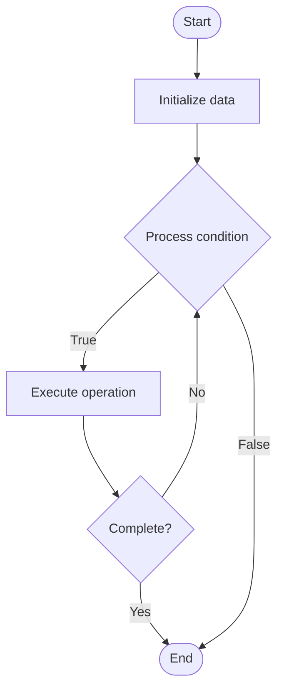

# HotStuff

## Учебные материалы

- [Школьный уровень](school.ru.md)
- [Университетский уровень](univer.ru.md)

## Algorithm Visualization

### Flowchart (ASCII)

```
HotStuff Flowchart:

┌─────────────┐
│   Start     │
└──────┬──────┘
       │
       ▼
┌─────────────┐
│  Initialize │
│   data      │
└──────┬──────┘
       │
       ▼
┌─────────────┐      Yes
│  Process   ├──────┐
│  condition?│      │
└──────┬──────┘      │
       │ No          │
       ▼             │
┌─────────────┐      │
│  Execute   │      │
│  operation │      │
└──────┬──────┘      │
       │             │
       └─────────────┘
       │
       ▼
┌─────────────┐
│    End      │
└─────────────┘
```

### Step-by-Step Execution

```
HotStuff Step-by-Step Execution:

Input: [example data]

Step 1: Initialize
State: [initial state]

Step 2: Process
State: [intermediate state]

Step 3: Finalize
State: [final state]

Result: [output]
```

### Interactive Flowchart (Mermaid)



> **Note**: Mermaid diagrams are rendered automatically on GitHub. For local viewing, use a Mermaid-compatible Markdown viewer.

- [Python Implementation](/code/semester_13/lecture_88_consensus_advanced/hotstuff/algorithm.py)
- [Java Implementation](/code/semester_13/lecture_88_consensus_advanced/hotstuff/Algorithm.java)
- [Python Tests](/code/semester_13/lecture_88_consensus_advanced/hotstuff/test_algorithm.py)

   HotStuff

What problem does it solve? (1 sentence)  
   Achieves Byzantine fault tolerance with linear message complexity and optimistic responsiveness using a three-phase consensus protocol with a rotating leader and pipelined block proposals.

Intuition (plain-language explanation)  
Like an efficient assembly line: HotStuff is like an efficient assembly line with a rotating supervisor (leader) - instead of stopping the line for each decision (expensive), the line keeps moving (pipelining) while the supervisor coordinates (three-phase consensus) - if the supervisor is slow, you rotate to a new one (leader change) - this enables fast, optimized consensus even with leader failures.

Inputs & Outputs  

  - Input: Transactions, leader rotation, replicas, consensus messages, timeout mechanisms.  
  - Output: Committed blocks, consensus certificates, leader decisions, pipelined proposals.

Step-by-step description (5–10 lines max)  
Propose: leader proposes block with sequence number.
Prepare: replicas vote on proposal (prepare phase).
Pre-commit: if prepared, replicas pre-commit.
Commit: if pre-committed, replicas commit.
Pipeline: pipeline multiple proposals for efficiency.
Rotate: rotate leader if timeout or failure.
Sync: synchronize on committed blocks.
Optimize: use optimistic path when leader is honest.
Recover: recover from leader failures quickly.
Finalize: finalize committed blocks.

Tiny example (hand-simulated)  
   HotStuff: leader proposes block 100 → prepare votes → pre-commit → commit → pipeline block 101 → commit block 100 → HotStuff successful (linear messages, fast).

Time & Space Complexity  

  - Time: O(n) message complexity, O(1) latency in optimistic case where n is replicas (HotStuff complexity).  
  - Space: O(n) for replica state, O(b) for pipelined blocks (HotStuff storage).

Strengths  

- Efficiency: linear message complexity (O(n) vs O(n²)).
- Speed: fast consensus with optimistic responsiveness.
- Robustness: handles leader failures gracefully.

Weaknesses / limitations  

- Complexity: more complex than basic BFT protocols.
- Leader: performance depends on leader quality.
- Pipelining: requires careful synchronization.

Compare with alternatives  
    Alternatives: Practical Byzantine Fault Tolerance, Raft, Tendermint, Algorand

30-second explanation (your own words)  
    A Byzantine fault-tolerant consensus protocol with linear message complexity and optimistic responsiveness, using a three-phase protocol with pipelined block proposals.

*Sources: Adapted from standard university textbooks and Wikipedia summaries.*
