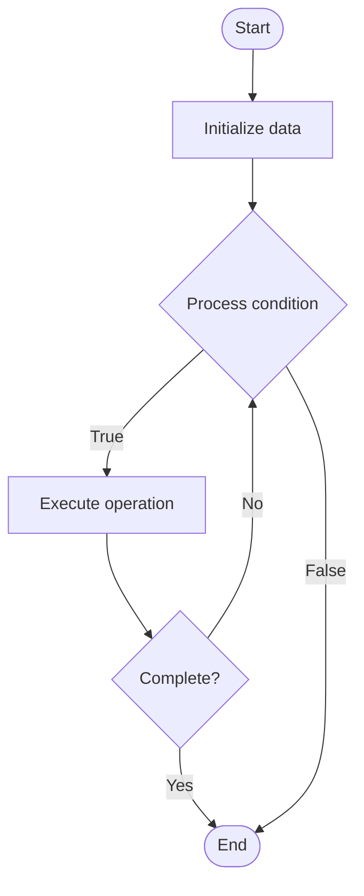

# PBFT (Practical Byzantine Fault Tolerance)

Name of Algorithm  

## Code Files


## Algorithm Visualization

### Flowchart (ASCII)


```
PBFT (Practical Byzantine Fault Tolerance) Flowchart:

┌─────────────┐
│   Start     │
└──────┬──────┘
       │
       ▼
┌─────────────┐
│  Initialize │
│   data      │
└──────┬──────┘
       │
       ▼
┌─────────────┐      Yes
│  Process   ├──────┐
│  condition?│      │
└──────┬──────┘      │
       │ No          │
       ▼             │
┌─────────────┐      │
│  Execute   │      │
│  operation │      │
└──────┬──────┘      │
       │             │
       └─────────────┘
       │
       ▼
┌─────────────┐
│    End      │
└─────────────┘
```


### Step-by-Step Execution


```
PBFT (Practical Byzantine Fault Tolerance) Step-by-Step Execution:

Input: [example data]

Step 1: Initialize
State: [initial state]

Step 2: Process
State: [intermediate state]

Step 3: Finalize
State: [final state]

Result: [output]
```


### Interactive Flowchart (Mermaid)





> **Note**: Mermaid diagrams are rendered automatically on GitHub. For local viewing, use a Mermaid-compatible Markdown viewer.
- [Python Implementation](/code/semester_13/lecture_88_consensus_advanced/pbft/algorithm.py)
- [Java Implementation](/code/semester_13/lecture_88_consensus_advanced/pbft/Algorithm.java)
- [Python Tests](/code/semester_13/lecture_88_consensus_advanced/pbft/test_algorithm.py)


   PBFT (Practical Byzantine Fault Tolerance)

What problem does it solve? (1 sentence)  
Implements PBFT consensus algorithm, a Byzantine fault-tolerant consensus protocol that tolerates up to (n-1)/3 Byzantine failures in a network of n nodes, providing fast finality and high throughput.

Intuition (plain-language explanation)  
   Like agreement despite liars: PBFT is like reaching agreement even when some people lie (Byzantine failures) - you need 2/3 honest nodes to agree, and you can tolerate up to 1/3 liars - just as you can reach consensus despite some dishonest participants, PBFT reaches consensus despite Byzantine failures.

Inputs & Outputs  
   - Input: Transactions, validators, consensus parameters, Byzantine fault tolerance, network messages.  
   - Output: Consensus decisions, finalized blocks, fast finality, high throughput, secure blockchain.

Step-by-step description (5–10 lines max)  
Request: client sends request to primary.
Pre-prepare: primary broadcasts pre-prepare message.
Prepare: validators send prepare messages.
Commit: validators send commit messages after 2f+1 prepares.
Reply: validators reply to client after 2f+1 commits.
Finalize: finalize block after consensus.
View-change: change view if primary fails.
Verify: verify message authenticity.
Repeat: repeat for next block.
Optimize: optimize consensus performance.

Tiny example (hand-simulated)  
   PBFT: validators: 4 validators (tolerates 1 Byzantine) → request: client request → pre-prepare: primary broadcasts → prepare: 3 validators prepare → commit: 3 validators commit → result: consensus reached, block finalized → PBFT successful.

Time & Space Complexity  
   - Time: O(n²) where n is validators (message complexity, but fast in practice).  
   - Space: O(n) where n is validators (validator storage, message logs).

Strengths  
- Finality: provides fast finality.
- Throughput: high transaction throughput.
- Security: Byzantine fault tolerant.

Weaknesses / limitations  
- Scalability: O(n²) message complexity limits scalability.
- Primary: requires trusted primary (view-change handles failures).
- Network: requires reliable network.

Compare with alternatives  
    Alternatives: Proof of Work, Proof of Stake, Other BFT, HotStuff

30-second explanation (your own words)  
Implements PBFT consensus algorithm, a Byzantine fault-tolerant consensus protocol that tolerates up to (n-1)/3 Byzantine failures in a network of n nodes, providing fast finality and high throughput.

*Sources: Adapted from standard university textbooks and Wikipedia summaries.*
