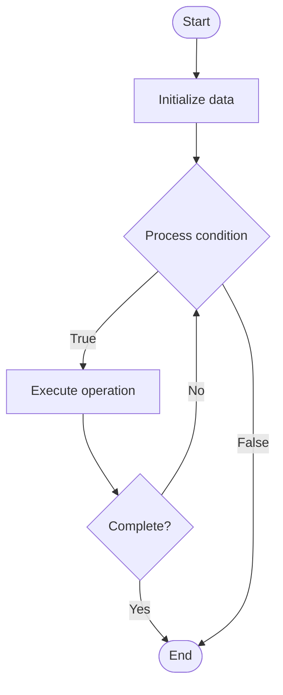

# Raft Blockchain

Name of Algorithm  

## Code Files


## Algorithm Visualization

### Flowchart (ASCII)


```
Raft Blockchain Flowchart:

┌─────────────┐
│   Start     │
└──────┬──────┘
       │
       ▼
┌─────────────┐
│  Initialize │
│   data      │
└──────┬──────┘
       │
       ▼
┌─────────────┐      Yes
│  Process   ├──────┐
│  condition?│      │
└──────┬──────┘      │
       │ No          │
       ▼             │
┌─────────────┐      │
│  Execute   │      │
│  operation │      │
└──────┬──────┘      │
       │             │
       └─────────────┘
       │
       ▼
┌─────────────┐
│    End      │
└─────────────┘
```


### Step-by-Step Execution


```
Raft Blockchain Step-by-Step Execution:

Input: [example data]

Step 1: Initialize
State: [initial state]

Step 2: Process
State: [intermediate state]

Step 3: Finalize
State: [final state]

Result: [output]
```


### Interactive Flowchart (Mermaid)





> **Note**: Mermaid diagrams are rendered automatically on GitHub. For local viewing, use a Mermaid-compatible Markdown viewer.
- [Python Implementation](/code/semester_13/lecture_88_consensus_advanced/raft_blockchain/algorithm.py)
- [Java Implementation](/code/semester_13/lecture_88_consensus_advanced/raft_blockchain/Algorithm.java)
- [Python Tests](/code/semester_13/lecture_88_consensus_advanced/raft_blockchain/test_algorithm.py)


   Raft Blockchain

What problem does it solve? (1 sentence)  
Implements Raft consensus algorithm for blockchains, providing a simpler alternative to Paxos with strong leader-based consensus, used in blockchain systems for fast and understandable consensus.

Intuition (plain-language explanation)  
   Like democratic leadership: Raft is like democratic leadership - you elect a leader (like electing a president) who makes decisions, and if the leader fails, you elect a new one - just as democratic leadership is understandable, Raft provides understandable consensus.

Inputs & Outputs  
   - Input: Transactions, nodes, leader election, log replication, consensus parameters.  
   - Output: Consensus decisions, replicated logs, finalized blocks, leader-based consensus, secure blockchain.

Step-by-step description (5–10 lines max)  
Elect: elect leader through voting.
Propose: leader proposes transactions.
Replicate: leader replicates log to followers.
Append: followers append to log.
Commit: commit after majority acknowledgment.
Apply: apply committed entries.
Heartbeat: leader sends heartbeats.
Re-elect: re-elect if leader fails.
Repeat: repeat for next entries.
Optimize: optimize consensus performance.

Tiny example (hand-simulated)  
   Raft Blockchain: nodes: 5 nodes → elect: node 1 elected leader → propose: leader proposes block → replicate: replicate to 4 followers → commit: 3 nodes acknowledge → result: block committed, consensus reached → Raft Blockchain successful.

Time & Space Complexity  
   - Time: O(n) where n is nodes (linear message complexity).  
   - Space: O(n + l) where n is nodes, l is log length (node and log storage).

Strengths  
- Simplicity: simpler than Paxos, easier to understand.
- Performance: fast consensus with strong leader.
- Safety: provides strong safety guarantees.

Weaknesses / limitations  
- Leader: requires leader (single point of coordination).
- Partition: may have issues with network partitions.
- Blockchain: designed for traditional distributed systems, adapted for blockchain.

Compare with alternatives  
    Alternatives: Paxos, PBFT, Proof of Stake, Other Consensus

30-second explanation (your own words)  
Implements Raft consensus algorithm for blockchains, providing a simpler alternative to Paxos with strong leader-based consensus, used in blockchain systems for fast and understandable consensus.

*Sources: Adapted from standard university textbooks and Wikipedia summaries.*
