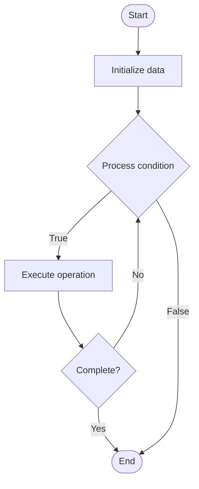

# Tendermint

Name of Algorithm  

## Code Files


## Algorithm Visualization

### Flowchart (ASCII)


```
Tendermint Flowchart:

┌─────────────┐
│   Start     │
└──────┬──────┘
       │
       ▼
┌─────────────┐
│  Initialize │
│   data      │
└──────┬──────┘
       │
       ▼
┌─────────────┐      Yes
│  Process   ├──────┐
│  condition?│      │
└──────┬──────┘      │
       │ No          │
       ▼             │
┌─────────────┐      │
│  Execute   │      │
│  operation │      │
└──────┬──────┘      │
       │             │
       └─────────────┘
       │
       ▼
┌─────────────┐
│    End      │
└─────────────┘
```


### Step-by-Step Execution


```
Tendermint Step-by-Step Execution:

Input: [example data]

Step 1: Initialize
State: [initial state]

Step 2: Process
State: [intermediate state]

Step 3: Finalize
State: [final state]

Result: [output]
```


### Interactive Flowchart (Mermaid)





> **Note**: Mermaid diagrams are rendered automatically on GitHub. For local viewing, use a Mermaid-compatible Markdown viewer.
- [Python Implementation](/code/semester_13/lecture_88_consensus_advanced/tendermint/algorithm.py)
- [Java Implementation](/code/semester_13/lecture_88_consensus_advanced/tendermint/Algorithm.java)
- [Python Tests](/code/semester_13/lecture_88_consensus_advanced/tendermint/test_algorithm.py)


   Tendermint

What problem does it solve? (1 sentence)  
Implements Tendermint consensus algorithm, a Byzantine fault-tolerant consensus protocol designed for blockchains, providing fast finality and high throughput with a focus on application-agnostic consensus.

Intuition (plain-language explanation)  
Like efficient agreement: Tendermint is like efficient agreement protocols - validators agree on blocks efficiently through voting rounds - just as optimized voting reaches decisions, Tendermint reaches consensus efficiently.

Inputs & Outputs  
   - Input: Transactions, validators, voting power, consensus parameters, Byzantine fault tolerance.  
   - Output: Consensus decisions, finalized blocks, fast finality, high throughput, secure blockchain.

Step-by-step description (5–10 lines max)  
Propose: proposer (selected by voting power) proposes block.
Pre-vote: validators pre-vote on proposal.
Pre-commit: validators pre-commit after 2/3 pre-votes.
Commit: commit block after 2/3 pre-commits.
Finalize: finalize committed block.
Broadcast: broadcast finalized block.
Verify: verify block validity.
Update: update blockchain state.
Rotate: rotate proposer.
Repeat: repeat for next block.

Tiny example (hand-simulated)  
   Tendermint: validators: 100 validators → propose: proposer proposes block → pre-vote: 67 validators pre-vote → pre-commit: 67 validators pre-commit → commit: block committed in <1 second → result: fast, secure consensus → Tendermint successful.

Time & Space Complexity  
   - Time: O(n) where n is validators (linear communication complexity).  
   - Space: O(n + b) where n is validators, b is block size (validator and block storage).

Strengths  
- Finality: provides instant finality (no forks).
- Throughput: high transaction throughput.
- Application-agnostic: works with any application logic.

Weaknesses / limitations  
- Validator set: requires known validator set.
- Voting power: voting power distribution affects security.
- Complexity: consensus protocol is complex.

Compare with alternatives  
    Alternatives: Proof of Work, Proof of Stake, PBFT, Other BFT

30-second explanation (your own words)  
Implements Tendermint consensus algorithm, a Byzantine fault-tolerant consensus protocol designed for blockchains, providing fast finality and high throughput with a focus on application-agnostic consensus.

*Sources: Adapted from standard university textbooks and Wikipedia summaries.*
