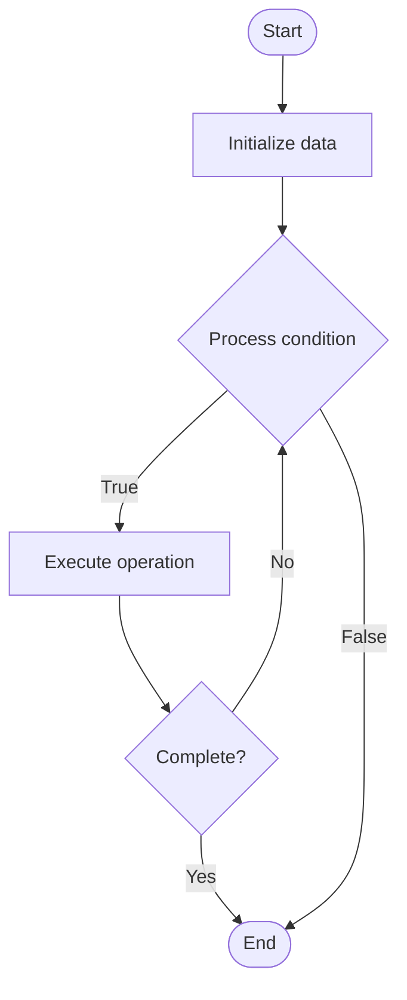

# Automated Market Makers (AMM)

## Учебные материалы

- [Школьный уровень](school.ru.md)
- [Университетский уровень](univer.ru.md)

## Algorithm Visualization

### Flowchart (ASCII)

```
Automated Market Makers (AMM) Flowchart:

┌─────────────┐
│   Start     │
└──────┬──────┘
       │
       ▼
┌─────────────┐
│  Initialize │
│   data      │
└──────┬──────┘
       │
       ▼
┌─────────────┐      Yes
│  Process   ├──────┐
│  condition?│      │
└──────┬──────┘      │
       │ No          │
       ▼             │
┌─────────────┐      │
│  Execute   │      │
│  operation │      │
└──────┬──────┘      │
       │             │
       └─────────────┘
       │
       ▼
┌─────────────┐
│    End      │
└─────────────┘
```

### Step-by-Step Execution

```
Automated Market Makers (AMM) Step-by-Step Execution:

Input: [example data]

Step 1: Initialize
State: [initial state]

Step 2: Process
State: [intermediate state]

Step 3: Finalize
State: [final state]

Result: [output]
```

### Interactive Flowchart (Mermaid)



> **Note**: Mermaid diagrams are rendered automatically on GitHub. For local viewing, use a Mermaid-compatible Markdown viewer.

- [Python Implementation](/code/semester_13/lecture_89_defi/automated_market_makers/algorithm.py)
- [Java Implementation](/code/semester_13/lecture_89_defi/automated_market_makers/Algorithm.java)
- [Python Tests](/code/semester_13/lecture_89_defi/automated_market_makers/test_algorithm.py)

   Automated Market Makers (AMM)

What problem does it solve? (1 sentence)  
Implements Automated Market Makers, decentralized exchange protocols that use mathematical formulas (like constant product formula) to determine asset prices and enable trading without traditional order books.

Intuition (plain-language explanation)  
   Like automatic pricing: AMMs are like automatic pricing systems - instead of buyers and sellers matching orders (like traditional exchanges), a formula automatically sets prices based on supply and demand - just as automatic pricing adjusts prices, AMMs automatically price assets.

Inputs & Outputs  

  - Input: Liquidity pools, trading pairs, liquidity provider tokens, swap requests, AMM formulas.  
  - Output: Asset swaps, updated prices, liquidity pool balances, trading fees, LP tokens.

Step-by-step description (5–10 lines max)  
Provide: liquidity providers add assets to pools.
Calculate: calculate prices using AMM formula (x * y = k).
Swap: users swap assets through pools.
Update: update pool balances after swap.
Price: new price determined by new balances.
Fee: collect trading fees.
Distribute: distribute fees to liquidity providers.
Track: track LP token ownership.
Remove: allow liquidity removal.
Optimize: optimize for low slippage.

Tiny example (hand-simulated)  
   AMM: pool: ETH/USDC pool (100 ETH, 200,000 USDC) → swap: user swaps 10 ETH for USDC → calculate: new price from formula → update: pool now 110 ETH, 181,818 USDC → result: user receives 18,182 USDC → AMM successful.

Time & Space Complexity  

  - Time: O(1) for swap calculation (constant time formula evaluation).  
  - Space: O(p) where p is number of pools (pool storage).

Strengths  

- Decentralization: fully decentralized, no order books needed.
- Accessibility: easy to use, always available.
- Liquidity: incentivizes liquidity provision.

Weaknesses / limitations  

- Slippage: large trades cause price slippage.
- Impermanent loss: liquidity providers face impermanent loss.
- Formula: simple formulas may not capture all market dynamics.

Compare with alternatives  
    Alternatives: Order Books, Centralized Exchanges, Other AMM Formulas, Hybrid Approaches

30-second explanation (your own words)  
Implements Automated Market Makers, decentralized exchange protocols that use mathematical formulas (like constant product formula) to determine asset prices and enable trading without traditional order books.

*Sources: Adapted from standard university textbooks and Wikipedia summaries.*
