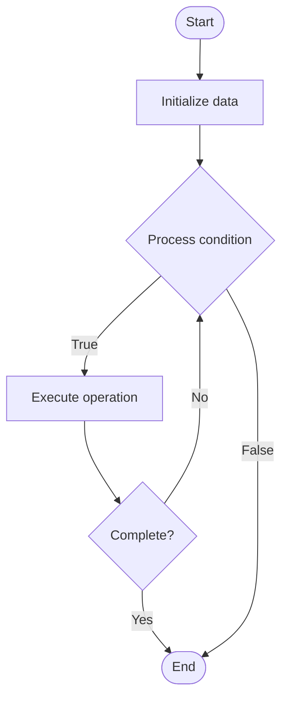

# Derivatives (DeFi)

Name of Algorithm  

## Code Files


## Algorithm Visualization

### Flowchart (ASCII)


```
Derivatives (DeFi) Flowchart:

┌─────────────┐
│   Start     │
└──────┬──────┘
       │
       ▼
┌─────────────┐
│  Initialize │
│   data      │
└──────┬──────┘
       │
       ▼
┌─────────────┐      Yes
│  Process   ├──────┐
│  condition?│      │
└──────┬──────┘      │
       │ No          │
       ▼             │
┌─────────────┐      │
│  Execute   │      │
│  operation │      │
└──────┬──────┘      │
       │             │
       └─────────────┘
       │
       ▼
┌─────────────┐
│    End      │
└─────────────┘
```


### Step-by-Step Execution


```
Derivatives (DeFi) Step-by-Step Execution:

Input: [example data]

Step 1: Initialize
State: [initial state]

Step 2: Process
State: [intermediate state]

Step 3: Finalize
State: [final state]

Result: [output]
```


### Interactive Flowchart (Mermaid)





> **Note**: Mermaid diagrams are rendered automatically on GitHub. For local viewing, use a Mermaid-compatible Markdown viewer.
- [Python Implementation](/code/semester_13/lecture_89_defi/derivatives/algorithm.py)
- [Java Implementation](/code/semester_13/lecture_89_defi/derivatives/Algorithm.java)
- [Python Tests](/code/semester_13/lecture_89_defi/derivatives/test_algorithm.py)


   Derivatives (DeFi)

What problem does it solve? (1 sentence)  
   Implements decentralized derivatives protocols that enable trading of financial derivatives (futures, options, perpetuals) on blockchain without intermediaries, providing transparent and accessible derivative markets.

Intuition (plain-language explanation)  
   Like derivatives but decentralized: DeFi Derivatives are like traditional derivatives (futures, options) but on blockchain - you trade contracts (like betting on future prices) without brokers - just as traditional derivatives enable price speculation, DeFi derivatives enable decentralized speculation.

Inputs & Outputs  
   - Input: Derivative contracts, collateral, positions, prices, liquidation parameters, margin requirements.  
   - Output: Derivative positions, PnL, liquidations, settlements, margin calls, trading fees.

Step-by-step description (5–10 lines max)  
Create: create derivative contract (futures, options).
Deposit: deposit collateral.
Open: open derivative position.
Price: track underlying asset price (oracle).
Margin: monitor margin requirements.
Liquidate: liquidate if margin insufficient.
Settle: settle contract at expiration.
Payout: payout profits/losses.
Close: close position early if desired.
Manage: manage risk and positions.

Tiny example (hand-simulated)  
   Derivatives: contract: ETH perpetual futures → deposit: 1000 USDC collateral → open: long position 10 ETH → price: ETH price increases → result: profit, position value increases → Derivatives successful.

Time & Space Complexity  
   - Time: O(1) for position operations (constant time contract operations).  
   - Space: O(p + c) where p is positions, c is contracts (position and contract storage).

Strengths  
- Accessibility: accessible to anyone with crypto.
- Transparency: transparent and auditable.
- Innovation: enables new derivative products.

Weaknesses / limitations  
- Risk: high risk, potential for large losses.
- Liquidation: liquidation risk if price moves against position.
- Oracles: depends on reliable price oracles.

Compare with alternatives  
    Alternatives: Traditional Derivatives, Centralized Crypto Derivatives, No Derivatives, Hybrid Approaches

30-second explanation (your own words)  
    Implements decentralized derivatives protocols that enable trading of financial derivatives (futures, options, perpetuals) on blockchain without intermediaries, providing transparent and accessible derivative markets.

*Sources: Adapted from standard university textbooks and Wikipedia summaries.*
