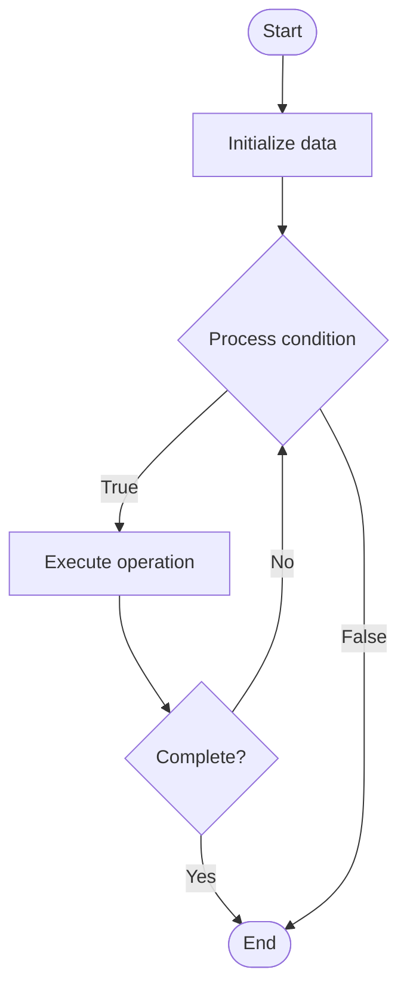

# Lending Protocols

1. **Name of Algorithm**  

## Code Files


## Algorithm Visualization

### Flowchart (ASCII)


```
Lending Protocols Flowchart:

┌─────────────┐
│   Start     │
└──────┬──────┘
       │
       ▼
┌─────────────┐
│  Initialize │
│   data      │
└──────┬──────┘
       │
       ▼
┌─────────────┐      Yes
│  Process   ├──────┐
│  condition?│      │
└──────┬──────┘      │
       │ No          │
       ▼             │
┌─────────────┐      │
│  Execute   │      │
│  operation │      │
└──────┬──────┘      │
       │             │
       └─────────────┘
       │
       ▼
┌─────────────┐
│    End      │
└─────────────┘
```


### Step-by-Step Execution


```
Lending Protocols Step-by-Step Execution:

Input: [example data]

Step 1: Initialize
State: [initial state]

Step 2: Process
State: [intermediate state]

Step 3: Finalize
State: [final state]

Result: [output]
```


### Interactive Flowchart (Mermaid)





> **Note**: Mermaid diagrams are rendered automatically on GitHub. For local viewing, use a Mermaid-compatible Markdown viewer.
- [Python Implementation](semester_13/lecture_89_defi/lending_protocols/algorithm.py)
- [Java Implementation](semester_13/lecture_89_defi/lending_protocols/Algorithm.java)
- [Python Tests](semester_13/lecture_89_defi/lending_protocols/test_algorithm.py)


   Lending Protocols

2. **What problem does it solve? (1 sentence)**  
   Implements decentralized lending protocols that enable users to lend and borrow cryptocurrencies without intermediaries, using smart contracts to manage loans, collateral, and interest rates algorithmically.

3. **Intuition (plain-language explanation)**  
Like banks but decentralized: Lending Protocols are like banks but on blockchain - you deposit crypto (like depositing money) to earn interest, or borrow crypto (like taking loans) by providing collateral - just as banks facilitate lending, DeFi lending protocols facilitate decentralized lending.

4. **Inputs & Outputs**  
   - Input: Deposits, borrows, collateral, interest rates, liquidation parameters, loan terms.  
   - Output: Loans, interest payments, liquidations, collateral management, yield, borrowing capacity.

5. **Step-by-step description (5–10 lines max)**  
1. Deposit: lenders deposit assets to earn interest.
2. Borrow: borrowers borrow assets against collateral.
3. Calculate: calculate interest rates algorithmically.
4. Accrue: accrue interest over time.
5. Monitor: monitor collateral ratios.
6. Liquidate: liquidate if collateral insufficient.
7. Repay: borrowers repay loans.
8. Withdraw: lenders withdraw deposits.
9. Distribute: distribute interest to lenders.
10. Manage: manage protocol reserves.

6. **Tiny example (hand-simulated)**  
   Lending Protocols: deposit: user deposits 100 ETH → borrow: user borrows 50,000 USDC (collateralized) → interest: pays 5% APY → repay: repays loan + interest → withdraw: withdraws ETH + earned interest → result: lending/borrowing successful → Lending Protocols operational.

7. **Time & Space Complexity**  
   - Time: O(1) for loan operations (constant time smart contract operations).  
   - Space: O(l + d) where l is loans, d is deposits (loan and deposit storage).

8. **Strengths**  
- Accessibility: accessible to anyone with crypto.
- Transparency: transparent interest rates and terms.
- Efficiency: automated, no intermediaries.

9. **Weaknesses / limitations**  
- Risk: smart contract risks, liquidation risks.
- Volatility: crypto volatility affects collateral value.
- Regulation: regulatory uncertainty.

10. **Compare with alternatives**  
    Alternatives: Traditional Lending, Centralized Crypto Lending, No Lending, Hybrid Approaches

11. **30-second explanation (your own words)**  
    Implements decentralized lending protocols that enable users to lend and borrow cryptocurrencies without intermediaries, using smart contracts to manage loans, collateral, and interest rates algorithmically.

*Sources: Adapted from standard university textbooks and Wikipedia summaries.*
