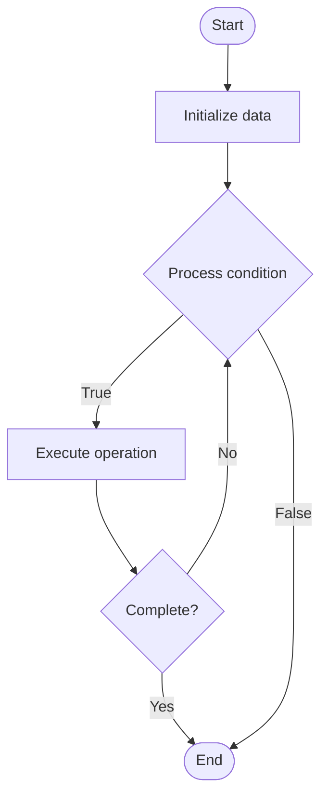

# Liquidity Pools

1. **Name of Algorithm**  

## Code Files


## Algorithm Visualization

### Flowchart (ASCII)


```
Liquidity Pools Flowchart:

┌─────────────┐
│   Start     │
└──────┬──────┘
       │
       ▼
┌─────────────┐
│  Initialize │
│   data      │
└──────┬──────┘
       │
       ▼
┌─────────────┐      Yes
│  Process   ├──────┐
│  condition?│      │
└──────┬──────┘      │
       │ No          │
       ▼             │
┌─────────────┐      │
│  Execute   │      │
│  operation │      │
└──────┬──────┘      │
       │             │
       └─────────────┘
       │
       ▼
┌─────────────┐
│    End      │
└─────────────┘
```


### Step-by-Step Execution


```
Liquidity Pools Step-by-Step Execution:

Input: [example data]

Step 1: Initialize
State: [initial state]

Step 2: Process
State: [intermediate state]

Step 3: Finalize
State: [final state]

Result: [output]
```


### Interactive Flowchart (Mermaid)





> **Note**: Mermaid diagrams are rendered automatically on GitHub. For local viewing, use a Mermaid-compatible Markdown viewer.
- [Python Implementation](semester_13/lecture_89_defi/liquidity_pools/algorithm.py)
- [Java Implementation](semester_13/lecture_89_defi/liquidity_pools/Algorithm.java)
- [Python Tests](semester_13/lecture_89_defi/liquidity_pools/test_algorithm.py)


   Liquidity Pools

2. **What problem does it solve? (1 sentence)**  
   Implements liquidity pools, reserves of token pairs locked in smart contracts that provide liquidity for decentralized exchanges and enable automated trading through AMMs.

3. **Intuition (plain-language explanation)**  
   Like shared reserves: Liquidity Pools are like shared reserves of tokens - multiple people contribute tokens (like contributing to a shared fund) that others can trade against - just as shared reserves enable trading, liquidity pools enable decentralized trading.

4. **Inputs & Outputs**  
   - Input: Token pairs, liquidity deposits, trading requests, AMM formulas, fee parameters.  
   - Output: Liquidity pools, LP tokens, trading liquidity, price discovery, trading fees, yield.

5. **Step-by-step description (5–10 lines max)**  
1. Create: create liquidity pool for token pair.
2. Deposit: liquidity providers deposit both tokens.
3. Receive: receive LP tokens representing share.
4. Trade: users trade against pool.
5. Update: update pool balances after trades.
6. Price: price determined by pool ratio.
7. Fee: collect trading fees.
8. Distribute: distribute fees to LPs.
9. Remove: LPs remove liquidity.
10. Burn: burn LP tokens on removal.

6. **Tiny example (hand-simulated)**  
   Liquidity Pools: pool: ETH/USDC → deposit: LP deposits 10 ETH + 20,000 USDC → receive: LP tokens → trade: user swaps 1 ETH → update: pool now 11 ETH, 18,182 USDC → fee: 0.3% fee collected → result: LP earns fees → Liquidity Pools operational.

7. **Time & Space Complexity**  
   - Time: O(1) for pool operations (constant time AMM calculations).  
   - Space: O(p) where p is number of pools (pool storage).

8. **Strengths**  
- Liquidity: provides constant liquidity for trading.
- Accessibility: easy to provide liquidity.
- Yield: LPs earn trading fees.

9. **Weaknesses / limitations**  
- Impermanent loss: LPs face impermanent loss risk.
- Slippage: large trades cause slippage.
- Concentration: liquidity may be concentrated in few pools.

10. **Compare with alternatives**  
    Alternatives: Order Books, Centralized Exchanges, Other Liquidity Mechanisms, Hybrid Approaches

11. **30-second explanation (your own words)**  
    Implements liquidity pools, reserves of token pairs locked in smart contracts that provide liquidity for decentralized exchanges and enable automated trading through AMMs.

*Sources: Adapted from standard university textbooks and Wikipedia summaries.*
