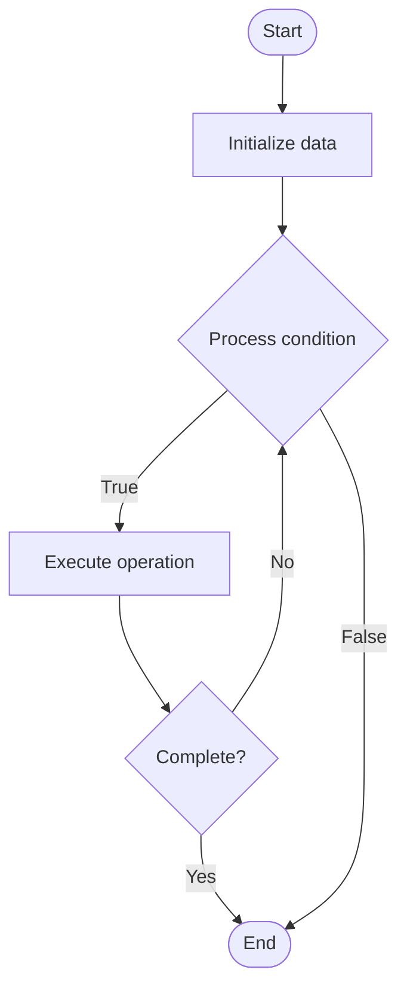

# Stablecoins

1. **Name of Algorithm**  

## Code Files


## Algorithm Visualization

### Flowchart (ASCII)


```
Stablecoins Flowchart:

┌─────────────┐
│   Start     │
└──────┬──────┘
       │
       ▼
┌─────────────┐
│  Initialize │
│   data      │
└──────┬──────┘
       │
       ▼
┌─────────────┐      Yes
│  Process   ├──────┐
│  condition?│      │
└──────┬──────┘      │
       │ No          │
       ▼             │
┌─────────────┐      │
│  Execute   │      │
│  operation │      │
└──────┬──────┘      │
       │             │
       └─────────────┘
       │
       ▼
┌─────────────┐
│    End      │
└─────────────┘
```


### Step-by-Step Execution


```
Stablecoins Step-by-Step Execution:

Input: [example data]

Step 1: Initialize
State: [initial state]

Step 2: Process
State: [intermediate state]

Step 3: Finalize
State: [final state]

Result: [output]
```


### Interactive Flowchart (Mermaid)





> **Note**: Mermaid diagrams are rendered automatically on GitHub. For local viewing, use a Mermaid-compatible Markdown viewer.
- [Python Implementation](semester_13/lecture_89_defi/stablecoins/algorithm.py)
- [Java Implementation](semester_13/lecture_89_defi/stablecoins/Algorithm.java)
- [Python Tests](semester_13/lecture_89_defi/stablecoins/test_algorithm.py)


   Stablecoins

2. **What problem does it solve? (1 sentence)**  
   Implements stablecoins, cryptocurrencies designed to maintain stable value (typically pegged to fiat currencies like USD), providing price stability for DeFi applications and serving as a medium of exchange.

3. **Intuition (plain-language explanation)**  
   Like stable currency: Stablecoins are like stable currency - instead of volatile crypto (like stocks), stablecoins maintain stable value (like dollars) - just as stable currency enables stable transactions, stablecoins enable stable DeFi transactions.

4. **Inputs & Outputs**  
   - Input: Minting requests, redemption requests, collateral, peg mechanisms, stability parameters.  
   - Output: Stablecoins, stable value, collateral management, minting/burning, peg maintenance.

5. **Step-by-step description (5–10 lines max)**  
1. Collateralize: deposit collateral (fiat, crypto, algorithmic).
2. Mint: mint stablecoins against collateral.
3. Peg: maintain peg to target value (e.g., $1).
4. Trade: stablecoins trade at stable price.
5. Redeem: redeem stablecoins for collateral.
6. Burn: burn stablecoins on redemption.
7. Adjust: adjust supply to maintain peg.
8. Stabilize: use mechanisms to stabilize price.
9. Audit: audit collateral reserves.
10. Govern: govern stablecoin parameters.

6. **Tiny example (hand-simulated)**  
   Stablecoins: type: USDC (fiat-collateralized) → deposit: deposit $1000 USD → mint: mint 1000 USDC → peg: maintains $1 peg → trade: use in DeFi → redeem: redeem 1000 USDC for $1000 USD → result: stable value maintained → Stablecoins operational.

7. **Time & Space Complexity**  
   - Time: O(1) for minting/redemption (constant time operations).  
   - Space: O(s + c) where s is supply, c is collateral (stablecoin and collateral storage).

8. **Strengths**  
- Stability: provides price stability.
- Utility: enables stable DeFi transactions.
- Accessibility: accessible to anyone.

9. **Weaknesses / limitations**  
- Trust: requires trust in issuer (for fiat-backed).
- Peg: maintaining peg can be challenging.
- Regulation: regulatory uncertainty.

10. **Compare with alternatives**  
    Alternatives: Volatile Cryptocurrencies, Fiat Currency, Other Stable Assets, Hybrid Approaches

11. **30-second explanation (your own words)**  
    Implements stablecoins, cryptocurrencies designed to maintain stable value (typically pegged to fiat currencies like USD), providing price stability for DeFi applications and serving as a medium of exchange.

*Sources: Adapted from standard university textbooks and Wikipedia summaries.*
