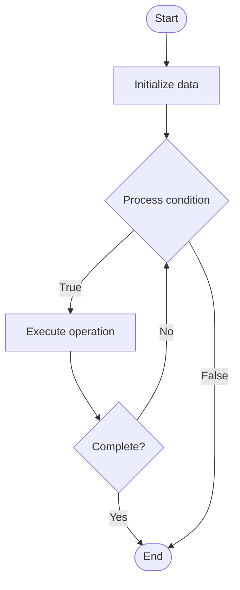

# Yield Farming

## Учебные материалы

- [Школьный уровень](school.ru.md)
- [Университетский уровень](univer.ru.md)

## Algorithm Visualization

### Flowchart (ASCII)

```
Yield Farming Flowchart:

┌─────────────┐
│   Start     │
└──────┬──────┘
       │
       ▼
┌─────────────┐
│  Initialize │
│   data      │
└──────┬──────┘
       │
       ▼
┌─────────────┐      Yes
│  Process   ├──────┐
│  condition?│      │
└──────┬──────┘      │
       │ No          │
       ▼             │
┌─────────────┐      │
│  Execute   │      │
│  operation │      │
└──────┬──────┘      │
       │             │
       └─────────────┘
       │
       ▼
┌─────────────┐
│    End      │
└─────────────┘
```

### Step-by-Step Execution

```
Yield Farming Step-by-Step Execution:

Input: [example data]

Step 1: Initialize
State: [initial state]

Step 2: Process
State: [intermediate state]

Step 3: Finalize
State: [final state]

Result: [output]
```

### Interactive Flowchart (Mermaid)



> **Note**: Mermaid diagrams are rendered automatically on GitHub. For local viewing, use a Mermaid-compatible Markdown viewer.

- [Python Implementation](/code/semester_13/lecture_89_defi/yield_farming/algorithm.py)
- [Java Implementation](/code/semester_13/lecture_89_defi/yield_farming/Algorithm.java)
- [Python Tests](/code/semester_13/lecture_89_defi/yield_farming/test_algorithm.py)

What problem does it solve? (1 sentence)  
   Implements yield farming strategies that maximize returns by moving assets between different DeFi protocols to earn the highest yields, incentivizing liquidity provision and protocol usage.

Intuition (plain-language explanation)  
Like optimizing returns: Yield Farming is like optimizing investment returns - you move money between different investments (DeFi protocols) to earn the highest interest - just as you optimize investment returns, yield farmers optimize DeFi returns.

Inputs & Outputs  

  - Input: Assets, DeFi protocols, yield rates, liquidity pools, farming strategies, reward tokens.  
  - Output: Optimized yields, farming rewards, LP tokens, protocol tokens, maximized returns, compound yields.

Step-by-step description (5–10 lines max)  
Analyze: analyze yield rates across protocols.
Select: select highest yield opportunities.
Deposit: deposit assets into protocols.
Farm: farm yield and rewards.
Compound: compound rewards for higher yields.
Monitor: monitor yield rates.
Reallocate: reallocate to better opportunities.
Harvest: harvest rewards.
Optimize: optimize farming strategy.
Manage: manage risks and gas costs.

Tiny example (hand-simulated)  
   Yield Farming: analyze: Protocol A: 10% APY, Protocol B: 15% APY → deposit: deposit into Protocol B → farm: earn 15% APY + rewards → compound: reinvest rewards → result: optimized yield → Yield Farming successful.

Time & Space Complexity  

  - Time: O(p) where p is protocols (analysis and optimization time).  
  - Space: O(a + p) where a is assets, p is positions (asset and position storage).

Strengths  

- Returns: maximizes returns through optimization.
- Incentives: incentivizes protocol usage.
- Flexibility: flexible farming strategies.

Weaknesses / limitations  

- Risk: high risk, smart contract risks.
- Gas: gas costs for frequent reallocation.
- Complexity: requires understanding multiple protocols.

Compare with alternatives  
    Alternatives: Single Protocol, Traditional Investing, HODLing, Passive Strategies

30-second explanation (your own words)  
    Implements yield farming strategies that maximize returns by moving assets between different DeFi protocols to earn the highest yields, incentivizing liquidity provision and protocol usage.

*Sources: Adapted from standard university textbooks and Wikipedia summaries.*
