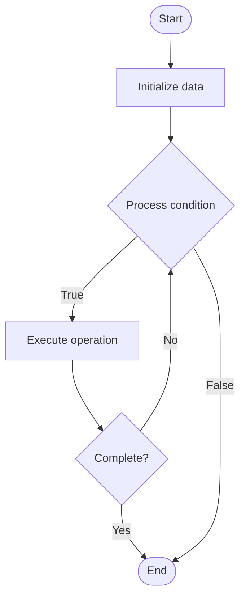

# Audit Techniques

Name of Algorithm  

## Code Files


## Algorithm Visualization

### Flowchart (ASCII)


```
Audit Techniques Flowchart:

┌─────────────┐
│   Start     │
└──────┬──────┘
       │
       ▼
┌─────────────┐
│  Initialize │
│   data      │
└──────┬──────┘
       │
       ▼
┌─────────────┐      Yes
│  Process   ├──────┐
│  condition?│      │
└──────┬──────┘      │
       │ No          │
       ▼             │
┌─────────────┐      │
│  Execute   │      │
│  operation │      │
└──────┬──────┘      │
       │             │
       └─────────────┘
       │
       ▼
┌─────────────┐
│    End      │
└─────────────┘
```


### Step-by-Step Execution


```
Audit Techniques Step-by-Step Execution:

Input: [example data]

Step 1: Initialize
State: [initial state]

Step 2: Process
State: [intermediate state]

Step 3: Finalize
State: [final state]

Result: [output]
```


### Interactive Flowchart (Mermaid)





> **Note**: Mermaid diagrams are rendered automatically on GitHub. For local viewing, use a Mermaid-compatible Markdown viewer.
- [Python Implementation](/code/semester_13/lecture_90_blockchain_security/audit_techniques/algorithm.py)
- [Java Implementation](/code/semester_13/lecture_90_blockchain_security/audit_techniques/Algorithm.java)
- [Python Tests](/code/semester_13/lecture_90_blockchain_security/audit_techniques/test_algorithm.py)


   Audit Techniques

What problem does it solve? (1 sentence)  
   Implements smart contract audit techniques and methodologies to identify security vulnerabilities, code issues, and potential exploits in blockchain smart contracts before deployment.

Intuition (plain-language explanation)  
   Like code review for security: Audit Techniques are like thorough code reviews but focused on security - you examine smart contracts (like reviewing code) to find bugs and vulnerabilities before they're exploited - just as code reviews catch bugs, audits catch security issues.

Inputs & Outputs  
   - Input: Smart contracts, code, audit checklists, security standards, vulnerability databases, analysis tools.  
   - Output: Audit reports, vulnerability findings, security recommendations, risk assessments, remediation guidance.

Step-by-step description (5–10 lines max)  
Review: review smart contract code.
Analyze: analyze for common vulnerabilities.
Test: test contract functionality.
Check: check against security standards.
Identify: identify vulnerabilities and issues.
Document: document findings.
Prioritize: prioritize risks.
Recommend: recommend fixes.
Verify: verify fixes after remediation.
Report: generate audit report.

Tiny example (hand-simulated)  
   Audit Techniques: contract: DeFi lending contract → review: code review → analyze: check for reentrancy → test: test edge cases → identify: reentrancy vulnerability found → recommend: add reentrancy guard → result: vulnerability fixed → Audit Techniques successful.

Time & Space Complexity  
   - Time: O(c + a) where c is code size, a is analysis time (varies by contract complexity).  
   - Space: O(c + r) where c is code storage, r is report storage (code and audit data).

Strengths  
- Security: identifies security vulnerabilities before deployment.
- Prevention: prevents exploits and hacks.
- Trust: increases trust in smart contracts.

Weaknesses / limitations  
- Time: audits take time and resources.
- Coverage: may not catch all vulnerabilities.
- Cost: professional audits can be expensive.

Compare with alternatives  
    Alternatives: No Audit, Automated Tools Only, Self-Audit, Formal Verification

30-second explanation (your own words)  
    Implements smart contract audit techniques and methodologies to identify security vulnerabilities, code issues, and potential exploits in blockchain smart contracts before deployment.

*Sources: Adapted from standard university textbooks and Wikipedia summaries.*
