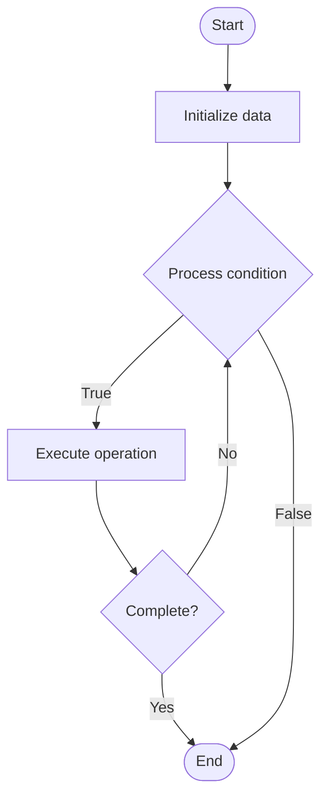

# Exploit Prevention

## Учебные материалы

- [Школьный уровень](school.ru.md)
- [Университетский уровень](univer.ru.md)

## Algorithm Visualization

### Flowchart (ASCII)

```
Exploit Prevention Flowchart:

┌─────────────┐
│   Start     │
└──────┬──────┘
       │
       ▼
┌─────────────┐
│  Initialize │
│   data      │
└──────┬──────┘
       │
       ▼
┌─────────────┐      Yes
│  Process   ├──────┐
│  condition?│      │
└──────┬──────┘      │
       │ No          │
       ▼             │
┌─────────────┐      │
│  Execute   │      │
│  operation │      │
└──────┬──────┘      │
       │             │
       └─────────────┘
       │
       ▼
┌─────────────┐
│    End      │
└─────────────┘
```

### Step-by-Step Execution

```
Exploit Prevention Step-by-Step Execution:

Input: [example data]

Step 1: Initialize
State: [initial state]

Step 2: Process
State: [intermediate state]

Step 3: Finalize
State: [final state]

Result: [output]
```

### Interactive Flowchart (Mermaid)



> **Note**: Mermaid diagrams are rendered automatically on GitHub. For local viewing, use a Mermaid-compatible Markdown viewer.

- [Python Implementation](/code/semester_13/lecture_90_blockchain_security/exploit_prevention/algorithm.py)
- [Java Implementation](/code/semester_13/lecture_90_blockchain_security/exploit_prevention/Algorithm.java)
- [Python Tests](/code/semester_13/lecture_90_blockchain_security/exploit_prevention/test_algorithm.py)

What problem does it solve? (1 sentence)  
   Implements techniques and mechanisms to prevent exploits and attacks on blockchain systems and smart contracts, including security patterns, access controls, and defensive programming.

Intuition (plain-language explanation)  
   Like security measures: Exploit Prevention is like security measures - you add protections (like locks and alarms) to prevent attacks - just as security measures protect buildings, exploit prevention protects blockchain systems.

Inputs & Outputs  

  - Input: Smart contracts, security patterns, access controls, defensive mechanisms, threat models, security requirements.  
  - Output: Protected contracts, security mechanisms, exploit prevention, hardened systems, defensive code.

Step-by-step description (5–10 lines max)  
Identify: identify potential exploits and attack vectors.
Design: design security mechanisms.
Implement: implement security patterns.
Control: implement access controls.
Validate: validate inputs and state.
Limit: limit attack surface.
Monitor: monitor for suspicious activity.
Respond: respond to threats.
Update: update defenses.
Test: test exploit prevention.

Tiny example (hand-simulated)  
   Exploit Prevention: threat: reentrancy attack → design: reentrancy guard pattern → implement: add guard modifier → validate: validate state changes → result: reentrancy prevented → Exploit Prevention successful.

Time & Space Complexity  

  - Time: O(i + d) where i is implementation time, d is defense overhead (varies by mechanisms).  
  - Space: O(s + d) where s is system storage, d is defense storage (security mechanisms).

Strengths  

- Protection: prevents exploits and attacks.
- Security: improves overall security.
- Trust: increases trust in systems.

Weaknesses / limitations  

- Overhead: security mechanisms add overhead.
- Complexity: may add complexity to code.
- Coverage: may not prevent all attack types.

Compare with alternatives  
    Alternatives: No Prevention, Reactive Security, Basic Security, Comprehensive Security

30-second explanation (your own words)  
    Implements techniques and mechanisms to prevent exploits and attacks on blockchain systems and smart contracts, including security patterns, access controls, and defensive programming.

*Sources: Adapted from standard university textbooks and Wikipedia summaries.*


## References

- [Exploit Prevention - Wikipedia](https://en.wikipedia.org/wiki/Exploit%20Prevention)
