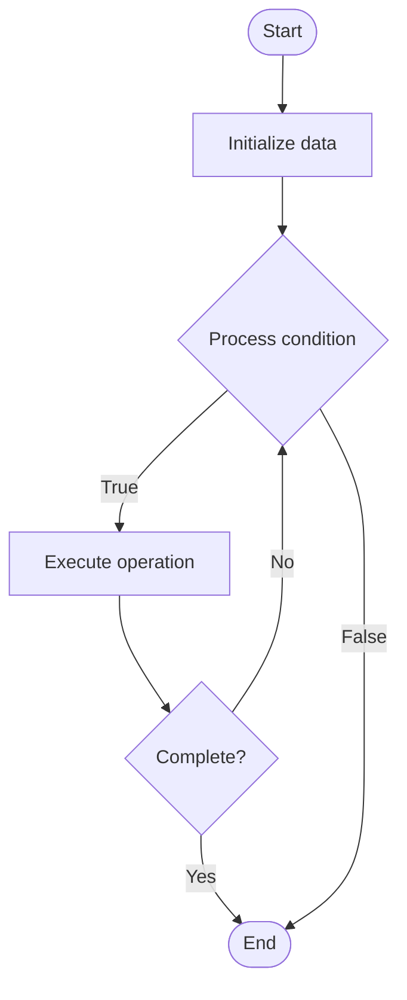

# Formal Verification

## Учебные материалы

- [Школьный уровень](school.ru.md)
- [Университетский уровень](univer.ru.md)

## Algorithm Visualization

### Flowchart (ASCII)

```
Formal Verification Flowchart:

┌─────────────┐
│   Start     │
└──────┬──────┘
       │
       ▼
┌─────────────┐
│  Initialize │
│   data      │
└──────┬──────┘
       │
       ▼
┌─────────────┐      Yes
│  Process   ├──────┐
│  condition?│      │
└──────┬──────┘      │
       │ No          │
       ▼             │
┌─────────────┐      │
│  Execute   │      │
│  operation │      │
└──────┬──────┘      │
       │             │
       └─────────────┘
       │
       ▼
┌─────────────┐
│    End      │
└─────────────┘
```

### Step-by-Step Execution

```
Formal Verification Step-by-Step Execution:

Input: [example data]

Step 1: Initialize
State: [initial state]

Step 2: Process
State: [intermediate state]

Step 3: Finalize
State: [final state]

Result: [output]
```

### Interactive Flowchart (Mermaid)



> **Note**: Mermaid diagrams are rendered automatically on GitHub. For local viewing, use a Mermaid-compatible Markdown viewer.

- [Python Implementation](/code/semester_13/lecture_90_blockchain_security/formal_verification/algorithm.py)
- [Java Implementation](/code/semester_13/lecture_90_blockchain_security/formal_verification/Algorithm.java)
- [Python Tests](/code/semester_13/lecture_90_blockchain_security/formal_verification/test_algorithm.py)

What problem does it solve? (1 sentence)  
   Uses mathematical methods to formally prove correctness and security properties of smart contracts, providing mathematical guarantees that contracts behave as specified and are free from certain classes of bugs.

Intuition (plain-language explanation)  
   Like mathematical proof: Formal Verification is like mathematical proof - you prove mathematically (like proving theorems) that code is correct - just as mathematical proofs guarantee truth, formal verification guarantees code correctness.

Inputs & Outputs  

  - Input: Smart contracts, specifications, formal models, verification tools, proof systems, properties to verify.  
  - Output: Formal proofs, verified contracts, correctness guarantees, security properties, verification reports.

Step-by-step description (5–10 lines max)  
Specify: specify contract requirements formally.
Model: model contract behavior mathematically.
Property: define properties to verify.
Prove: prove properties using formal methods.
Verify: verify proof with verification tools.
Check: check for property violations.
Fix: fix issues if found.
Re-verify: re-verify after fixes.
Document: document verification results.
Deploy: deploy verified contract.

Tiny example (hand-simulated)  
   Formal Verification: contract: token contract → specify: total supply invariant → model: formal model → prove: prove total supply never exceeds max → verify: verification tool confirms → result: contract formally verified → Formal Verification successful.

Time & Space Complexity  

  - Time: O(v + p) where v is verification time, p is proof time (varies by complexity, can be exponential).  
  - Space: O(m + p) where m is model storage, p is proof storage (formal models and proofs).

Strengths  

- Correctness: provides mathematical guarantees of correctness.
- Security: proves security properties.
- Reliability: increases contract reliability.

Weaknesses / limitations  

- Complexity: formal verification is complex.
- Time: verification can be time-consuming.
- Coverage: may not verify all properties.

Compare with alternatives  
    Alternatives: No Verification, Testing, Auditing, Hybrid Approaches

30-second explanation (your own words)  
    Uses mathematical methods to formally prove correctness and security properties of smart contracts, providing mathematical guarantees that contracts behave as specified and are free from certain classes of bugs.

*Sources: Adapted from standard university textbooks and Wikipedia summaries.*
