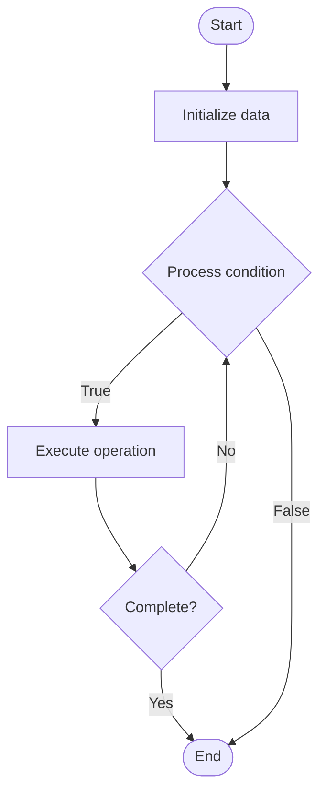

# Security Patterns

1. **Name of Algorithm**  

## Code Files


## Algorithm Visualization

### Flowchart (ASCII)


```
Security Patterns Flowchart:

┌─────────────┐
│   Start     │
└──────┬──────┘
       │
       ▼
┌─────────────┐
│  Initialize │
│   data      │
└──────┬──────┘
       │
       ▼
┌─────────────┐      Yes
│  Process   ├──────┐
│  condition?│      │
└──────┬──────┘      │
       │ No          │
       ▼             │
┌─────────────┐      │
│  Execute   │      │
│  operation │      │
└──────┬──────┘      │
       │             │
       └─────────────┘
       │
       ▼
┌─────────────┐
│    End      │
└─────────────┘
```


### Step-by-Step Execution


```
Security Patterns Step-by-Step Execution:

Input: [example data]

Step 1: Initialize
State: [initial state]

Step 2: Process
State: [intermediate state]

Step 3: Finalize
State: [final state]

Result: [output]
```


### Interactive Flowchart (Mermaid)





> **Note**: Mermaid diagrams are rendered automatically on GitHub. For local viewing, use a Mermaid-compatible Markdown viewer.
- [Python Implementation](semester_13/lecture_90_blockchain_security/security_patterns/algorithm.py)
- [Java Implementation](semester_13/lecture_90_blockchain_security/security_patterns/Algorithm.java)
- [Python Tests](semester_13/lecture_90_blockchain_security/security_patterns/test_algorithm.py)


   Security Patterns

2. **What problem does it solve? (1 sentence)**  
   Implements proven security patterns and best practices for smart contract development, providing reusable solutions to common security problems and vulnerabilities.

3. **Intuition (plain-language explanation)**  
   Like security templates: Security Patterns are like security templates - you use proven patterns (like using templates) to solve security problems - just as templates help you build things correctly, security patterns help you build secure contracts.

4. **Inputs & Outputs**  
   - Input: Security requirements, threat models, design patterns, best practices, security standards.  
   - Output: Secure contracts, security patterns, hardened code, best practices, pattern implementations.

5. **Step-by-step description (5–10 lines max)**  
1. Identify: identify security requirements.
2. Select: select appropriate security patterns.
3. Apply: apply security patterns to code.
4. Implement: implement pattern correctly.
5. Validate: validate pattern implementation.
6. Test: test security patterns.
7. Document: document pattern usage.
8. Review: review pattern effectiveness.
9. Update: update patterns as needed.
10. Reuse: reuse patterns across contracts.

6. **Tiny example (hand-simulated)**  
   Security Patterns: requirement: prevent reentrancy → pattern: Checks-Effects-Interactions → apply: apply pattern → implement: checks first, effects second, interactions last → result: reentrancy prevented → Security Patterns successful.

7. **Time & Space Complexity**  
   - Time: O(i) where i is implementation time (pattern application time).  
   - Space: O(p + c) where p is pattern storage, c is code storage (patterns and code).

8. **Strengths**  
- Proven: uses proven security solutions.
- Reusability: patterns are reusable.
- Best practices: incorporates best practices.

9. **Weaknesses / limitations**  
- Application: patterns must be applied correctly.
- Coverage: may not cover all security concerns.
- Evolution: patterns evolve as threats evolve.

10. **Compare with alternatives**  
    Alternatives: No Patterns, Ad-Hoc Security, Custom Solutions, Hybrid Approaches

11. **30-second explanation (your own words)**  
    Implements proven security patterns and best practices for smart contract development, providing reusable solutions to common security problems and vulnerabilities.

*Sources: Adapted from standard university textbooks and Wikipedia summaries.*
